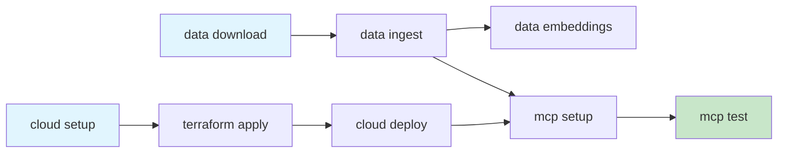
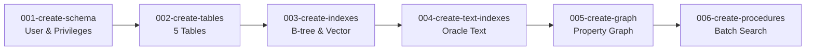
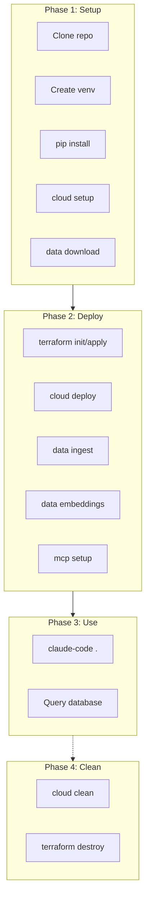

# Panama Papers PoC Deployment Guide

## Oracle Database Converged Capabilities for Graph Analytics

This guide provides complete deployment instructions for the Panama Papers Proof-of-Concept, demonstrating Oracle Database's converged architecture with Property Graph, Oracle Text, Spatial, and AI Vector Search capabilities.

> **Prerequisites:** Before deploying, review the data model in [TechnicalGuide.md](TechnicalGuide.md) and the Oracle implementation patterns in [Implementation.md](Implementation.md). This guide assumes familiarity with the schema and query patterns documented there.

---

## Table of Contents

1. [Architecture Overview](#architecture-overview)
2. [Project Structure](#project-structure)
3. [Component Reference](#component-reference)
4. [Prerequisites](#prerequisites)
5. [Step-by-Step Deployment](#step-by-step-deployment)
6. [MCP Configuration](#mcp-configuration)
7. [Cleanup Procedures](#cleanup-procedures)

---

## Architecture Overview

```mermaid
flowchart TB
    subgraph Dev["Developer Environment"]
        CC[Claude Code<br/>AI Assistant]
        MCP[SQLcl MCP Server<br/>Protocol Bridge]
        Tools[manage.py | Terraform | Liquibase | SQLcl]
    end

    subgraph OCI["Oracle Cloud Infrastructure"]
        ADB[Autonomous Database<br/>Oracle 23ai]
        subgraph Schema["PANAMA_PAPERS Schema"]
            T1[ENTITIES<br/>810K+]
            T2[OFFICERS<br/>750K+]
            T3[INTERMEDIARIES<br/>14K+]
            T4[ADDRESSES<br/>150K+]
            T5[RELATIONSHIPS<br/>3M+]
            PG[PANAMA_GRAPH<br/>Property Graph]
        end
    end

    CC <-->|MCP Protocol| MCP
    MCP <-->|SQL*Net / mTLS| ADB
    Tools -->|Provision & Deploy| OCI
```

---

## Project Structure

```
panama-papers-poc/
├── manage.py                    # CLI orchestration tool
├── requirements.txt             # Python dependencies
├── .mcp.json                    # MCP server configuration for Claude
├── README.md                    # Quick start guide
│
├── deploy/
│   └── terraform/
│       ├── main.tf              # Main Terraform configuration
│       ├── variables.tf         # Input variables
│       ├── outputs.tf           # Output values
│       ├── provider.tf          # OCI provider configuration
│       ├── adb.tf               # Autonomous Database resource
│       ├── network.tf           # VCN and networking (optional)
│       └── terraform.tfvars.example
│
├── database/
│   ├── liquibase/
│   │   ├── liquibase.properties.template
│   │   ├── changelog-master.xml # Master changelog
│   │   └── changelogs/
│   │       ├── 001-create-schema.xml
│   │       ├── 002-create-tables.xml
│   │       ├── 003-create-indexes.xml
│   │       ├── 004-create-text-indexes.xml
│   │       ├── 005-create-graph.xml
│   │       └── 006-create-procedures.xml
│   │
│   └── scripts/
│       ├── 00_create_user.sql   # Create PANAMA_PAPERS user
│       ├── 01_grant_permissions.sql
│       ├── 02_create_tables.sql
│       ├── 03_create_indexes.sql
│       ├── 04_create_text_indexes.sql
│       ├── 05_create_graph.sql
│       ├── 06_create_procedures.sql
│       └── 99_cleanup.sql
│
├── data/
│   └── .gitkeep                 # CSV files downloaded here
│
├── scripts/
│   ├── ingest_data.py           # Python data ingestion script
│   ├── generate_embeddings.py   # Vector embedding generation
│   └── validate_data.py         # Data validation utilities
│
├── notebooks/
│   ├── 01_data_exploration.ipynb
│   ├── 02_graph_analytics.ipynb
│   └── 03_visualizations.ipynb
│
└── docs/
    ├── TECHNICAL_REFERENCE.md
    └── QUERY_EXAMPLES.md
```

---

## Component Reference

### 1. manage.py — CLI Orchestration Tool

The `manage.py` script is the central orchestration tool that coordinates all deployment activities. It follows a command-subcommand pattern similar to Django's management commands.

**Design Philosophy:**
The script provides a unified interface for infrastructure provisioning, schema deployment, data loading, and cleanup. It handles state management, error recovery, and provides clear feedback at each step.

**Available Commands:**

| Command | Subcommand   | Description                                               |
| ------- | ------------ | --------------------------------------------------------- |
| `cloud` | `setup`      | Interactive OCI configuration, generates terraform.tfvars |
| `cloud` | `deploy`     | Downloads wallet, runs Liquibase schema deployment        |
| `cloud` | `clean`      | Removes generated files and local artifacts               |
| `data`  | `download`   | Downloads ICIJ CSV files                                  |
| `data`  | `ingest`     | Loads CSV data into Oracle tables                         |
| `data`  | `embeddings` | Generates vector embeddings for names                     |
| `mcp`   | `setup`      | Configures SQLcl saved connections for MCP                |
| `mcp`   | `test`       | Validates MCP connection                                  |
| `full`  | `setup`      | Complete end-to-end deployment                            |
| `full`  | `clean`      | Complete teardown                                         |



**Key Implementation Details:**

```python
#!/usr/bin/env python3
"""
Panama Papers PoC Management CLI

Orchestrates deployment of Oracle Database infrastructure, schema,
and data loading for the Panama Papers analysis demonstration.

Usage:
    ./manage.py cloud setup      # Configure OCI credentials
    ./manage.py cloud deploy     # Deploy schema via Liquibase
    ./manage.py data download    # Download ICIJ CSV files
    ./manage.py data ingest      # Load data into Oracle
    ./manage.py mcp setup        # Configure SQLcl MCP connections
    ./manage.py full clean       # Complete cleanup
"""

import argparse
import json
import os
import shutil
import subprocess
import sys
import zipfile
from pathlib import Path
from typing import Optional

import requests
from rich.console import Console
from rich.progress import Progress, SpinnerColumn, TextColumn
from rich.prompt import Prompt, Confirm
from rich.table import Table

# Initialize Rich console for pretty output
console = Console()

# Project paths
PROJECT_ROOT = Path(__file__).parent
DEPLOY_DIR = PROJECT_ROOT / "deploy" / "terraform"
DATABASE_DIR = PROJECT_ROOT / "database"
DATA_DIR = PROJECT_ROOT / "data"
SCRIPTS_DIR = PROJECT_ROOT / "scripts"
WALLET_DIR = PROJECT_ROOT / ".wallet"


class Config:
    """Configuration management for the PoC."""

    CONFIG_FILE = PROJECT_ROOT / ".panama_config.json"

    @classmethod
    def load(cls) -> dict:
        """Load configuration from file."""
        if cls.CONFIG_FILE.exists():
            with open(cls.CONFIG_FILE) as f:
                return json.load(f)
        return {}

    @classmethod
    def save(cls, config: dict):
        """Save configuration to file."""
        with open(cls.CONFIG_FILE, 'w') as f:
            json.dump(config, f, indent=2)

    @classmethod
    def get(cls, key: str, default=None):
        """Get a configuration value."""
        return cls.load().get(key, default)

    @classmethod
    def set(cls, key: str, value):
        """Set a configuration value."""
        config = cls.load()
        config[key] = value
        cls.save(config)


def run_command(cmd: list, cwd: Optional[Path] = None,
                capture: bool = False) -> subprocess.CompletedProcess:
    """Run a shell command with error handling."""
    try:
        result = subprocess.run(
            cmd,
            cwd=cwd,
            capture_output=capture,
            text=True,
            check=True
        )
        return result
    except subprocess.CalledProcessError as e:
        console.print(f"[red]Command failed: {' '.join(cmd)}[/red]")
        if e.stderr:
            console.print(f"[red]{e.stderr}[/red]")
        raise


# ============================================================================
# CLOUD COMMANDS
# ============================================================================

def cloud_setup():
    """Interactive setup for OCI configuration."""
    console.print("\n[bold blue]═══ Oracle Cloud Infrastructure Setup ═══[/bold blue]\n")

    # Check OCI CLI configuration
    oci_config_path = Path.home() / ".oci" / "config"
    if not oci_config_path.exists():
        console.print("[yellow]Warning: OCI CLI config not found at ~/.oci/config[/yellow]")
        console.print("Please configure OCI CLI first: [cyan]oci setup config[/cyan]\n")
        return

    console.print("[green]✓[/green] OCI CLI configuration found\n")

    # Gather configuration interactively
    config = {}

    config['compartment_id'] = Prompt.ask(
        "Enter OCI Compartment OCID",
        default=os.environ.get('OCI_COMPARTMENT_ID', '')
    )

    config['region'] = Prompt.ask(
        "Enter OCI Region",
        default=os.environ.get('OCI_REGION', 'eu-frankfurt-1')
    )

    config['adb_display_name'] = Prompt.ask(
        "Enter ADB Display Name",
        default="PanamaPapersPoC"
    )

    config['adb_db_name'] = Prompt.ask(
        "Enter ADB Database Name (alphanumeric, max 14 chars)",
        default="PANAMAPOC"
    )

    config['adb_admin_password'] = Prompt.ask(
        "Enter ADB ADMIN password (min 12 chars, upper+lower+number)",
        password=True
    )

    config['adb_cpu_count'] = Prompt.ask(
        "Enter ECPU count",
        default="2"
    )

    config['adb_storage_tb'] = Prompt.ask(
        "Enter Storage in TB",
        default="1"
    )

    # Save configuration
    Config.save(config)

    # Generate terraform.tfvars
    tfvars_content = f'''# Auto-generated by manage.py cloud setup
# Panama Papers PoC - Terraform Variables

compartment_id     = "{config['compartment_id']}"
region             = "{config['region']}"
adb_display_name   = "{config['adb_display_name']}"
adb_db_name        = "{config['adb_db_name']}"
adb_admin_password = "{config['adb_admin_password']}"
adb_cpu_count      = {config['adb_cpu_count']}
adb_storage_tb     = {config['adb_storage_tb']}
'''

    tfvars_path = DEPLOY_DIR / "terraform.tfvars"
    with open(tfvars_path, 'w') as f:
        f.write(tfvars_content)

    console.print(f"\n[green]✓[/green] Configuration saved to {tfvars_path}")
    console.print("\n[bold]Next steps:[/bold]")
    console.print("  1. cd deploy/terraform")
    console.print("  2. terraform init")
    console.print("  3. terraform plan -out=tfplan")
    console.print("  4. terraform apply tfplan")
    console.print("  5. ./manage.py cloud deploy")


def cloud_deploy():
    """Deploy schema to cloud ADB after Terraform provisioning."""
    console.print("\n[bold blue]═══ Cloud Database Deployment ═══[/bold blue]\n")

    # Check Terraform state
    tfstate_path = DEPLOY_DIR / "terraform.tfstate"
    if not tfstate_path.exists():
        console.print("[red]Error: Terraform state not found.[/red]")
        console.print("Run terraform apply first in deploy/terraform/")
        return

    # Get outputs from Terraform
    console.print("Extracting Terraform outputs...")
    result = run_command(
        ["terraform", "output", "-json"],
        cwd=DEPLOY_DIR,
        capture=True
    )
    outputs = json.loads(result.stdout)

    adb_id = outputs.get('adb_id', {}).get('value')
    db_name = outputs.get('adb_db_name', {}).get('value')

    if not adb_id:
        console.print("[red]Error: Could not get ADB ID from Terraform outputs[/red]")
        return

    console.print(f"[green]✓[/green] Found ADB: {db_name} ({adb_id[:20]}...)")

    # Download wallet
    console.print("\nDownloading database wallet...")
    WALLET_DIR.mkdir(exist_ok=True)
    wallet_zip = WALLET_DIR / "wallet.zip"

    config = Config.load()
    wallet_password = Prompt.ask("Enter wallet password", password=True)

    run_command([
        "oci", "db", "autonomous-database", "generate-wallet",
        "--autonomous-database-id", adb_id,
        "--password", wallet_password,
        "--file", str(wallet_zip)
    ])

    # Extract wallet
    with zipfile.ZipFile(wallet_zip, 'r') as zf:
        zf.extractall(WALLET_DIR)

    console.print(f"[green]✓[/green] Wallet extracted to {WALLET_DIR}")

    # Update TNS_ADMIN
    os.environ['TNS_ADMIN'] = str(WALLET_DIR)

    # Get connection string
    tnsnames_path = WALLET_DIR / "tnsnames.ora"
    with open(tnsnames_path) as f:
        tns_content = f.read()

    # Parse service name (use _low for batch operations)
    service_name = f"{db_name.lower()}_low"

    console.print(f"\nUsing service: {service_name}")

    # Run Liquibase deployment
    console.print("\n[bold]Running Liquibase schema deployment...[/bold]\n")

    # Generate liquibase.properties
    admin_password = config.get('adb_admin_password')
    liquibase_props = f'''driver=oracle.jdbc.OracleDriver
url=jdbc:oracle:thin:@{service_name}?TNS_ADMIN={WALLET_DIR}
username=ADMIN
password={admin_password}
changeLogFile=changelog-master.xml
liquibase.hub.mode=off
'''

    liquibase_props_path = DATABASE_DIR / "liquibase" / "liquibase.properties"
    with open(liquibase_props_path, 'w') as f:
        f.write(liquibase_props)

    # Run Liquibase update
    run_command(
        ["liquibase", "update"],
        cwd=DATABASE_DIR / "liquibase"
    )

    console.print("\n[green]✓[/green] Schema deployment complete!")

    # Save connection info for MCP
    Config.set('wallet_dir', str(WALLET_DIR))
    Config.set('service_name', service_name)


def cloud_clean():
    """Clean up cloud deployment artifacts."""
    console.print("\n[bold blue]═══ Cloud Cleanup ═══[/bold blue]\n")

    items_to_clean = [
        (WALLET_DIR, "Wallet directory"),
        (DEPLOY_DIR / "terraform.tfvars", "Terraform variables"),
        (DATABASE_DIR / "liquibase" / "liquibase.properties", "Liquibase properties"),
        (PROJECT_ROOT / ".panama_config.json", "Configuration file"),
    ]

    for path, description in items_to_clean:
        if path.exists():
            if Confirm.ask(f"Delete {description} ({path})?"):
                if path.is_dir():
                    shutil.rmtree(path)
                else:
                    path.unlink()
                console.print(f"[green]✓[/green] Deleted {description}")

    console.print("\n[yellow]Note:[/yellow] Run 'terraform destroy' in deploy/terraform/ to remove cloud resources")


# ============================================================================
# DATA COMMANDS
# ============================================================================

def data_download():
    """Download ICIJ Offshore Leaks CSV files."""
    console.print("\n[bold blue]═══ Download ICIJ Data ═══[/bold blue]\n")

    DATA_DIR.mkdir(exist_ok=True)

    url = "https://offshoreleaks-data.icij.org/offshoreleaks/csv/full-oldb.LATEST.zip"
    zip_path = DATA_DIR / "full-oldb.zip"

    if zip_path.exists():
        if not Confirm.ask("Data already downloaded. Re-download?"):
            return

    console.print(f"Downloading from {url}...")
    console.print("[yellow]Note: This is a large file (~500MB), please wait...[/yellow]\n")

    with Progress(
        SpinnerColumn(),
        TextColumn("[progress.description]{task.description}"),
        console=console
    ) as progress:
        task = progress.add_task("Downloading...", total=None)

        response = requests.get(url, stream=True)
        response.raise_for_status()

        with open(zip_path, 'wb') as f:
            for chunk in response.iter_content(chunk_size=8192):
                f.write(chunk)

        progress.update(task, description="Extracting...")

        with zipfile.ZipFile(zip_path, 'r') as zf:
            zf.extractall(DATA_DIR)

    console.print(f"\n[green]✓[/green] Data downloaded and extracted to {DATA_DIR}")

    # List files
    csv_files = list(DATA_DIR.glob("*.csv"))
    table = Table(title="Downloaded Files")
    table.add_column("File", style="cyan")
    table.add_column("Size", justify="right")

    for f in csv_files:
        size_mb = f.stat().st_size / (1024 * 1024)
        table.add_row(f.name, f"{size_mb:.1f} MB")

    console.print(table)


def data_ingest():
    """Ingest CSV data into Oracle database."""
    console.print("\n[bold blue]═══ Data Ingestion ═══[/bold blue]\n")

    # Check for CSV files
    csv_files = list(DATA_DIR.glob("*.csv"))
    if not csv_files:
        console.print("[red]Error: No CSV files found in data/[/red]")
        console.print("Run './manage.py data download' first")
        return

    # Run ingestion script
    console.print("Starting data ingestion (this may take 30-60 minutes)...\n")

    run_command([
        sys.executable,
        str(SCRIPTS_DIR / "ingest_data.py"),
        "--data-dir", str(DATA_DIR),
        "--wallet-dir", Config.get('wallet_dir', str(WALLET_DIR)),
        "--service", Config.get('service_name', 'panamapoc_low')
    ])

    console.print("\n[green]✓[/green] Data ingestion complete!")


def data_embeddings():
    """Generate vector embeddings for name fields."""
    console.print("\n[bold blue]═══ Generate Embeddings ═══[/bold blue]\n")

    console.print("Generating vector embeddings (this may take several hours)...\n")

    run_command([
        sys.executable,
        str(SCRIPTS_DIR / "generate_embeddings.py"),
        "--wallet-dir", Config.get('wallet_dir', str(WALLET_DIR)),
        "--service", Config.get('service_name', 'panamapoc_low'),
        "--batch-size", "500"
    ])

    console.print("\n[green]✓[/green] Embedding generation complete!")


# ============================================================================
# MCP COMMANDS
# ============================================================================

def mcp_setup():
    """Configure SQLcl saved connections for MCP server."""
    console.print("\n[bold blue]═══ MCP Connection Setup ═══[/bold blue]\n")

    config = Config.load()
    wallet_dir = config.get('wallet_dir', str(WALLET_DIR))
    service_name = config.get('service_name', 'panamapoc_low')

    # Get credentials
    console.print("Configure connection for PANAMA_PAPERS schema:\n")

    password = Prompt.ask("Enter PANAMA_PAPERS password", password=True)

    # Create SQLcl connection using conn command
    # SQLcl stores connections in ~/.sqlcl/connections.xml

    connection_name = "panama_papers"

    console.print(f"\nSaving SQLcl connection: {connection_name}")

    # Use SQLcl to save the connection
    sqlcl_cmd = f'''
conn -save {connection_name} -savepwd PANAMA_PAPERS/{password}@{service_name}
exit
'''

    # Set TNS_ADMIN for wallet
    env = os.environ.copy()
    env['TNS_ADMIN'] = wallet_dir

    process = subprocess.Popen(
        ['sql', '/nolog'],
        stdin=subprocess.PIPE,
        stdout=subprocess.PIPE,
        stderr=subprocess.PIPE,
        text=True,
        env=env
    )
    stdout, stderr = process.communicate(input=sqlcl_cmd)

    if process.returncode != 0:
        console.print(f"[red]Error saving connection: {stderr}[/red]")
        return

    console.print(f"[green]✓[/green] Connection '{connection_name}' saved")

    # Generate .mcp.json
    mcp_config = {
        "mcpServers": {
            "oracle-database": {
                "command": "sql",
                "args": [
                    "-oci",
                    "-nohistory",
                    "-nomcp",
                    f"{connection_name}"
                ],
                "env": {
                    "TNS_ADMIN": wallet_dir
                }
            }
        }
    }

    mcp_json_path = PROJECT_ROOT / ".mcp.json"
    with open(mcp_json_path, 'w') as f:
        json.dump(mcp_config, f, indent=2)

    console.print(f"[green]✓[/green] MCP configuration saved to {mcp_json_path}")

    console.print("\n[bold]MCP server configured![/bold]")
    console.print("You can now use Claude Code to query the Panama Papers database.")
    console.print("\nExample prompts:")
    console.print('  "List the top 10 jurisdictions by entity count"')
    console.print('  "Find officers with names similar to Putin"')
    console.print('  "Show the graph schema for panama_graph"')


def mcp_test():
    """Test MCP connection."""
    console.print("\n[bold blue]═══ Test MCP Connection ═══[/bold blue]\n")

    config = Config.load()
    wallet_dir = config.get('wallet_dir', str(WALLET_DIR))

    env = os.environ.copy()
    env['TNS_ADMIN'] = wallet_dir

    test_query = "SELECT COUNT(*) AS entity_count FROM entities;"

    result = subprocess.run(
        ['sql', '-S', 'panama_papers', '-c', test_query],
        capture_output=True,
        text=True,
        env=env
    )

    if result.returncode == 0:
        console.print("[green]✓[/green] Connection successful!")
        console.print(f"\nQuery result:\n{result.stdout}")
    else:
        console.print(f"[red]Connection failed: {result.stderr}[/red]")


# ============================================================================
# FULL WORKFLOW COMMANDS
# ============================================================================

def full_setup():
    """Complete end-to-end setup."""
    console.print("\n[bold blue]═══ Full Setup Workflow ═══[/bold blue]\n")

    steps = [
        ("Cloud Configuration", cloud_setup),
        ("Data Download", data_download),
    ]

    for step_name, step_func in steps:
        console.print(f"\n[bold]Step: {step_name}[/bold]")
        step_func()

    console.print("\n[bold green]═══ Setup Phase Complete ═══[/bold green]")
    console.print("\n[bold]Next steps:[/bold]")
    console.print("  1. cd deploy/terraform && terraform init && terraform apply")
    console.print("  2. ./manage.py cloud deploy")
    console.print("  3. ./manage.py data ingest")
    console.print("  4. ./manage.py data embeddings  (optional)")
    console.print("  5. ./manage.py mcp setup")


def full_clean():
    """Complete cleanup of all resources."""
    console.print("\n[bold blue]═══ Full Cleanup ═══[/bold blue]\n")

    if not Confirm.ask("[red]This will delete ALL local artifacts. Continue?[/red]"):
        return

    cloud_clean()

    # Clean data directory
    if DATA_DIR.exists() and Confirm.ask("Delete downloaded data?"):
        shutil.rmtree(DATA_DIR)
        DATA_DIR.mkdir()
        (DATA_DIR / ".gitkeep").touch()
        console.print("[green]✓[/green] Data directory cleaned")

    console.print("\n[bold green]═══ Cleanup Complete ═══[/bold green]")
    console.print("\n[yellow]Don't forget to run 'terraform destroy' if needed[/yellow]")


# ============================================================================
# MAIN
# ============================================================================

def main():
    parser = argparse.ArgumentParser(
        description="Panama Papers PoC Management CLI",
        formatter_class=argparse.RawDescriptionHelpFormatter,
        epilog="""
Examples:
  ./manage.py cloud setup      Configure OCI credentials
  ./manage.py cloud deploy     Deploy database schema
  ./manage.py data download    Download ICIJ data
  ./manage.py data ingest      Load data into Oracle
  ./manage.py mcp setup        Configure MCP connections
  ./manage.py full clean       Complete cleanup
        """
    )

    subparsers = parser.add_subparsers(dest='command', help='Command category')

    # Cloud commands
    cloud_parser = subparsers.add_parser('cloud', help='Cloud infrastructure commands')
    cloud_sub = cloud_parser.add_subparsers(dest='subcommand')
    cloud_sub.add_parser('setup', help='Interactive OCI configuration')
    cloud_sub.add_parser('deploy', help='Deploy schema via Liquibase')
    cloud_sub.add_parser('clean', help='Clean cloud artifacts')

    # Data commands
    data_parser = subparsers.add_parser('data', help='Data management commands')
    data_sub = data_parser.add_subparsers(dest='subcommand')
    data_sub.add_parser('download', help='Download ICIJ CSV files')
    data_sub.add_parser('ingest', help='Load data into Oracle')
    data_sub.add_parser('embeddings', help='Generate vector embeddings')

    # MCP commands
    mcp_parser = subparsers.add_parser('mcp', help='MCP configuration commands')
    mcp_sub = mcp_parser.add_subparsers(dest='subcommand')
    mcp_sub.add_parser('setup', help='Configure SQLcl connections')
    mcp_sub.add_parser('test', help='Test MCP connection')

    # Full workflow commands
    full_parser = subparsers.add_parser('full', help='Full workflow commands')
    full_sub = full_parser.add_subparsers(dest='subcommand')
    full_sub.add_parser('setup', help='Complete setup workflow')
    full_sub.add_parser('clean', help='Complete cleanup')

    args = parser.parse_args()

    # Command dispatch
    commands = {
        ('cloud', 'setup'): cloud_setup,
        ('cloud', 'deploy'): cloud_deploy,
        ('cloud', 'clean'): cloud_clean,
        ('data', 'download'): data_download,
        ('data', 'ingest'): data_ingest,
        ('data', 'embeddings'): data_embeddings,
        ('mcp', 'setup'): mcp_setup,
        ('mcp', 'test'): mcp_test,
        ('full', 'setup'): full_setup,
        ('full', 'clean'): full_clean,
    }

    key = (args.command, args.subcommand)
    if key in commands:
        commands[key]()
    else:
        parser.print_help()


if __name__ == '__main__':
    main()
```

---

### 2. requirements.txt — Python Dependencies

The requirements file specifies all Python dependencies needed for the PoC:

```text
# Panama Papers PoC - Python Dependencies
# Install with: pip install -r requirements.txt

# Oracle Database connectivity
oracledb>=2.0.0

# Data processing
pandas>=2.0.0
numpy>=1.24.0

# Vector embeddings (for entity resolution)
sentence-transformers>=2.2.0
torch>=2.0.0

# CLI interface
rich>=13.0.0
click>=8.1.0

# HTTP requests (for data download)
requests>=2.31.0

# Jupyter notebooks (optional, for exploration)
jupyter>=1.0.0
jupyterlab>=4.0.0
matplotlib>=3.7.0
seaborn>=0.12.0

# Network visualization
networkx>=3.0.0
pyvis>=0.3.0

# Progress bars
tqdm>=4.65.0

# Configuration management
python-dotenv>=1.0.0
pyyaml>=6.0.0
```

**Installation Notes:**

The `oracledb` driver operates in "thin mode" by default, requiring no Oracle Client installation. For thick mode features (like Advanced Queuing), install Oracle Instant Client separately.

The `sentence-transformers` library downloads embedding models on first use. The default model (all-MiniLM-L6-v2) is approximately 80MB.

PyTorch will install CUDA support automatically if NVIDIA drivers are detected. For CPU-only installation, use `torch --index-url https://download.pytorch.org/whl/cpu`.

---

### 3. Terraform Code — Infrastructure as Code

The Terraform configuration provisions an Oracle Autonomous Database Serverless (ADB-S) instance on OCI.

#### provider.tf

```hcl
# Panama Papers PoC - OCI Provider Configuration

terraform {
  required_version = ">= 1.5.0"

  required_providers {
    oci = {
      source  = "oracle/oci"
      version = ">= 5.30.0"
    }
  }
}

provider "oci" {
  region = var.region

  # Authentication via OCI CLI config (~/.oci/config)
  # Or set these explicitly:
  # tenancy_ocid     = var.tenancy_ocid
  # user_ocid        = var.user_ocid
  # fingerprint      = var.fingerprint
  # private_key_path = var.private_key_path
}
```

#### variables.tf

```hcl
# Panama Papers PoC - Input Variables

variable "compartment_id" {
  description = "OCI Compartment OCID where resources will be created"
  type        = string
}

variable "region" {
  description = "OCI Region"
  type        = string
  default     = "eu-frankfurt-1"
}

variable "adb_display_name" {
  description = "Display name for the Autonomous Database"
  type        = string
  default     = "PanamaPapersPoC"
}

variable "adb_db_name" {
  description = "Database name (alphanumeric, max 14 characters)"
  type        = string
  default     = "PANAMAPOC"

  validation {
    condition     = can(regex("^[A-Za-z][A-Za-z0-9]{0,13}$", var.adb_db_name))
    error_message = "Database name must be alphanumeric, start with letter, max 14 chars."
  }
}

variable "adb_admin_password" {
  description = "ADMIN user password (min 12 chars, must include upper, lower, number)"
  type        = string
  sensitive   = true

  validation {
    condition     = length(var.adb_admin_password) >= 12
    error_message = "Password must be at least 12 characters."
  }
}

variable "adb_cpu_count" {
  description = "Number of ECPUs for the Autonomous Database"
  type        = number
  default     = 2

  validation {
    condition     = var.adb_cpu_count >= 2 && var.adb_cpu_count <= 128
    error_message = "CPU count must be between 2 and 128."
  }
}

variable "adb_storage_tb" {
  description = "Storage size in terabytes"
  type        = number
  default     = 1

  validation {
    condition     = var.adb_storage_tb >= 1 && var.adb_storage_tb <= 128
    error_message = "Storage must be between 1 and 128 TB."
  }
}

variable "adb_license_model" {
  description = "License model: LICENSE_INCLUDED or BRING_YOUR_OWN_LICENSE"
  type        = string
  default     = "LICENSE_INCLUDED"
}

variable "adb_workload" {
  description = "Workload type: DW (Data Warehouse) or OLTP (Transaction Processing)"
  type        = string
  default     = "DW"
}

variable "adb_version" {
  description = "Oracle Database version"
  type        = string
  default     = "23ai"
}

variable "whitelisted_ips" {
  description = "List of IP addresses/CIDR blocks allowed to access the database"
  type        = list(string)
  default     = []  # Empty = allow all (use network ACL for production)
}
```

#### adb.tf

```hcl
# Panama Papers PoC - Autonomous Database Resource

resource "oci_database_autonomous_database" "panama_papers_adb" {
  compartment_id = var.compartment_id

  # Database identification
  display_name = var.adb_display_name
  db_name      = var.adb_db_name

  # Compute and storage
  compute_model               = "ECPU"
  compute_count              = var.adb_cpu_count
  data_storage_size_in_tbs   = var.adb_storage_tb

  # Database configuration
  db_version                  = var.adb_version
  db_workload                = var.adb_workload
  license_model              = var.adb_license_model
  admin_password             = var.adb_admin_password

  # Network configuration
  is_mtls_connection_required = true  # Require wallet for connections

  # Access control (optional - for production, restrict IPs)
  whitelisted_ips = length(var.whitelisted_ips) > 0 ? var.whitelisted_ips : null

  # Features
  is_auto_scaling_enabled           = false
  is_auto_scaling_for_storage_enabled = false

  # Character set for international data
  character_set      = "AL32UTF8"
  ncharacter_set     = "AL16UTF16"

  # Free tier eligible (for development)
  is_free_tier = false

  lifecycle {
    # Prevent accidental deletion
    prevent_destroy = false
  }
}

# Outputs for downstream processes
output "adb_id" {
  description = "Autonomous Database OCID"
  value       = oci_database_autonomous_database.panama_papers_adb.id
}

output "adb_db_name" {
  description = "Database name"
  value       = oci_database_autonomous_database.panama_papers_adb.db_name
}

output "adb_connection_strings" {
  description = "Database connection strings"
  value       = oci_database_autonomous_database.panama_papers_adb.connection_strings
  sensitive   = true
}

output "adb_service_console_url" {
  description = "Service Console URL"
  value       = oci_database_autonomous_database.panama_papers_adb.service_console_url
}
```

#### outputs.tf

```hcl
# Panama Papers PoC - Terraform Outputs

output "database_info" {
  description = "Summary of deployed database"
  value = {
    display_name = oci_database_autonomous_database.panama_papers_adb.display_name
    db_name      = oci_database_autonomous_database.panama_papers_adb.db_name
    state        = oci_database_autonomous_database.panama_papers_adb.state
    version      = oci_database_autonomous_database.panama_papers_adb.db_version
    cpu_count    = oci_database_autonomous_database.panama_papers_adb.compute_count
    storage_tb   = oci_database_autonomous_database.panama_papers_adb.data_storage_size_in_tbs
  }
}

output "connection_info" {
  description = "Connection information (use wallet for actual connection)"
  value = {
    service_console = oci_database_autonomous_database.panama_papers_adb.service_console_url

    # Service names (append to wallet connection)
    service_low     = "${lower(oci_database_autonomous_database.panama_papers_adb.db_name)}_low"
    service_medium  = "${lower(oci_database_autonomous_database.panama_papers_adb.db_name)}_medium"
    service_high    = "${lower(oci_database_autonomous_database.panama_papers_adb.db_name)}_high"
  }
}

output "next_steps" {
  description = "Next steps after provisioning"
  value = <<-EOT

    ═══════════════════════════════════════════════════════════
    Autonomous Database provisioned successfully!
    ═══════════════════════════════════════════════════════════

    Next steps:
    1. Return to project root: cd ../..
    2. Deploy schema: ./manage.py cloud deploy
    3. Download data: ./manage.py data download
    4. Ingest data: ./manage.py data ingest
    5. Configure MCP: ./manage.py mcp setup

    Database Console: ${oci_database_autonomous_database.panama_papers_adb.service_console_url}

  EOT
}
```

#### terraform.tfvars.example

```hcl
# Panama Papers PoC - Example Terraform Variables
# Copy to terraform.tfvars and update with your values
# Or use: ./manage.py cloud setup (auto-generates this file)

compartment_id     = "ocid1.compartment.oc1..aaaaaaaxxxxxxxxx"
region             = "eu-frankfurt-1"
adb_display_name   = "PanamaPapersPoC"
adb_db_name        = "PANAMAPOC"
adb_admin_password = "YourSecurePassword123!"  # Min 12 chars, upper+lower+number
adb_cpu_count      = 2
adb_storage_tb     = 1
```

---

### 4. Liquibase — Database Schema Deployment

Liquibase manages database schema changes in a version-controlled, repeatable manner.



#### changelog-master.xml

```xml
<?xml version="1.0" encoding="UTF-8"?>
<databaseChangeLog
    xmlns="http://www.liquibase.org/xml/ns/dbchangelog"
    xmlns:xsi="http://www.w3.org/2001/XMLSchema-instance"
    xsi:schemaLocation="http://www.liquibase.org/xml/ns/dbchangelog
        http://www.liquibase.org/xml/ns/dbchangelog/dbchangelog-4.20.xsd">

    <preConditions>
        <dbms type="oracle"/>
    </preConditions>

    <!-- Include all changelogs in order -->
    <include file="changelogs/001-create-schema.xml" relativeToChangelogFile="true"/>
    <include file="changelogs/002-create-tables.xml" relativeToChangelogFile="true"/>
    <include file="changelogs/003-create-indexes.xml" relativeToChangelogFile="true"/>
    <include file="changelogs/004-create-text-indexes.xml" relativeToChangelogFile="true"/>
    <include file="changelogs/005-create-graph.xml" relativeToChangelogFile="true"/>
    <include file="changelogs/006-create-procedures.xml" relativeToChangelogFile="true"/>

</databaseChangeLog>
```

#### changelogs/001-create-schema.xml

```xml
<?xml version="1.0" encoding="UTF-8"?>
<databaseChangeLog
    xmlns="http://www.liquibase.org/xml/ns/dbchangelog"
    xmlns:xsi="http://www.w3.org/2001/XMLSchema-instance"
    xsi:schemaLocation="http://www.liquibase.org/xml/ns/dbchangelog
        http://www.liquibase.org/xml/ns/dbchangelog/dbchangelog-4.20.xsd">

    <changeSet id="001-create-user" author="panama-papers-poc" runOnChange="false">
        <comment>Create PANAMA_PAPERS schema user</comment>
        <sql splitStatements="true" endDelimiter=";">
            -- Create user (run as ADMIN)
            DECLARE
                v_count NUMBER;
            BEGIN
                SELECT COUNT(*) INTO v_count
                FROM dba_users
                WHERE username = 'PANAMA_PAPERS';

                IF v_count = 0 THEN
                    EXECUTE IMMEDIATE 'CREATE USER panama_papers IDENTIFIED BY "PanamaPapers2024!"';
                END IF;
            END;
        </sql>
    </changeSet>

    <changeSet id="001-grant-privileges" author="panama-papers-poc">
        <comment>Grant necessary privileges to PANAMA_PAPERS user</comment>
        <sql splitStatements="true" endDelimiter=";">
            -- Basic privileges
            GRANT CREATE SESSION TO panama_papers;
            GRANT CREATE TABLE TO panama_papers;
            GRANT CREATE VIEW TO panama_papers;
            GRANT CREATE SEQUENCE TO panama_papers;
            GRANT CREATE PROCEDURE TO panama_papers;
            GRANT CREATE TYPE TO panama_papers;
            GRANT CREATE TRIGGER TO panama_papers;

            -- Quota
            GRANT UNLIMITED TABLESPACE TO panama_papers;

            -- Graph privileges (Oracle 23ai)
            GRANT CREATE PROPERTY GRAPH TO panama_papers;
            GRANT GRAPH_DEVELOPER TO panama_papers;

            -- Text privileges
            GRANT CTXAPP TO panama_papers;
            GRANT EXECUTE ON CTXSYS.CTX_DDL TO panama_papers;

            -- Spatial privileges
            GRANT CREATE SEQUENCE TO panama_papers;

            -- Vector privileges (Oracle 23ai)
            -- Implicit with CREATE TABLE
        </sql>
    </changeSet>

</databaseChangeLog>
```

#### changelogs/002-create-tables.xml

```xml
<?xml version="1.0" encoding="UTF-8"?>
<databaseChangeLog
    xmlns="http://www.liquibase.org/xml/ns/dbchangelog"
    xmlns:xsi="http://www.w3.org/2001/XMLSchema-instance"
    xsi:schemaLocation="http://www.liquibase.org/xml/ns/dbchangelog
        http://www.liquibase.org/xml/ns/dbchangelog/dbchangelog-4.20.xsd">

    <changeSet id="002-create-entities-table" author="panama-papers-poc">
        <comment>Create ENTITIES table for offshore companies/trusts</comment>
        <sql splitStatements="false">
            CREATE TABLE panama_papers.entities (
                node_id           VARCHAR2(50) PRIMARY KEY,
                name              VARCHAR2(500),
                jurisdiction      VARCHAR2(200),
                jurisdiction_desc VARCHAR2(500),
                country_codes     VARCHAR2(200),
                countries         VARCHAR2(500),
                incorporation_date DATE,
                inactivation_date DATE,
                struck_off_date   DATE,
                status            VARCHAR2(100),
                service_provider  VARCHAR2(200),
                source_id         VARCHAR2(100),
                address           VARCHAR2(1000),
                internal_id       VARCHAR2(100),
                name_embedding    VECTOR(384, FLOAT32),
                load_timestamp    TIMESTAMP DEFAULT SYSTIMESTAMP
            )
        </sql>
    </changeSet>

    <changeSet id="002-create-officers-table" author="panama-papers-poc">
        <comment>Create OFFICERS table for directors/shareholders/beneficiaries</comment>
        <sql splitStatements="false">
            CREATE TABLE panama_papers.officers (
                node_id           VARCHAR2(50) PRIMARY KEY,
                name              VARCHAR2(500),
                country_codes     VARCHAR2(200),
                countries         VARCHAR2(500),
                source_id         VARCHAR2(100),
                valid_until       VARCHAR2(100),
                name_embedding    VECTOR(384, FLOAT32),
                load_timestamp    TIMESTAMP DEFAULT SYSTIMESTAMP
            )
        </sql>
    </changeSet>

    <changeSet id="002-create-intermediaries-table" author="panama-papers-poc">
        <comment>Create INTERMEDIARIES table for law firms/banks/agents</comment>
        <sql splitStatements="false">
            CREATE TABLE panama_papers.intermediaries (
                node_id           VARCHAR2(50) PRIMARY KEY,
                name              VARCHAR2(500),
                country_codes     VARCHAR2(200),
                countries         VARCHAR2(500),
                source_id         VARCHAR2(100),
                status            VARCHAR2(100),
                internal_id       VARCHAR2(100),
                address           VARCHAR2(1000),
                name_embedding    VECTOR(384, FLOAT32),
                load_timestamp    TIMESTAMP DEFAULT SYSTIMESTAMP
            )
        </sql>
    </changeSet>

    <changeSet id="002-create-addresses-table" author="panama-papers-poc">
        <comment>Create ADDRESSES table with spatial geometry</comment>
        <sql splitStatements="false">
            CREATE TABLE panama_papers.addresses (
                node_id           VARCHAR2(50) PRIMARY KEY,
                address           VARCHAR2(2000),
                country_codes     VARCHAR2(200),
                countries         VARCHAR2(500),
                source_id         VARCHAR2(100),
                location          SDO_GEOMETRY,
                load_timestamp    TIMESTAMP DEFAULT SYSTIMESTAMP
            )
        </sql>
    </changeSet>

    <changeSet id="002-register-spatial-metadata" author="panama-papers-poc">
        <comment>Register spatial column metadata</comment>
        <sql splitStatements="false">
            INSERT INTO user_sdo_geom_metadata (table_name, column_name, diminfo, srid)
            SELECT 'ADDRESSES', 'LOCATION',
                SDO_DIM_ARRAY(
                    SDO_DIM_ELEMENT('Longitude', -180, 180, 0.005),
                    SDO_DIM_ELEMENT('Latitude', -90, 90, 0.005)
                ),
                4326
            FROM dual
            WHERE NOT EXISTS (
                SELECT 1 FROM user_sdo_geom_metadata
                WHERE table_name = 'ADDRESSES' AND column_name = 'LOCATION'
            )
        </sql>
    </changeSet>

    <changeSet id="002-create-relationships-table" author="panama-papers-poc">
        <comment>Create RELATIONSHIPS table for graph edges</comment>
        <sql splitStatements="false">
            CREATE TABLE panama_papers.relationships (
                rel_id            NUMBER GENERATED ALWAYS AS IDENTITY PRIMARY KEY,
                node_id_start     VARCHAR2(50) NOT NULL,
                node_id_end       VARCHAR2(50) NOT NULL,
                rel_type          VARCHAR2(100) NOT NULL,
                source_id         VARCHAR2(100),
                start_date        DATE,
                end_date          DATE,
                load_timestamp    TIMESTAMP DEFAULT SYSTIMESTAMP
            )
        </sql>
    </changeSet>

</databaseChangeLog>
```

#### changelogs/003-create-indexes.xml

```xml
<?xml version="1.0" encoding="UTF-8"?>
<databaseChangeLog
    xmlns="http://www.liquibase.org/xml/ns/dbchangelog"
    xmlns:xsi="http://www.w3.org/2001/XMLSchema-instance"
    xsi:schemaLocation="http://www.liquibase.org/xml/ns/dbchangelog
        http://www.liquibase.org/xml/ns/dbchangelog/dbchangelog-4.20.xsd">

    <changeSet id="003-relationship-indexes" author="panama-papers-poc">
        <comment>Create indexes for relationship traversal</comment>
        <sql splitStatements="true" endDelimiter=";">
            CREATE INDEX panama_papers.idx_rel_start ON panama_papers.relationships(node_id_start);
            CREATE INDEX panama_papers.idx_rel_end ON panama_papers.relationships(node_id_end);
            CREATE INDEX panama_papers.idx_rel_type ON panama_papers.relationships(rel_type);
            CREATE INDEX panama_papers.idx_rel_start_type ON panama_papers.relationships(node_id_start, rel_type);
        </sql>
    </changeSet>

    <changeSet id="003-entity-indexes" author="panama-papers-poc">
        <comment>Create indexes on entity columns</comment>
        <sql splitStatements="true" endDelimiter=";">
            CREATE INDEX panama_papers.idx_entities_jurisdiction ON panama_papers.entities(jurisdiction);
            CREATE INDEX panama_papers.idx_entities_source ON panama_papers.entities(source_id);
            CREATE INDEX panama_papers.idx_entities_inc_date ON panama_papers.entities(incorporation_date);
        </sql>
    </changeSet>

    <changeSet id="003-officer-indexes" author="panama-papers-poc">
        <comment>Create indexes on officer columns</comment>
        <sql splitStatements="true" endDelimiter=";">
            CREATE INDEX panama_papers.idx_officers_countries ON panama_papers.officers(countries);
            CREATE INDEX panama_papers.idx_officers_source ON panama_papers.officers(source_id);
        </sql>
    </changeSet>

    <changeSet id="003-vector-indexes" author="panama-papers-poc">
        <comment>Create vector indexes for similarity search</comment>
        <sql splitStatements="true" endDelimiter=";">
            CREATE VECTOR INDEX panama_papers.idx_entities_vec ON panama_papers.entities(name_embedding)
                ORGANIZATION NEIGHBOR PARTITIONS WITH DISTANCE COSINE;

            CREATE VECTOR INDEX panama_papers.idx_officers_vec ON panama_papers.officers(name_embedding)
                ORGANIZATION NEIGHBOR PARTITIONS WITH DISTANCE COSINE;

            CREATE VECTOR INDEX panama_papers.idx_intermediaries_vec ON panama_papers.intermediaries(name_embedding)
                ORGANIZATION NEIGHBOR PARTITIONS WITH DISTANCE COSINE;
        </sql>
    </changeSet>

    <changeSet id="003-spatial-index" author="panama-papers-poc">
        <comment>Create spatial index on addresses</comment>
        <sql splitStatements="false">
            CREATE INDEX panama_papers.idx_addresses_spatial ON panama_papers.addresses(location)
                INDEXTYPE IS MDSYS.SPATIAL_INDEX_V2
        </sql>
    </changeSet>

</databaseChangeLog>
```

#### changelogs/004-create-text-indexes.xml

```xml
<?xml version="1.0" encoding="UTF-8"?>
<databaseChangeLog
    xmlns="http://www.liquibase.org/xml/ns/dbchangelog"
    xmlns:xsi="http://www.w3.org/2001/XMLSchema-instance"
    xsi:schemaLocation="http://www.liquibase.org/xml/ns/dbchangelog
        http://www.liquibase.org/xml/ns/dbchangelog/dbchangelog-4.20.xsd">

    <changeSet id="004-create-text-preferences" author="panama-papers-poc">
        <comment>Create Oracle Text lexer and wordlist preferences</comment>
        <sql splitStatements="true" endDelimiter="/">
            BEGIN
                -- Create lexer for case-insensitive matching
                CTX_DDL.CREATE_PREFERENCE('panama_papers.PANAMA_LEXER', 'BASIC_LEXER');
                CTX_DDL.SET_ATTRIBUTE('panama_papers.PANAMA_LEXER', 'mixed_case', 'NO');
            EXCEPTION
                WHEN OTHERS THEN
                    IF SQLCODE != -20000 THEN RAISE; END IF;
            END;
            /

            BEGIN
                -- Create wordlist for fuzzy and soundex matching
                CTX_DDL.CREATE_PREFERENCE('panama_papers.PANAMA_WORDLIST', 'BASIC_WORDLIST');
                CTX_DDL.SET_ATTRIBUTE('panama_papers.PANAMA_WORDLIST', 'FUZZY_MATCH', 'AUTO');
                CTX_DDL.SET_ATTRIBUTE('panama_papers.PANAMA_WORDLIST', 'FUZZY_SCORE', '40');
                CTX_DDL.SET_ATTRIBUTE('panama_papers.PANAMA_WORDLIST', 'FUZZY_NUMRESULTS', '100');
                CTX_DDL.SET_ATTRIBUTE('panama_papers.PANAMA_WORDLIST', 'SOUNDEX', 'ENGLISH');
            EXCEPTION
                WHEN OTHERS THEN
                    IF SQLCODE != -20000 THEN RAISE; END IF;
            END;
            /
        </sql>
    </changeSet>

    <changeSet id="004-create-text-indexes" author="panama-papers-poc">
        <comment>Create Oracle Text indexes for fuzzy name search</comment>
        <sql splitStatements="true" endDelimiter=";">
            CREATE INDEX panama_papers.idx_entities_name_text
                ON panama_papers.entities(name)
                INDEXTYPE IS CTXSYS.CONTEXT
                PARAMETERS ('LEXER panama_papers.PANAMA_LEXER WORDLIST panama_papers.PANAMA_WORDLIST SYNC (ON COMMIT)');

            CREATE INDEX panama_papers.idx_officers_name_text
                ON panama_papers.officers(name)
                INDEXTYPE IS CTXSYS.CONTEXT
                PARAMETERS ('LEXER panama_papers.PANAMA_LEXER WORDLIST panama_papers.PANAMA_WORDLIST SYNC (ON COMMIT)');

            CREATE INDEX panama_papers.idx_intermediaries_name_text
                ON panama_papers.intermediaries(name)
                INDEXTYPE IS CTXSYS.CONTEXT
                PARAMETERS ('LEXER panama_papers.PANAMA_LEXER WORDLIST panama_papers.PANAMA_WORDLIST SYNC (ON COMMIT)');
        </sql>
    </changeSet>

</databaseChangeLog>
```

#### changelogs/005-create-graph.xml

```xml
<?xml version="1.0" encoding="UTF-8"?>
<databaseChangeLog
    xmlns="http://www.liquibase.org/xml/ns/dbchangelog"
    xmlns:xsi="http://www.w3.org/2001/XMLSchema-instance"
    xsi:schemaLocation="http://www.liquibase.org/xml/ns/dbchangelog
        http://www.liquibase.org/xml/ns/dbchangelog/dbchangelog-4.20.xsd">

    <changeSet id="005-create-property-graph" author="panama-papers-poc">
        <comment>Create Property Graph over relational tables</comment>
        <sql splitStatements="false">
            CREATE PROPERTY GRAPH panama_papers.panama_graph
                VERTEX TABLES (
                    panama_papers.entities AS entity
                        KEY (node_id)
                        LABEL offshore_entity
                        PROPERTIES (node_id, name, jurisdiction, country_codes, countries,
                                   incorporation_date, inactivation_date, status, source_id),

                    panama_papers.officers AS officer
                        KEY (node_id)
                        LABEL person
                        PROPERTIES (node_id, name, country_codes, countries, source_id),

                    panama_papers.intermediaries AS intermediary
                        KEY (node_id)
                        LABEL intermediary
                        PROPERTIES (node_id, name, country_codes, countries, status, address, source_id),

                    panama_papers.addresses AS address
                        KEY (node_id)
                        LABEL address
                        PROPERTIES (node_id, address, country_codes, countries, source_id)
                )
                EDGE TABLES (
                    panama_papers.relationships AS officer_of
                        KEY (rel_id)
                        SOURCE KEY (node_id_start) REFERENCES officer (node_id)
                        DESTINATION KEY (node_id_end) REFERENCES entity (node_id)
                        LABEL officer_of
                        PROPERTIES (rel_type, source_id)
                        WHERE rel_type IN ('officer_of', 'director_of', 'shareholder_of',
                                          'beneficiary_of', 'secretary_of', 'protector_of',
                                          'nominee_director_of', 'nominee_shareholder_of',
                                          'nominee_beneficiary_of'),

                    panama_papers.relationships AS intermediary_of
                        KEY (rel_id)
                        SOURCE KEY (node_id_start) REFERENCES intermediary (node_id)
                        DESTINATION KEY (node_id_end) REFERENCES entity (node_id)
                        LABEL intermediary_of
                        PROPERTIES (rel_type, source_id)
                        WHERE rel_type = 'intermediary_of',

                    panama_papers.relationships AS entity_address
                        KEY (rel_id)
                        SOURCE KEY (node_id_start) REFERENCES entity (node_id)
                        DESTINATION KEY (node_id_end) REFERENCES address (node_id)
                        LABEL registered_address
                        PROPERTIES (rel_type, source_id)
                        WHERE rel_type = 'registered_address',

                    panama_papers.relationships AS related_entity
                        KEY (rel_id)
                        SOURCE KEY (node_id_start) REFERENCES entity (node_id)
                        DESTINATION KEY (node_id_end) REFERENCES entity (node_id)
                        LABEL related_to
                        PROPERTIES (rel_type, source_id)
                        WHERE rel_type LIKE '%entity%'
                )
        </sql>
    </changeSet>

</databaseChangeLog>
```

#### changelogs/006-create-procedures.xml

```xml
<?xml version="1.0" encoding="UTF-8"?>
<databaseChangeLog
    xmlns="http://www.liquibase.org/xml/ns/dbchangelog"
    xmlns:xsi="http://www.w3.org/2001/XMLSchema-instance"
    xsi:schemaLocation="http://www.liquibase.org/xml/ns/dbchangelog
        http://www.liquibase.org/xml/ns/dbchangelog/dbchangelog-4.20.xsd">

    <changeSet id="006-batch-search-objects" author="panama-papers-poc">
        <comment>Create objects for batch name searching</comment>
        <sql splitStatements="true" endDelimiter="/">
            -- Temporary table for search terms
            CREATE GLOBAL TEMPORARY TABLE panama_papers.search_names (
                search_term VARCHAR2(200),
                search_id   NUMBER
            ) ON COMMIT PRESERVE ROWS
            /

            -- Results table
            CREATE TABLE panama_papers.batch_search_results (
                search_id        NUMBER,
                search_term      VARCHAR2(200),
                matched_node_id  VARCHAR2(50),
                matched_name     VARCHAR2(500),
                node_type        VARCHAR2(20),
                similarity_score NUMBER,
                search_timestamp TIMESTAMP DEFAULT SYSTIMESTAMP
            )
            /

            -- Batch search procedure
            CREATE OR REPLACE PROCEDURE panama_papers.batch_fuzzy_search(
                p_similarity_threshold NUMBER DEFAULT 70
            ) AS
            BEGIN
                DELETE FROM panama_papers.batch_search_results
                WHERE search_timestamp &lt; SYSTIMESTAMP - INTERVAL '1' DAY;

                -- Search officers
                INSERT INTO panama_papers.batch_search_results
                       (search_id, search_term, matched_node_id, matched_name,
                        node_type, similarity_score)
                SELECT sn.search_id, sn.search_term, o.node_id, o.name,
                       'OFFICER', SCORE(1)
                FROM panama_papers.search_names sn, panama_papers.officers o
                WHERE CONTAINS(o.name,
                    'FUZZY(' || REPLACE(sn.search_term, '''', '''''') || ', ' ||
                    p_similarity_threshold || ', 100, weight)', 1) > 0;

                -- Search entities
                INSERT INTO panama_papers.batch_search_results
                       (search_id, search_term, matched_node_id, matched_name,
                        node_type, similarity_score)
                SELECT sn.search_id, sn.search_term, e.node_id, e.name,
                       'ENTITY', SCORE(1)
                FROM panama_papers.search_names sn, panama_papers.entities e
                WHERE CONTAINS(e.name,
                    'FUZZY(' || REPLACE(sn.search_term, '''', '''''') || ', ' ||
                    p_similarity_threshold || ', 100, weight)', 1) > 0;

                -- Search intermediaries
                INSERT INTO panama_papers.batch_search_results
                       (search_id, search_term, matched_node_id, matched_name,
                        node_type, similarity_score)
                SELECT sn.search_id, sn.search_term, i.node_id, i.name,
                       'INTERMEDIARY', SCORE(1)
                FROM panama_papers.search_names sn, panama_papers.intermediaries i
                WHERE CONTAINS(i.name,
                    'FUZZY(' || REPLACE(sn.search_term, '''', '''''') || ', ' ||
                    p_similarity_threshold || ', 100, weight)', 1) > 0;

                COMMIT;
            END;
            /
        </sql>
    </changeSet>

    <changeSet id="006-utility-views" author="panama-papers-poc">
        <comment>Create utility views for common queries</comment>
        <sql splitStatements="true" endDelimiter=";">
            -- Jurisdiction summary view
            CREATE OR REPLACE VIEW panama_papers.v_jurisdiction_summary AS
            SELECT jurisdiction,
                   COUNT(*) AS entity_count,
                   ROUND(COUNT(*) * 100.0 / SUM(COUNT(*)) OVER (), 2) AS percentage,
                   MIN(incorporation_date) AS earliest_incorporation,
                   MAX(incorporation_date) AS latest_incorporation
            FROM panama_papers.entities
            WHERE jurisdiction IS NOT NULL
            GROUP BY jurisdiction;

            -- Officer entity count view
            CREATE OR REPLACE VIEW panama_papers.v_officer_entity_count AS
            SELECT o.node_id,
                   o.name,
                   o.countries,
                   COUNT(DISTINCT r.node_id_end) AS entity_count
            FROM panama_papers.officers o
            JOIN panama_papers.relationships r ON o.node_id = r.node_id_start
            WHERE r.rel_type LIKE '%officer%'
            GROUP BY o.node_id, o.name, o.countries;

            -- Data quality summary view
            CREATE OR REPLACE VIEW panama_papers.v_data_summary AS
            SELECT 'entities' AS table_name, COUNT(*) AS record_count FROM panama_papers.entities
            UNION ALL
            SELECT 'officers', COUNT(*) FROM panama_papers.officers
            UNION ALL
            SELECT 'intermediaries', COUNT(*) FROM panama_papers.intermediaries
            UNION ALL
            SELECT 'addresses', COUNT(*) FROM panama_papers.addresses
            UNION ALL
            SELECT 'relationships', COUNT(*) FROM panama_papers.relationships;
        </sql>
    </changeSet>

</databaseChangeLog>
```

---

### 5. Database Scripts — Direct SQL Execution

For scenarios where Liquibase is not available, these SQL scripts can be executed directly via SQLcl or SQL\*Plus.

#### scripts/00_create_user.sql

```sql
-- Panama Papers PoC - Create Schema User
-- Run as ADMIN on Autonomous Database

WHENEVER SQLERROR EXIT SQL.SQLCODE

-- Create user
CREATE USER panama_papers IDENTIFIED BY "PanamaPapers2024!";

-- Grant privileges
GRANT CREATE SESSION TO panama_papers;
GRANT CREATE TABLE TO panama_papers;
GRANT CREATE VIEW TO panama_papers;
GRANT CREATE SEQUENCE TO panama_papers;
GRANT CREATE PROCEDURE TO panama_papers;
GRANT CREATE TYPE TO panama_papers;
GRANT CREATE TRIGGER TO panama_papers;

-- Unlimited tablespace
GRANT UNLIMITED TABLESPACE TO panama_papers;

-- Graph privileges (Oracle 23ai)
GRANT CREATE PROPERTY GRAPH TO panama_papers;
GRANT GRAPH_DEVELOPER TO panama_papers;

-- Text privileges
GRANT CTXAPP TO panama_papers;
GRANT EXECUTE ON CTXSYS.CTX_DDL TO panama_papers;

COMMIT;

-- Verify
SELECT username, account_status, created
FROM dba_users
WHERE username = 'PANAMA_PAPERS';
```

#### scripts/99_cleanup.sql

```sql
-- Panama Papers PoC - Cleanup Script
-- Run as ADMIN to completely remove the schema

WHENEVER SQLERROR CONTINUE

-- Drop the user and all objects
DROP USER panama_papers CASCADE;

-- Verify
SELECT COUNT(*) AS remaining_objects
FROM dba_objects
WHERE owner = 'PANAMA_PAPERS';

COMMIT;
```

---

### 6. MCP Configuration — .mcp.json

The MCP configuration file enables Claude Code to connect to the Oracle database through the SQLcl MCP server.

```json
{
  "mcpServers": {
    "oracle-panama-papers": {
      "command": "sql",
      "args": ["-oci", "-nohistory", "-nomcp", "panama_papers"],
      "env": {
        "TNS_ADMIN": "${PROJECT_ROOT}/.wallet"
      }
    }
  }
}
```

**Configuration Notes:**

The `-oci` flag enables OCI authentication mode. The `-nohistory` flag prevents command history storage. The `-nomcp` flag indicates this is an MCP server instance. The connection name `panama_papers` must match a saved SQLcl connection created by `./manage.py mcp setup`.

The `TNS_ADMIN` environment variable points to the wallet directory containing `tnsnames.ora`, `sqlnet.ora`, and the wallet files for mTLS authentication.

---

## Prerequisites

Before beginning deployment, ensure the following tools are installed and configured:

### Required Software

| Tool      | Version | Purpose                                | Installation                                                                    |
| --------- | ------- | -------------------------------------- | ------------------------------------------------------------------------------- |
| Python    | 3.10+   | Script execution, data processing      | `brew install python` or system package                                         |
| Terraform | 1.5+    | Infrastructure provisioning            | `brew install terraform`                                                        |
| OCI CLI   | 3.0+    | OCI authentication and wallet download | `brew install oci-cli`                                                          |
| SQLcl     | 24.1+   | Database connectivity and MCP server   | [Oracle Downloads](https://www.oracle.com/tools/downloads/sqlcl-downloads.html) |
| Liquibase | 4.20+   | Schema deployment                      | `brew install liquibase`                                                        |

### OCI Configuration

Configure the OCI CLI with your credentials:

```bash
oci setup config
```

This creates `~/.oci/config` with your tenancy, user, and API key information.

### SQLcl Installation

Download SQLcl from Oracle and add to PATH:

```bash
# Extract SQLcl
unzip sqlcl-*.zip -d ~/tools/

# Add to PATH (add to ~/.bashrc or ~/.zshrc)
export PATH="$HOME/tools/sqlcl/bin:$PATH"

# Verify installation
sql -V
```

---

## Step-by-Step Deployment



### Phase 1: Setup

**Step 1.1: Clone and Initialize**

```bash
# Clone repository (or create from template)
git clone https://github.com/yourorg/panama-papers-poc.git
cd panama-papers-poc

# Create Python virtual environment
python3 -m venv venv
source venv/bin/activate

# Install dependencies
pip install -r requirements.txt
```

**Step 1.2: Configure OCI**

```bash
# Interactive configuration
./manage.py cloud setup
```

This prompts for:

- OCI Compartment OCID
- Region
- Database name and credentials
- Compute and storage sizing

The script generates `deploy/terraform/terraform.tfvars`.

**Step 1.3: Download ICIJ Data**

```bash
./manage.py data download
```

This downloads approximately 500MB of CSV files from the ICIJ Offshore Leaks Database.

### Phase 2: Deploy

**Step 2.1: Provision Infrastructure**

```bash
cd deploy/terraform

# Initialize Terraform
terraform init

# Review plan
terraform plan -out=tfplan

# Apply (creates ADB-S instance)
terraform apply tfplan

# Return to project root
cd ../..
```

This takes approximately 5-10 minutes. The Autonomous Database will be provisioned with:

- Oracle Database 23ai
- Specified ECPU and storage
- mTLS wallet authentication enabled

**Step 2.2: Deploy Schema**

```bash
./manage.py cloud deploy
```

This:

1. Downloads the database wallet from OCI
2. Extracts wallet to `.wallet/` directory
3. Runs Liquibase to create schema, tables, indexes, and graph

**Step 2.3: Ingest Data**

```bash
./manage.py data ingest
```

This loads the CSV data into Oracle tables. Expect 30-60 minutes depending on network speed and database sizing.

**Step 2.4: Generate Embeddings (Optional)**

```bash
./manage.py data embeddings
```

This generates vector embeddings for entity resolution. This is computationally intensive and may take several hours. Skip for initial testing.

**Step 2.5: Configure MCP**

```bash
./manage.py mcp setup
```

This:

1. Creates a saved SQLcl connection
2. Generates `.mcp.json` for Claude Code

**Step 2.6: Test Connection**

```bash
./manage.py mcp test
```

Verifies the MCP connection is working correctly.

### Phase 3: Use

Open the project in Claude Code:

```bash
claude-code .
```

Example prompts to test:

- "Show me the data summary from the v_data_summary view"
- "List the top 10 jurisdictions by entity count"
- "Find officers with names similar to 'Vladimir Putin' using fuzzy search"
- "Execute a graph query to find all entities connected to a specific officer"
- "Show the schema for the panama_graph property graph"

### Phase 4: Clean

**Clean Local Artifacts Only:**

```bash
./manage.py cloud clean
```

This removes:

- Wallet files
- Terraform variables
- Liquibase properties
- Configuration files

**Destroy Cloud Infrastructure:**

```bash
cd deploy/terraform
terraform destroy
cd ../..
```

This terminates the Autonomous Database and removes all cloud resources.

**Complete Cleanup:**

```bash
./manage.py full clean
```

This removes all local artifacts and prompts for data deletion.

---

## Troubleshooting

### Common Issues

**Issue: Terraform authentication fails**

Solution: Verify OCI CLI configuration:

```bash
oci iam user get --user-id $(grep user ~/.oci/config | head -1 | cut -d= -f2)
```

**Issue: Wallet download fails**

Solution: Ensure the database is in AVAILABLE state:

```bash
oci db autonomous-database get --autonomous-database-id <adb_id> --query 'data."lifecycle-state"'
```

**Issue: Liquibase connection fails**

Solution: Verify TNS_ADMIN is set correctly:

```bash
export TNS_ADMIN=/path/to/panama-papers-poc/.wallet
sql ADMIN/<password>@panamapoc_low
```

**Issue: MCP server not starting**

Solution: Verify SQLcl connection:

```bash
sql -S panama_papers
SQL> SELECT 1 FROM dual;
```

---

## References

- [Oracle Autonomous Database Documentation](https://docs.oracle.com/en/cloud/paas/autonomous-database/)
- [Oracle Property Graph Documentation](https://docs.oracle.com/en/database/oracle/property-graph/)
- [SQLcl MCP Server Documentation](https://docs.oracle.com/en/database/oracle/sql-developer-command-line/)
- [ICIJ Offshore Leaks Database](https://offshoreleaks.icij.org/)
- [Terraform OCI Provider](https://registry.terraform.io/providers/oracle/oci/latest)
- [Liquibase Documentation](https://docs.liquibase.com/)
