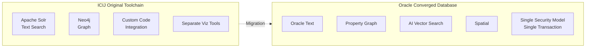
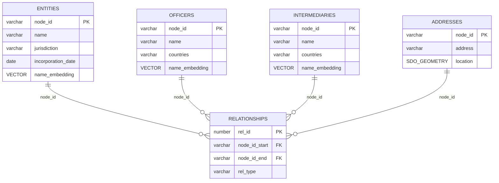
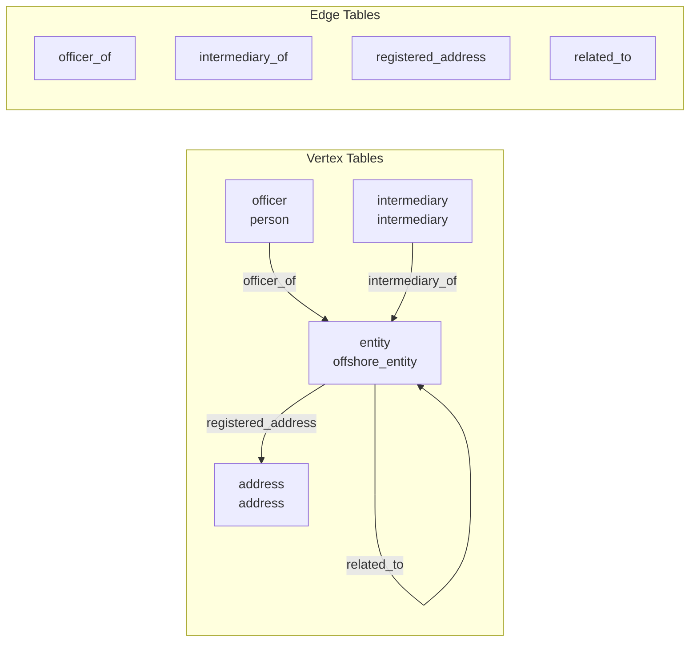

# Implementing Panama Papers Analysis with Oracle Database

## A Technical Guide to Graph, Spatial, Text Search, and AI Vector Capabilities

---

## Introduction: The Converged Database Advantage

The Panama Papers investigation required ICIJ to assemble a fragmented toolchain: Apache Solr for text search, Neo4j for graph analysis, separate visualization tools, and custom integration code to correlate results across systems. Each component required distinct expertise, separate infrastructure, and explicit data movement between systems. Oracle Database's converged architecture eliminates this fragmentation by providing graph, spatial, text search, JSON, and vector capabilities within a single engine—sharing the same security model, transactional guarantees, and query optimizer.



This document provides a technical implementation guide for reproducing the Panama Papers analytical capabilities using Oracle Database. We begin with Python-based data ingestion from the publicly available CSV files, proceed through Oracle Text configuration for fuzzy name matching, detail the Property Graph implementation with PGQL queries and built-in algorithms, demonstrate spatial analysis for geographic pattern detection, and show how AI Vector Search enables semantic entity resolution. The goal is a working proof-of-concept that demonstrates hybrid query capabilities combining multiple data paradigms in single analytical operations.

> **Prerequisites:** This guide assumes familiarity with the Panama Papers background ([Overview.md](Overview.md)) and the ICIJ data model ([TechnicalGuide.md](TechnicalGuide.md)). The authoritative CSV schema and relationship type definitions are in TechnicalGuide.md.

---

## Dataset Overview

The ICIJ Offshore Leaks Database (detailed in [TechnicalGuide.md](TechnicalGuide.md)) provides five CSV files representing a property graph with 810,000+ entities across 200+ countries. For implementation purposes, the key tables are:

| Table            | Primary Key | Oracle Features              |
| ---------------- | ----------- | ---------------------------- |
| `entities`       | node_id     | Text index, Vector embedding |
| `officers`       | node_id     | Text index, Vector embedding |
| `intermediaries` | node_id     | Text index, Vector embedding |
| `addresses`      | node_id     | Spatial geometry             |
| `relationships`  | rel_id      | Graph edges                  |

---

## Environment Setup

### Prerequisites

The implementation requires Oracle Database 23ai (or Autonomous Database) for the full feature set including Property Graph, AI Vector Search, and Select AI. Oracle Database 19c or 21c support Property Graph and Oracle Text but lack the vector capabilities.

Python 3.9 or later with the `oracledb` driver (the thin client mode requires no Oracle Client installation) handles data ingestion. The `pandas` library manages CSV processing.

```bash
# Install Python dependencies
pip install oracledb pandas numpy sentence-transformers
```

### Data Download

The ICIJ Offshore Leaks CSV files can be downloaded using the project CLI or manually:

**Using manage.py (Recommended):**

```bash
# Download and extract CSV files to data/ directory
./manage.py data download
```

The CLI downloads from `https://offshoreleaks-data.icij.org/offshoreleaks/csv/full-oldb.LATEST.zip` (~500MB), extracts the files, and displays a summary of downloaded files. See [Deployment.md](Deployment.md) for the full CLI reference.

**Manual Download:**

```bash
# Alternative: download manually with wget
wget https://offshoreleaks-data.icij.org/offshoreleaks/csv/full-oldb.LATEST.zip
unzip full-oldb.LATEST.zip -d data/
```

### Database Schema Creation

The schema design reflects the graph model while enabling relational access patterns. Each node type becomes a table with a primary key that serves as the vertex identifier in the graph. The relationships table stores edges with foreign keys to the node tables.

```sql
-- Create tablespace for the Panama Papers data
CREATE TABLESPACE panama_data
    DATAFILE 'panama_data01.dbf' SIZE 2G
    AUTOEXTEND ON NEXT 500M MAXSIZE 10G;

-- Create the schema owner
CREATE USER panama_papers IDENTIFIED BY <secure_password>
    DEFAULT TABLESPACE panama_data
    QUOTA UNLIMITED ON panama_data;

GRANT CREATE SESSION, CREATE TABLE, CREATE VIEW, CREATE SEQUENCE,
      CREATE PROCEDURE, CREATE TYPE TO panama_papers;

-- Grant graph-specific privileges
GRANT CREATE PROPERTY GRAPH TO panama_papers;
GRANT GRAPH_DEVELOPER TO panama_papers;

-- Grant text search privileges
GRANT CTXAPP TO panama_papers;

-- Connect as the schema owner for subsequent operations
ALTER SESSION SET CURRENT_SCHEMA = panama_papers;
```

---

## Data Ingestion with Python

### Table Creation

The table structures accommodate the CSV schema while adding columns for Oracle-specific features: spatial geometry columns for addresses, vector columns for embeddings, and appropriate indexes.



```sql
-- Entities table: offshore companies, trusts, foundations
CREATE TABLE entities (
    node_id           VARCHAR2(50) PRIMARY KEY,
    name              VARCHAR2(500),
    jurisdiction      VARCHAR2(200),
    jurisdiction_desc VARCHAR2(500),
    country_codes     VARCHAR2(200),
    countries         VARCHAR2(500),
    incorporation_date DATE,
    inactivation_date DATE,
    struck_off_date   DATE,
    status            VARCHAR2(100),
    service_provider  VARCHAR2(200),
    source_id         VARCHAR2(100),
    address           VARCHAR2(1000),
    internal_id       VARCHAR2(100),
    -- Vector column for semantic search (Oracle 23ai)
    name_embedding    VECTOR(384, FLOAT32),
    -- Timestamp for tracking
    load_timestamp    TIMESTAMP DEFAULT SYSTIMESTAMP
);

-- Officers table: people and companies with roles in entities
CREATE TABLE officers (
    node_id           VARCHAR2(50) PRIMARY KEY,
    name              VARCHAR2(500),
    country_codes     VARCHAR2(200),
    countries         VARCHAR2(500),
    source_id         VARCHAR2(100),
    valid_until       VARCHAR2(100),
    -- Vector column for entity resolution
    name_embedding    VECTOR(384, FLOAT32),
    load_timestamp    TIMESTAMP DEFAULT SYSTIMESTAMP
);

-- Intermediaries table: law firms, banks, agents
CREATE TABLE intermediaries (
    node_id           VARCHAR2(50) PRIMARY KEY,
    name              VARCHAR2(500),
    country_codes     VARCHAR2(200),
    countries         VARCHAR2(500),
    source_id         VARCHAR2(100),
    status            VARCHAR2(100),
    internal_id       VARCHAR2(100),
    address           VARCHAR2(1000),
    name_embedding    VECTOR(384, FLOAT32),
    load_timestamp    TIMESTAMP DEFAULT SYSTIMESTAMP
);

-- Addresses table with spatial geometry
CREATE TABLE addresses (
    node_id           VARCHAR2(50) PRIMARY KEY,
    address           VARCHAR2(2000),
    country_codes     VARCHAR2(200),
    countries         VARCHAR2(500),
    source_id         VARCHAR2(100),
    -- Spatial column for geocoded location
    location          SDO_GEOMETRY,
    load_timestamp    TIMESTAMP DEFAULT SYSTIMESTAMP
);

-- Register the spatial column with Oracle Spatial metadata
INSERT INTO user_sdo_geom_metadata (table_name, column_name, diminfo, srid)
VALUES ('ADDRESSES', 'LOCATION',
    SDO_DIM_ARRAY(
        SDO_DIM_ELEMENT('Longitude', -180, 180, 0.005),
        SDO_DIM_ELEMENT('Latitude', -90, 90, 0.005)
    ),
    4326  -- WGS84 coordinate system
);

-- Relationships table for graph edges
CREATE TABLE relationships (
    rel_id            NUMBER GENERATED ALWAYS AS IDENTITY PRIMARY KEY,
    node_id_start     VARCHAR2(50) NOT NULL,
    node_id_end       VARCHAR2(50) NOT NULL,
    rel_type          VARCHAR2(100) NOT NULL,
    source_id         VARCHAR2(100),
    start_date        DATE,
    end_date          DATE,
    load_timestamp    TIMESTAMP DEFAULT SYSTIMESTAMP
);

-- Create indexes for relationship traversal performance
CREATE INDEX idx_rel_start ON relationships(node_id_start);
CREATE INDEX idx_rel_end ON relationships(node_id_end);
CREATE INDEX idx_rel_type ON relationships(rel_type);
CREATE INDEX idx_rel_start_type ON relationships(node_id_start, rel_type);
```

### Python Ingestion Script

The ingestion script handles CSV loading with proper type conversion, null handling, and batch insertion for performance. The `oracledb` driver's `executemany` method with batch error handling enables efficient bulk loading while capturing problematic records for review.

```python
"""
Panama Papers Data Ingestion Script
Loads ICIJ Offshore Leaks CSV data into Oracle Database

Requirements:
    pip install oracledb pandas numpy
"""

import oracledb
import pandas as pd
import numpy as np
from datetime import datetime
import os

# Configuration - adjust for your environment
DB_CONFIG = {
    'user': 'panama_papers',
    'password': '<secure_password>',
    'dsn': 'localhost:1521/FREEPDB1'  # Adjust for your database
}

# For Autonomous Database, use a wallet:
# DB_CONFIG = {
#     'user': 'panama_papers',
#     'password': '<secure_password>',
#     'dsn': 'your_adb_name_low',
#     'config_dir': '/path/to/wallet',
#     'wallet_location': '/path/to/wallet',
#     'wallet_password': '<wallet_password>'
# }

CSV_DIR = './csv_data'  # Directory containing extracted CSV files
BATCH_SIZE = 5000       # Records per batch insert


def get_connection():
    """Establish database connection using thin mode (no Oracle Client needed)."""
    return oracledb.connect(**DB_CONFIG)


def safe_date_parse(date_str):
    """
    Parse date strings from CSV, handling various formats and null values.
    Returns None for unparseable values rather than raising exceptions.
    """
    if pd.isna(date_str) or date_str == '' or date_str == 'null':
        return None

    # Try common date formats found in the ICIJ data
    formats = ['%Y-%m-%d', '%d-%b-%Y', '%Y/%m/%d', '%d/%m/%Y']
    for fmt in formats:
        try:
            return datetime.strptime(str(date_str).strip(), fmt)
        except ValueError:
            continue
    return None


def truncate_string(value, max_length):
    """Safely truncate strings to fit database column limits."""
    if pd.isna(value) or value is None:
        return None
    str_value = str(value)
    return str_value[:max_length] if len(str_value) > max_length else str_value


def load_entities(connection, csv_path):
    """
    Load entities (offshore companies, trusts, foundations) from CSV.
    These represent the core offshore structures in the investigation.
    """
    print(f"Loading entities from {csv_path}...")

    df = pd.read_csv(csv_path, dtype=str, low_memory=False)
    df.columns = df.columns.str.lower().str.strip()

    cursor = connection.cursor()

    insert_sql = """
        INSERT INTO entities (
            node_id, name, jurisdiction, jurisdiction_desc,
            country_codes, countries, incorporation_date,
            inactivation_date, struck_off_date, status,
            service_provider, source_id, address, internal_id
        ) VALUES (
            :1, :2, :3, :4, :5, :6, :7, :8, :9, :10, :11, :12, :13, :14
        )
    """

    records = []
    total_loaded = 0
    errors = []

    for idx, row in df.iterrows():
        record = (
            truncate_string(row.get('node_id'), 50),
            truncate_string(row.get('name'), 500),
            truncate_string(row.get('jurisdiction'), 200),
            truncate_string(row.get('jurisdiction_description'), 500),
            truncate_string(row.get('country_codes'), 200),
            truncate_string(row.get('countries'), 500),
            safe_date_parse(row.get('incorporation_date')),
            safe_date_parse(row.get('inactivation_date')),
            safe_date_parse(row.get('struck_off_date')),
            truncate_string(row.get('status'), 100),
            truncate_string(row.get('service_provider'), 200),
            truncate_string(row.get('sourceid', row.get('source_id')), 100),
            truncate_string(row.get('address'), 1000),
            truncate_string(row.get('internal_id'), 100)
        )
        records.append(record)

        if len(records) >= BATCH_SIZE:
            try:
                cursor.executemany(insert_sql, records)
                connection.commit()
                total_loaded += len(records)
                print(f"  Loaded {total_loaded:,} entities...")
            except oracledb.Error as e:
                errors.append(f"Batch error at record {total_loaded}: {e}")
                connection.rollback()
            records = []

    if records:
        try:
            cursor.executemany(insert_sql, records)
            connection.commit()
            total_loaded += len(records)
        except oracledb.Error as e:
            errors.append(f"Final batch error: {e}")
            connection.rollback()

    cursor.close()
    print(f"  Completed: {total_loaded:,} entities loaded")
    if errors:
        print(f"  Warnings: {len(errors)} batch errors encountered")

    return total_loaded


def load_officers(connection, csv_path):
    """Load officers (directors, shareholders, beneficiaries) from CSV."""
    print(f"Loading officers from {csv_path}...")

    df = pd.read_csv(csv_path, dtype=str, low_memory=False)
    df.columns = df.columns.str.lower().str.strip()

    cursor = connection.cursor()

    insert_sql = """
        INSERT INTO officers (
            node_id, name, country_codes, countries,
            source_id, valid_until
        ) VALUES (:1, :2, :3, :4, :5, :6)
    """

    records = []
    total_loaded = 0

    for idx, row in df.iterrows():
        record = (
            truncate_string(row.get('node_id'), 50),
            truncate_string(row.get('name'), 500),
            truncate_string(row.get('country_codes'), 200),
            truncate_string(row.get('countries'), 500),
            truncate_string(row.get('sourceid', row.get('source_id')), 100),
            truncate_string(row.get('valid_until'), 100)
        )
        records.append(record)

        if len(records) >= BATCH_SIZE:
            cursor.executemany(insert_sql, records)
            connection.commit()
            total_loaded += len(records)
            print(f"  Loaded {total_loaded:,} officers...")
            records = []

    if records:
        cursor.executemany(insert_sql, records)
        connection.commit()
        total_loaded += len(records)

    cursor.close()
    print(f"  Completed: {total_loaded:,} officers loaded")
    return total_loaded


def load_intermediaries(connection, csv_path):
    """Load intermediaries (law firms, banks, corporate agents) from CSV."""
    print(f"Loading intermediaries from {csv_path}...")

    df = pd.read_csv(csv_path, dtype=str, low_memory=False)
    df.columns = df.columns.str.lower().str.strip()

    cursor = connection.cursor()

    insert_sql = """
        INSERT INTO intermediaries (
            node_id, name, country_codes, countries,
            source_id, status, internal_id, address
        ) VALUES (:1, :2, :3, :4, :5, :6, :7, :8)
    """

    records = []
    total_loaded = 0

    for idx, row in df.iterrows():
        record = (
            truncate_string(row.get('node_id'), 50),
            truncate_string(row.get('name'), 500),
            truncate_string(row.get('country_codes'), 200),
            truncate_string(row.get('countries'), 500),
            truncate_string(row.get('sourceid', row.get('source_id')), 100),
            truncate_string(row.get('status'), 100),
            truncate_string(row.get('internal_id'), 100),
            truncate_string(row.get('address'), 1000)
        )
        records.append(record)

        if len(records) >= BATCH_SIZE:
            cursor.executemany(insert_sql, records)
            connection.commit()
            total_loaded += len(records)
            print(f"  Loaded {total_loaded:,} intermediaries...")
            records = []

    if records:
        cursor.executemany(insert_sql, records)
        connection.commit()
        total_loaded += len(records)

    cursor.close()
    print(f"  Completed: {total_loaded:,} intermediaries loaded")
    return total_loaded


def load_addresses(connection, csv_path):
    """Load addresses from CSV."""
    print(f"Loading addresses from {csv_path}...")

    df = pd.read_csv(csv_path, dtype=str, low_memory=False)
    df.columns = df.columns.str.lower().str.strip()

    cursor = connection.cursor()

    insert_sql = """
        INSERT INTO addresses (
            node_id, address, country_codes, countries, source_id
        ) VALUES (:1, :2, :3, :4, :5)
    """

    records = []
    total_loaded = 0

    for idx, row in df.iterrows():
        record = (
            truncate_string(row.get('node_id'), 50),
            truncate_string(row.get('address', row.get('name')), 2000),
            truncate_string(row.get('country_codes'), 200),
            truncate_string(row.get('countries'), 500),
            truncate_string(row.get('sourceid', row.get('source_id')), 100)
        )
        records.append(record)

        if len(records) >= BATCH_SIZE:
            cursor.executemany(insert_sql, records)
            connection.commit()
            total_loaded += len(records)
            print(f"  Loaded {total_loaded:,} addresses...")
            records = []

    if records:
        cursor.executemany(insert_sql, records)
        connection.commit()
        total_loaded += len(records)

    cursor.close()
    print(f"  Completed: {total_loaded:,} addresses loaded")
    return total_loaded


def load_relationships(connection, csv_path):
    """Load relationships (edges) connecting nodes."""
    print(f"Loading relationships from {csv_path}...")

    df = pd.read_csv(csv_path, dtype=str, low_memory=False)
    df.columns = df.columns.str.lower().str.strip()

    cursor = connection.cursor()

    insert_sql = """
        INSERT INTO relationships (
            node_id_start, node_id_end, rel_type, source_id,
            start_date, end_date
        ) VALUES (:1, :2, :3, :4, :5, :6)
    """

    records = []
    total_loaded = 0

    for idx, row in df.iterrows():
        record = (
            truncate_string(row.get('node_id_start', row.get('start')), 50),
            truncate_string(row.get('node_id_end', row.get('end')), 50),
            truncate_string(row.get('rel_type', row.get('type')), 100),
            truncate_string(row.get('sourceid', row.get('source_id')), 100),
            safe_date_parse(row.get('start_date')),
            safe_date_parse(row.get('end_date'))
        )
        records.append(record)

        if len(records) >= BATCH_SIZE:
            cursor.executemany(insert_sql, records)
            connection.commit()
            total_loaded += len(records)
            print(f"  Loaded {total_loaded:,} relationships...")
            records = []

    if records:
        cursor.executemany(insert_sql, records)
        connection.commit()
        total_loaded += len(records)

    cursor.close()
    print(f"  Completed: {total_loaded:,} relationships loaded")
    return total_loaded


def main():
    """Main ingestion workflow."""
    print("=" * 60)
    print("Panama Papers Data Ingestion")
    print("=" * 60)

    print("\nConnecting to database...")
    connection = get_connection()
    print(f"Connected to: {connection.dsn}")

    stats = {}

    try:
        stats['entities'] = load_entities(
            connection, os.path.join(CSV_DIR, 'nodes-entities.csv'))
        stats['officers'] = load_officers(
            connection, os.path.join(CSV_DIR, 'nodes-officers.csv'))
        stats['intermediaries'] = load_intermediaries(
            connection, os.path.join(CSV_DIR, 'nodes-intermediaries.csv'))
        stats['addresses'] = load_addresses(
            connection, os.path.join(CSV_DIR, 'nodes-addresses.csv'))
        stats['relationships'] = load_relationships(
            connection, os.path.join(CSV_DIR, 'relationships.csv'))

        print("\n" + "=" * 60)
        print("Ingestion Complete")
        print("=" * 60)
        for table, count in stats.items():
            print(f"  {table}: {count:,} records")
        print(f"  Total: {sum(stats.values()):,} records")

    finally:
        connection.close()
        print("\nConnection closed.")


if __name__ == '__main__':
    main()
```

---

## Oracle Text for Fuzzy Name Search

Name matching across leaked documents presents significant challenges: the same individual appears with different spellings, transliterations, inclusion or exclusion of middle names, and various formatting conventions. Oracle Text provides sophisticated fuzzy matching capabilities that address this directly.

### Creating Text Indexes

Oracle Text indexes support multiple search modes. The `CONTEXT` index type provides the richest functionality including fuzzy matching, stemming, and proximity search.

```sql
-- Create supporting lexer with case-insensitive matching
BEGIN
    CTX_DDL.CREATE_PREFERENCE('panama_lexer', 'BASIC_LEXER');
    CTX_DDL.SET_ATTRIBUTE('panama_lexer', 'mixed_case', 'NO');
END;
/

-- Create wordlist enabling fuzzy matching
-- The fuzzy parameters control match sensitivity
BEGIN
    CTX_DDL.CREATE_PREFERENCE('panama_wordlist', 'BASIC_WORDLIST');
    -- Enable fuzzy matching with edit distance calculation
    CTX_DDL.SET_ATTRIBUTE('panama_wordlist', 'FUZZY_MATCH', 'AUTO');
    -- Score threshold: only return matches above this similarity
    CTX_DDL.SET_ATTRIBUTE('panama_wordlist', 'FUZZY_SCORE', '40');
    -- Maximum number of fuzzy expansions per term
    CTX_DDL.SET_ATTRIBUTE('panama_wordlist', 'FUZZY_NUMRESULTS', '100');
    -- Enable soundex for phonetic matching
    CTX_DDL.SET_ATTRIBUTE('panama_wordlist', 'SOUNDEX', 'ENGLISH');
END;
/

-- Create Oracle Text index on entity names
CREATE INDEX idx_entities_name_text ON entities(name)
    INDEXTYPE IS CTXSYS.CONTEXT
    PARAMETERS ('
        LEXER panama_lexer
        WORDLIST panama_wordlist
        SYNC (ON COMMIT)
    ');

-- Create index on officers (where name matching is most critical)
CREATE INDEX idx_officers_name_text ON officers(name)
    INDEXTYPE IS CTXSYS.CONTEXT
    PARAMETERS ('
        LEXER panama_lexer
        WORDLIST panama_wordlist
        SYNC (ON COMMIT)
    ');

-- Create index on intermediaries
CREATE INDEX idx_intermediaries_name_text ON intermediaries(name)
    INDEXTYPE IS CTXSYS.CONTEXT
    PARAMETERS ('
        LEXER panama_lexer
        WORDLIST panama_wordlist
        SYNC (ON COMMIT)
    ');
```

### Fuzzy Search Queries

The `CONTAINS` operator queries Oracle Text indexes with various matching modes. The `FUZZY` operator finds terms within a specified edit distance (number of character changes needed to transform one string into another).

```sql
-- Basic fuzzy search: find officers with names similar to "Gunnlaugsson"
-- (the Icelandic Prime Minister who resigned due to Panama Papers)
-- The FUZZY operator parameters:
--   70 = similarity threshold (0-100, higher = more similar required)
--   100 = maximum expansions to consider
--   weight = use similarity as score weight
SELECT name, countries,
       SCORE(1) as relevance_score
FROM officers
WHERE CONTAINS(name, 'FUZZY(Gunnlaugsson, 70, 100, weight)', 1) > 0
ORDER BY SCORE(1) DESC
FETCH FIRST 20 ROWS ONLY;

-- Search with multiple fuzzy terms (OR logic)
-- Finding variations of "Vladimir Putin" associates
SELECT name, countries,
       SCORE(1) as relevance_score
FROM officers
WHERE CONTAINS(name, 'FUZZY(Vladimir, 60, 50) OR FUZZY(Putin, 70, 50)', 1) > 0
ORDER BY SCORE(1) DESC
FETCH FIRST 50 ROWS ONLY;

-- Wildcard search for partial name matching
-- Useful when you know part of a name
SELECT name, jurisdiction, source_id
FROM entities
WHERE CONTAINS(name, 'MOSSACK%', 1) > 0
ORDER BY name;

-- Combine fuzzy with exact terms
-- Find "Smith" variations associated with "Limited" companies
SELECT name, jurisdiction
FROM entities
WHERE CONTAINS(name, 'FUZZY(Smith, 65, 50) AND Limited', 1) > 0
ORDER BY SCORE(1) DESC;

-- Phonetic search using soundex (finds phonetically similar names)
-- The ! prefix triggers soundex expansion
SELECT name, countries
FROM officers
WHERE CONTAINS(name, '!Smyth', 1) > 0
ORDER BY name;
-- This finds Smith, Smyth, Smithe, etc.

-- Proximity search: find names where terms appear near each other
SELECT name, countries
FROM officers
WHERE CONTAINS(name, 'NEAR((John, Smith), 3)', 1) > 0
ORDER BY SCORE(1) DESC;
```

### Batch Name Matching

The ICIJ journalists valued the ability to upload lists of names and find matches. This pattern implements batch matching efficiently.

```sql
-- Create a temporary table for batch search terms
CREATE GLOBAL TEMPORARY TABLE search_names (
    search_term VARCHAR2(200),
    search_id   NUMBER
) ON COMMIT PRESERVE ROWS;

-- Create results table
CREATE TABLE batch_search_results (
    search_id        NUMBER,
    search_term      VARCHAR2(200),
    matched_node_id  VARCHAR2(50),
    matched_name     VARCHAR2(500),
    node_type        VARCHAR2(20),
    similarity_score NUMBER,
    search_timestamp TIMESTAMP DEFAULT SYSTIMESTAMP
);

-- Procedure to perform batch fuzzy search
CREATE OR REPLACE PROCEDURE batch_fuzzy_search(
    p_similarity_threshold NUMBER DEFAULT 70
) AS
BEGIN
    DELETE FROM batch_search_results
    WHERE search_timestamp < SYSTIMESTAMP - INTERVAL '1' DAY;

    -- Search officers
    INSERT INTO batch_search_results
           (search_id, search_term, matched_node_id, matched_name,
            node_type, similarity_score)
    SELECT sn.search_id,
           sn.search_term,
           o.node_id,
           o.name,
           'OFFICER',
           SCORE(1)
    FROM search_names sn, officers o
    WHERE CONTAINS(o.name,
        'FUZZY(' || REPLACE(sn.search_term, '''', '''''') || ', ' ||
        p_similarity_threshold || ', 100, weight)', 1) > 0;

    -- Search entities
    INSERT INTO batch_search_results
           (search_id, search_term, matched_node_id, matched_name,
            node_type, similarity_score)
    SELECT sn.search_id,
           sn.search_term,
           e.node_id,
           e.name,
           'ENTITY',
           SCORE(1)
    FROM search_names sn, entities e
    WHERE CONTAINS(e.name,
        'FUZZY(' || REPLACE(sn.search_term, '''', '''''') || ', ' ||
        p_similarity_threshold || ', 100, weight)', 1) > 0;

    COMMIT;
END;
/

-- Usage example
BEGIN
    DELETE FROM search_names;
    INSERT INTO search_names VALUES ('Lionel Messi', 1);
    INSERT INTO search_names VALUES ('Sigmundur Gunnlaugsson', 2);
    INSERT INTO search_names VALUES ('Sergei Roldugin', 3);
    COMMIT;

    batch_fuzzy_search(60);
END;
/

-- Review results
SELECT search_term, matched_name, node_type, similarity_score
FROM batch_search_results
ORDER BY search_id, similarity_score DESC;
```

---

## Oracle Property Graph Implementation

Oracle Property Graph provides native graph storage and querying capabilities within the database. The graph can be created as a view over existing relational tables, eliminating data duplication while enabling graph traversal operations.

### Creating the Property Graph

Oracle 23ai introduces SQL-based graph creation syntax that defines vertices and edges declaratively over existing relational tables.



```sql
-- Create the Panama Papers property graph
-- This creates a graph VIEW over the relational tables without copying data
CREATE PROPERTY GRAPH panama_graph
    VERTEX TABLES (
        -- Entity vertices: offshore companies, trusts, foundations
        entities AS entity
            KEY (node_id)
            LABEL offshore_entity
            PROPERTIES (
                node_id,
                name,
                jurisdiction,
                country_codes,
                countries,
                incorporation_date,
                inactivation_date,
                struck_off_date,
                status,
                service_provider,
                source_id
            ),

        -- Officer vertices: people and companies with roles in entities
        officers AS officer
            KEY (node_id)
            LABEL person
            PROPERTIES (
                node_id,
                name,
                country_codes,
                countries,
                source_id
            ),

        -- Intermediary vertices: facilitators (law firms, banks)
        intermediaries AS intermediary
            KEY (node_id)
            LABEL intermediary
            PROPERTIES (
                node_id,
                name,
                country_codes,
                countries,
                status,
                address,
                source_id
            ),

        -- Address vertices
        addresses AS address
            KEY (node_id)
            LABEL address
            PROPERTIES (
                node_id,
                address,
                country_codes,
                countries,
                source_id
            )
    )
    EDGE TABLES (
        -- Officer to Entity relationships (multiple types)
        relationships AS officer_of
            KEY (rel_id)
            SOURCE KEY (node_id_start) REFERENCES officer (node_id)
            DESTINATION KEY (node_id_end) REFERENCES entity (node_id)
            LABEL officer_of
            PROPERTIES (rel_type, source_id)
            WHERE rel_type IN ('officer_of', 'director_of', 'shareholder_of',
                               'beneficiary_of', 'secretary_of', 'protector_of',
                               'nominee_director_of', 'nominee_shareholder_of',
                               'nominee_beneficiary_of'),

        -- Intermediary to Entity relationships
        relationships AS intermediary_of
            KEY (rel_id)
            SOURCE KEY (node_id_start) REFERENCES intermediary (node_id)
            DESTINATION KEY (node_id_end) REFERENCES entity (node_id)
            LABEL intermediary_of
            PROPERTIES (rel_type, source_id)
            WHERE rel_type = 'intermediary_of',

        -- Entity to Address relationships
        relationships AS entity_address
            KEY (rel_id)
            SOURCE KEY (node_id_start) REFERENCES entity (node_id)
            DESTINATION KEY (node_id_end) REFERENCES address (node_id)
            LABEL registered_address
            PROPERTIES (rel_type, source_id)
            WHERE rel_type = 'registered_address',

        -- Officer to Address relationships
        relationships AS officer_address
            KEY (rel_id)
            SOURCE KEY (node_id_start) REFERENCES officer (node_id)
            DESTINATION KEY (node_id_end) REFERENCES address (node_id)
            LABEL has_address
            PROPERTIES (rel_type, source_id)
            WHERE rel_type = 'registered_address',

        -- Entity to Entity relationships (related companies)
        relationships AS related_entity
            KEY (rel_id)
            SOURCE KEY (node_id_start) REFERENCES entity (node_id)
            DESTINATION KEY (node_id_end) REFERENCES entity (node_id)
            LABEL related_to
            PROPERTIES (rel_type, source_id)
            WHERE rel_type LIKE '%entity%'
    );
```

### PGQL Queries: Basic Pattern Matching

PGQL (Property Graph Query Language) provides a pattern-matching syntax optimized for graph traversal. The syntax uses ASCII art-like notation where parentheses represent vertices and arrows represent edges.

```sql
-- Basic pattern match: Find all entities where a specific person is an officer
-- The --> notation indicates edge direction
SELECT e.name AS entity_name,
       e.jurisdiction,
       o.name AS officer_name
FROM GRAPH_TABLE (panama_graph
    MATCH (o IS person) -[r IS officer_of]-> (e IS offshore_entity)
    WHERE o.name LIKE '%Messi%'
    COLUMNS (o.name, e.name, e.jurisdiction)
);

-- Find all officers of entities in the British Virgin Islands
SELECT o.name AS officer_name,
       o.countries AS officer_country,
       e.name AS entity_name
FROM GRAPH_TABLE (panama_graph
    MATCH (o IS person) -[IS officer_of]-> (e IS offshore_entity)
    WHERE e.jurisdiction = 'British Virgin Islands'
    COLUMNS (o.name, o.countries, e.name)
)
FETCH FIRST 100 ROWS ONLY;

-- Find entities with specific relationship types
SELECT o.name AS officer,
       r.rel_type AS role,
       e.name AS entity
FROM GRAPH_TABLE (panama_graph
    MATCH (o IS person) -[r IS officer_of]-> (e IS offshore_entity)
    WHERE r.rel_type = 'beneficiary_of'
    COLUMNS (o.name, r.rel_type, e.name)
)
FETCH FIRST 50 ROWS ONLY;
```

### Multi-Hop Traversals

Graph queries excel at finding indirect connections that would require expensive self-joins in relational SQL.

```sql
-- Find "sibling" companies: entities sharing the same officer
-- This pattern reveals potential coordinated ownership
SELECT e1.name AS entity1,
       o.name AS shared_officer,
       e2.name AS entity2
FROM GRAPH_TABLE (panama_graph
    MATCH (e1 IS offshore_entity) <-[IS officer_of]- (o IS person)
          -[IS officer_of]-> (e2 IS offshore_entity)
    WHERE e1.node_id < e2.node_id  -- Avoid duplicates and self-matches
    COLUMNS (e1.name, o.name, e2.name)
)
FETCH FIRST 100 ROWS ONLY;

-- Three-hop pattern: Officer -> Entity -> Address <- Other Entity
-- Finds entities sharing registered addresses
SELECT e1.name AS entity1,
       a.address,
       e2.name AS entity2
FROM GRAPH_TABLE (panama_graph
    MATCH (e1 IS offshore_entity) -[IS registered_address]-> (a IS address)
          <-[IS registered_address]- (e2 IS offshore_entity)
    WHERE e1.node_id < e2.node_id
    COLUMNS (e1.name, a.address, e2.name)
)
FETCH FIRST 100 ROWS ONLY;

-- Complex pattern: Find intermediaries who created entities
-- where a specific country's residents are officers
SELECT i.name AS intermediary,
       i.countries AS intermediary_country,
       COUNT(DISTINCT e.node_id) AS entity_count,
       COUNT(DISTINCT o.node_id) AS officer_count
FROM GRAPH_TABLE (panama_graph
    MATCH (i IS intermediary) -[IS intermediary_of]-> (e IS offshore_entity)
          <-[IS officer_of]- (o IS person)
    WHERE o.countries LIKE '%Russia%'
    COLUMNS (i.name, i.countries, i.node_id, e.node_id, o.node_id)
)
GROUP BY i.name, i.countries
ORDER BY entity_count DESC
FETCH FIRST 20 ROWS ONLY;
```

### Path Finding Queries

Finding paths between nodes reveals hidden connections—a core capability for investigative analysis.

```sql
-- Shortest path between two specific nodes
-- Reveals how two seemingly unrelated people connect through offshore structures
SELECT *
FROM GRAPH_TABLE (panama_graph
    MATCH SHORTEST (start IS person) (-[e]- (v))* (finish IS person)
    WHERE start.name LIKE '%Roldugin%'    -- Putin's cellist friend
      AND finish.name LIKE '%Gunnlaugsson%' -- Iceland PM
    COLUMNS (
        LISTAGG(v.name, ' -> ') AS path,
        COUNT(e) AS path_length
    )
);

-- All paths up to 3 hops from a person to Panama entities
SELECT o.name AS officer,
       path_length,
       e.name AS panama_entity
FROM GRAPH_TABLE (panama_graph
    MATCH (o IS person) -[r]->+ (e IS offshore_entity)
    WHERE o.name LIKE '%Roldugin%'
      AND e.jurisdiction = 'Panama'
      AND COUNT(r) <= 3
    COLUMNS (o.name, COUNT(r) AS path_length, e.name)
);

-- Variable-length paths: Find all entities reachable within N hops
SELECT DISTINCT e.name, e.jurisdiction, hops
FROM GRAPH_TABLE (panama_graph
    MATCH (start IS person) -[r]->+ (e IS offshore_entity)
    WHERE start.name LIKE '%Messi%'
      AND COUNT(r) <= 4
    COLUMNS (e.name, e.jurisdiction, COUNT(r) AS hops)
)
ORDER BY hops, e.name;
```

### Aggregation and Analytics

Combining graph patterns with SQL aggregation provides analytical insights.

```sql
-- Find the most active intermediaries (created most entities)
SELECT i.name AS intermediary_name,
       i.countries AS intermediary_country,
       COUNT(*) AS entities_created
FROM GRAPH_TABLE (panama_graph
    MATCH (i IS intermediary) -[IS intermediary_of]-> (e IS offshore_entity)
    COLUMNS (i.name, i.countries, e.node_id)
)
GROUP BY i.name, i.countries
ORDER BY entities_created DESC
FETCH FIRST 20 ROWS ONLY;

-- Jurisdiction analysis: which jurisdictions host entities
-- with officers from specific countries?
SELECT e.jurisdiction,
       COUNT(DISTINCT e.node_id) AS entity_count,
       COUNT(DISTINCT o.node_id) AS unique_officers
FROM GRAPH_TABLE (panama_graph
    MATCH (o IS person) -[IS officer_of]-> (e IS offshore_entity)
    WHERE o.countries LIKE '%China%'
    COLUMNS (e.jurisdiction, e.node_id, o.node_id)
)
GROUP BY e.jurisdiction
ORDER BY entity_count DESC
FETCH FIRST 15 ROWS ONLY;

-- Network density: officers with the most entity connections
SELECT o.name,
       o.countries,
       COUNT(DISTINCT e.node_id) AS entity_count,
       COUNT(DISTINCT e.jurisdiction) AS jurisdiction_diversity
FROM GRAPH_TABLE (panama_graph
    MATCH (o IS person) -[IS officer_of]-> (e IS offshore_entity)
    COLUMNS (o.name, o.countries, e.node_id, e.jurisdiction)
)
GROUP BY o.name, o.countries
HAVING COUNT(DISTINCT e.node_id) > 10
ORDER BY entity_count DESC
FETCH FIRST 50 ROWS ONLY;

-- Cross-jurisdiction flow: which country pairs have the most connections?
-- This reveals the flow patterns in offshore finance
SELECT officer_country,
       entity_jurisdiction,
       connection_count
FROM (
    SELECT o.countries AS officer_country,
           e.jurisdiction AS entity_jurisdiction,
           COUNT(*) AS connection_count
    FROM GRAPH_TABLE (panama_graph
        MATCH (o IS person) -[IS officer_of]-> (e IS offshore_entity)
        WHERE o.countries IS NOT NULL
          AND e.jurisdiction IS NOT NULL
        COLUMNS (o.countries, e.jurisdiction)
    )
    GROUP BY o.countries, e.jurisdiction
)
WHERE connection_count > 100
ORDER BY connection_count DESC
FETCH FIRST 50 ROWS ONLY;
```

---

## Graph Algorithms

Oracle Graph Server (PGX) provides built-in implementations of graph algorithms that run in-memory for performance. These algorithms identify structural patterns that visual inspection and simple queries would miss.

### PageRank: Finding Important Nodes

PageRank identifies nodes that are connected to many other well-connected nodes. In the Panama Papers context, high PageRank officers are those connected to entities that are themselves well-connected—suggesting hub positions in the network.

```python
"""
Graph Algorithm Execution with Python
Uses the Oracle Graph Python client for algorithm execution
"""

from opg4py import Graph
import oracledb
import pandas as pd

# Connect to the graph server
graph_client = Graph(
    base_url="https://localhost:7007",
    username="panama_papers",
    password="<password>"
)

# Load the graph from the database
graph = graph_client.get_graph("PANAMA_GRAPH")

print(f"Graph loaded: {graph.num_vertices} vertices, {graph.num_edges} edges")

# Execute PageRank to find influential nodes
# damping_factor: probability of following an edge (vs random jump)
# Higher values emphasize link structure more
pagerank = graph.pagerank(
    damping_factor=0.85,
    max_iterations=100,
    tolerance=0.0001
)

# Get top results
print("\nTop 30 Nodes by PageRank:")
print("-" * 60)
top_nodes = pagerank.get_top_k(30)
for node_id, score in top_nodes:
    vertex = graph.get_vertex(node_id)
    print(f"{vertex.get_property('name')[:50]:50} {score:.6f}")
```

### Betweenness Centrality: Finding Connectors

Betweenness centrality identifies nodes that sit on many shortest paths between other nodes. These are critical connectors—removing them would break network connectivity. In Panama Papers, these are often the professional intermediaries who connect otherwise separate groups.

```python
# Execute Betweenness Centrality
# This is computationally expensive for large graphs
# Consider sampling for very large networks
betweenness = graph.vertex_betweenness_centrality()

print("\nTop 20 Nodes by Betweenness Centrality:")
print("-" * 60)
top_betweenness = betweenness.get_top_k(20)
for node_id, score in top_betweenness:
    vertex = graph.get_vertex(node_id)
    node_type = vertex.get_label()
    print(f"[{node_type:15}] {vertex.get_property('name')[:40]:40} {score:.6f}")
```

### Community Detection: Finding Clusters

Community detection algorithms identify groups of nodes that are more densely connected to each other than to the rest of the network. The Louvain algorithm is particularly effective for large networks.

```python
# Execute Community Detection (Louvain algorithm)
# resolution: higher values find smaller communities
communities = graph.louvain(
    max_iterations=10,
    resolution=1.0
)

# Get community assignments
community_assignments = communities.get_community_assignments()

# Analyze community structure
from collections import Counter
community_sizes = Counter(community_assignments.values())

print(f"\nCommunity Detection Results:")
print(f"Total communities detected: {len(community_sizes)}")
print(f"\nLargest 10 communities:")
for community_id, size in community_sizes.most_common(10):
    print(f"  Community {community_id}: {size:,} nodes")

# Export community assignments to database for further analysis
community_df = pd.DataFrame([
    {'node_id': node_id, 'community_id': comm_id}
    for node_id, comm_id in community_assignments.items()
])

# Write to Oracle
connection = oracledb.connect(
    user="panama_papers",
    password="<password>",
    dsn="localhost:1521/FREEPDB1"
)

cursor = connection.cursor()
cursor.execute("CREATE TABLE node_communities (node_id VARCHAR2(50), community_id NUMBER)")

cursor.executemany(
    "INSERT INTO node_communities VALUES (:1, :2)",
    list(community_df.itertuples(index=False, name=None))
)
connection.commit()
connection.close()

print("\nCommunity assignments exported to database")
```

### Weakly Connected Components

Connected components identify isolated subgraphs—groups of nodes with no path connecting them to other groups. This reveals the overall structure of the network.

```python
# Weakly Connected Components
components = graph.weakly_connected_components()
component_assignments = components.get_component_assignments()

component_sizes = Counter(component_assignments.values())
print(f"\nConnected Components Analysis:")
print(f"Total components: {len(component_sizes)}")
print(f"Largest component: {max(component_sizes.values()):,} nodes")
print(f"Singleton components: {sum(1 for s in component_sizes.values() if s == 1)}")

# The largest component typically contains most nodes
# Smaller components may represent isolated structures worth investigating
print(f"\nComponents with 10-100 nodes (potentially interesting isolated groups):")
interesting = [(cid, size) for cid, size in component_sizes.items()
               if 10 <= size <= 100]
for comp_id, size in sorted(interesting, key=lambda x: -x[1])[:10]:
    print(f"  Component {comp_id}: {size} nodes")
```

### SQL Interface to Algorithm Results

After running algorithms, the results can be joined with relational tables for combined analysis.

```sql
-- After PageRank results are stored in pagerank_scores table
-- Analyze which jurisdictions have the highest-ranked entities
SELECT e.jurisdiction,
       COUNT(*) AS entity_count,
       AVG(pr.pagerank) AS avg_pagerank,
       MAX(pr.pagerank) AS max_pagerank
FROM entities e
JOIN pagerank_scores pr ON e.node_id = pr.node_id
GROUP BY e.jurisdiction
ORDER BY avg_pagerank DESC
FETCH FIRST 15 ROWS ONLY;

-- Find the highest PageRank officers and their entity connections
SELECT o.name,
       o.countries,
       pr.pagerank,
       COUNT(DISTINCT r.node_id_end) AS entity_count
FROM officers o
JOIN pagerank_scores pr ON o.node_id = pr.node_id
JOIN relationships r ON o.node_id = r.node_id_start
WHERE r.rel_type LIKE '%officer%'
GROUP BY o.name, o.countries, pr.pagerank
ORDER BY pr.pagerank DESC
FETCH FIRST 30 ROWS ONLY;

-- Analyze community composition
-- Which communities span multiple jurisdictions?
SELECT nc.community_id,
       COUNT(DISTINCT e.node_id) AS entity_count,
       COUNT(DISTINCT e.jurisdiction) AS jurisdiction_count,
       LISTAGG(DISTINCT e.jurisdiction, ', ')
           WITHIN GROUP (ORDER BY e.jurisdiction) AS jurisdictions
FROM node_communities nc
JOIN entities e ON nc.node_id = e.node_id
GROUP BY nc.community_id
HAVING COUNT(DISTINCT e.jurisdiction) > 3
ORDER BY entity_count DESC
FETCH FIRST 20 ROWS ONLY;
```

---

## Oracle Spatial for Geographic Analysis

The addresses in the Panama Papers can be geocoded to coordinates, enabling spatial queries that reveal geographic patterns invisible in textual analysis.

### Geocoding and Spatial Index Creation

Geocoding converts address text to latitude/longitude coordinates. After geocoding (via external service or batch processing), create spatial indexes for efficient queries.

```sql
-- After geocoding, update addresses with coordinates
-- Example: Update a single address with known coordinates
UPDATE addresses
SET location = SDO_GEOMETRY(
    2001,                        -- Point geometry type
    4326,                        -- SRID for WGS84 (GPS coordinates)
    SDO_POINT_TYPE(
        -79.5341,                -- Longitude (Panama City)
        9.0012,                  -- Latitude
        NULL
    ),
    NULL, NULL
)
WHERE node_id = 'address_123';

-- Batch geocoding would typically use an external service
-- and update the location column in batches

-- Create spatial index for efficient geometric queries
CREATE INDEX idx_addresses_spatial ON addresses(location)
    INDEXTYPE IS MDSYS.SPATIAL_INDEX_V2;
```

### Spatial Queries

```sql
-- Find all addresses within 5km of Mossack Fonseca's office
-- Panama City coordinates: -79.5341, 9.0012
SELECT a.address,
       a.countries,
       SDO_GEOM.SDO_DISTANCE(
           a.location,
           SDO_GEOMETRY(2001, 4326,
                        SDO_POINT_TYPE(-79.5341, 9.0012, NULL),
                        NULL, NULL),
           0.005, 'unit=KM'
       ) AS distance_km
FROM addresses a
WHERE a.location IS NOT NULL
  AND SDO_WITHIN_DISTANCE(
        a.location,
        SDO_GEOMETRY(2001, 4326,
                     SDO_POINT_TYPE(-79.5341, 9.0012, NULL),
                     NULL, NULL),
        'distance=5 unit=KM'
      ) = 'TRUE'
ORDER BY distance_km;

-- Geographic clustering: find address concentrations by country
SELECT a.countries,
       COUNT(*) AS address_count,
       SDO_GEOM.SDO_CENTROID(
           SDO_AGGR_CONVEXHULL(SDOAGGRTYPE(a.location, 0.005)),
           0.005
       ) AS geographic_center
FROM addresses a
WHERE a.location IS NOT NULL
GROUP BY a.countries
HAVING COUNT(*) > 50
ORDER BY address_count DESC;

-- Find entities in a specific geographic region (bounding box)
-- Example: Caribbean region
SELECT e.name,
       e.jurisdiction,
       a.address
FROM entities e
JOIN relationships r ON e.node_id = r.node_id_start
JOIN addresses a ON r.node_id_end = a.node_id
WHERE r.rel_type = 'registered_address'
  AND a.location IS NOT NULL
  AND SDO_INSIDE(
        a.location,
        SDO_GEOMETRY(2003, 4326, NULL,
            SDO_ELEM_INFO_ARRAY(1, 1003, 3),
            SDO_ORDINATE_ARRAY(
                -90, 10,    -- Lower-left corner (lon, lat)
                -60, 25     -- Upper-right corner
            )
        )
      ) = 'TRUE';
```

### Combining Spatial with Graph Queries

```sql
-- Find officers connected to entities registered in a geographic area
-- then trace their other entity connections
WITH caribbean_entities AS (
    SELECT e.node_id, e.name, e.jurisdiction
    FROM entities e
    JOIN relationships r ON e.node_id = r.node_id_start
    JOIN addresses a ON r.node_id_end = a.node_id
    WHERE r.rel_type = 'registered_address'
      AND a.location IS NOT NULL
      AND SDO_WITHIN_DISTANCE(
            a.location,
            SDO_GEOMETRY(2001, 4326,
                         SDO_POINT_TYPE(-64.7, 18.3, NULL),
                         NULL, NULL),
            'distance=500 unit=KM'
          ) = 'TRUE'
)
SELECT o.name AS officer,
       o.countries AS officer_country,
       ce.name AS caribbean_entity,
       ce.jurisdiction,
       other_e.name AS other_entity,
       other_e.jurisdiction AS other_jurisdiction
FROM caribbean_entities ce
JOIN relationships r1 ON ce.node_id = r1.node_id_end
JOIN officers o ON r1.node_id_start = o.node_id
JOIN relationships r2 ON o.node_id = r2.node_id_start
JOIN entities other_e ON r2.node_id_end = other_e.node_id
WHERE r1.rel_type LIKE '%officer%'
  AND r2.rel_type LIKE '%officer%'
  AND other_e.node_id != ce.node_id
ORDER BY o.name, ce.name;
```

---

## AI Vector Search for Entity Resolution

Entity resolution—determining when different records refer to the same real-world entity—is fundamental to investigative analysis. Oracle 23ai's vector capabilities enable semantic matching that goes beyond string similarity.

### Generating Name Embeddings

Vector embeddings capture semantic meaning in high-dimensional space, allowing similarity comparisons between names and contexts.

```python
"""
Generate embeddings for entity resolution using sentence-transformers
"""

from sentence_transformers import SentenceTransformer
import oracledb
import numpy as np

# Load embedding model (runs locally, no API needed)
# all-MiniLM-L6-v2 produces 384-dimensional embeddings
# Good balance of quality and speed
model = SentenceTransformer('all-MiniLM-L6-v2')

print(f"Model loaded. Embedding dimension: {model.get_sentence_embedding_dimension()}")

# Connect to Oracle
connection = oracledb.connect(
    user="panama_papers",
    password="<password>",
    dsn="localhost:1521/FREEPDB1"
)

def generate_embeddings_batch(table_name, batch_size=500):
    """Generate and store embeddings for a table's name column."""

    cursor = connection.cursor()

    # Get records without embeddings
    cursor.execute(f"""
        SELECT node_id, name
        FROM {table_name}
        WHERE name IS NOT NULL
          AND name_embedding IS NULL
    """)

    total_processed = 0

    while True:
        rows = cursor.fetchmany(batch_size)
        if not rows:
            break

        node_ids = [row[0] for row in rows]
        names = [row[1] if row[1] else '' for row in rows]

        # Generate embeddings (batch processing is efficient)
        embeddings = model.encode(names, show_progress_bar=False)

        # Update database with embeddings
        update_cursor = connection.cursor()
        for node_id, embedding in zip(node_ids, embeddings):
            # Convert numpy array to list for Oracle VECTOR type
            embedding_list = embedding.tolist()

            update_cursor.execute(f"""
                UPDATE {table_name}
                SET name_embedding = :embedding
                WHERE node_id = :node_id
            """, {
                'embedding': embedding_list,
                'node_id': node_id
            })

        connection.commit()
        total_processed += len(node_ids)
        print(f"  {table_name}: Processed {total_processed:,} records...")

    cursor.close()
    return total_processed

# Generate embeddings for all tables
print("Generating embeddings for officers...")
officers_count = generate_embeddings_batch('officers')
print(f"Completed: {officers_count:,} officers")

print("\nGenerating embeddings for entities...")
entities_count = generate_embeddings_batch('entities')
print(f"Completed: {entities_count:,} entities")

print("\nGenerating embeddings for intermediaries...")
intermediaries_count = generate_embeddings_batch('intermediaries')
print(f"Completed: {intermediaries_count:,} intermediaries")

connection.close()
print("\nAll embeddings generated successfully!")
```

### Vector Index Creation

```sql
-- Create vector index for efficient similarity search
-- ORGANIZATION NEIGHBOR PARTITIONS uses IVF (Inverted File) indexing
-- Good for large-scale approximate nearest neighbor search
CREATE VECTOR INDEX idx_officers_name_vec ON officers(name_embedding)
    ORGANIZATION NEIGHBOR PARTITIONS
    WITH DISTANCE COSINE;

CREATE VECTOR INDEX idx_entities_name_vec ON entities(name_embedding)
    ORGANIZATION NEIGHBOR PARTITIONS
    WITH DISTANCE COSINE;

CREATE VECTOR INDEX idx_intermediaries_name_vec ON intermediaries(name_embedding)
    ORGANIZATION NEIGHBOR PARTITIONS
    WITH DISTANCE COSINE;
```

### Vector Similarity Queries

```sql
-- Find officers with names semantically similar to a query
-- First, generate the query embedding (done in application code)
-- Then use it in the query

-- Example: Find names similar to "Vladimir Putin"
-- (query_embedding would be passed as a bind variable)
SELECT name,
       countries,
       VECTOR_DISTANCE(name_embedding, :query_embedding, COSINE) AS similarity
FROM officers
WHERE name_embedding IS NOT NULL
ORDER BY VECTOR_DISTANCE(name_embedding, :query_embedding, COSINE)
FETCH FIRST 20 ROWS ONLY;

-- Find potential duplicate officers using vector similarity
-- Low distance = high similarity
SELECT o1.node_id AS id1,
       o1.name AS name1,
       o2.node_id AS id2,
       o2.name AS name2,
       VECTOR_DISTANCE(o1.name_embedding, o2.name_embedding, COSINE) AS distance
FROM officers o1, officers o2
WHERE o1.node_id < o2.node_id  -- Avoid self-joins and duplicates
  AND o1.name_embedding IS NOT NULL
  AND o2.name_embedding IS NOT NULL
  AND VECTOR_DISTANCE(o1.name_embedding, o2.name_embedding, COSINE) < 0.15
ORDER BY distance
FETCH FIRST 1000 ROWS ONLY;
```

### Python Entity Resolution Pipeline

```python
"""
Entity Resolution Pipeline combining vector search with fuzzy matching
"""

import oracledb
from sentence_transformers import SentenceTransformer
import numpy as np

model = SentenceTransformer('all-MiniLM-L6-v2')

connection = oracledb.connect(
    user="panama_papers",
    password="<password>",
    dsn="localhost:1521/FREEPDB1"
)


def find_similar_names(query_name, table='officers', top_k=20,
                       max_distance=0.3):
    """
    Find records with names similar to the query using vector search.

    Args:
        query_name: Name to search for
        table: Table to search (officers, entities, intermediaries)
        top_k: Number of results to return
        max_distance: Maximum cosine distance (0=identical, 2=opposite)

    Returns:
        List of (node_id, name, distance) tuples
    """
    # Generate embedding for query
    query_embedding = model.encode(query_name).tolist()

    cursor = connection.cursor()

    # Vector similarity search
    cursor.execute(f"""
        SELECT node_id, name,
               VECTOR_DISTANCE(name_embedding, :embedding, COSINE) AS distance
        FROM {table}
        WHERE name_embedding IS NOT NULL
        ORDER BY VECTOR_DISTANCE(name_embedding, :embedding, COSINE)
        FETCH FIRST :top_k ROWS ONLY
    """, {
        'embedding': query_embedding,
        'top_k': top_k
    })

    results = []
    for row in cursor:
        if row[2] <= max_distance:
            results.append({
                'node_id': row[0],
                'name': row[1],
                'distance': row[2],
                'similarity': 1 - row[2]  # Convert distance to similarity
            })

    cursor.close()
    return results


def find_duplicate_candidates(table='officers', distance_threshold=0.15,
                               limit=1000):
    """
    Find potential duplicate records based on name embedding similarity.

    Returns pairs of records that may represent the same real-world entity.
    """
    cursor = connection.cursor()

    cursor.execute(f"""
        SELECT o1.node_id, o1.name, o2.node_id, o2.name,
               VECTOR_DISTANCE(o1.name_embedding, o2.name_embedding, COSINE) AS distance
        FROM {table} o1, {table} o2
        WHERE o1.node_id < o2.node_id
          AND o1.name_embedding IS NOT NULL
          AND o2.name_embedding IS NOT NULL
          AND VECTOR_DISTANCE(o1.name_embedding, o2.name_embedding, COSINE) < :threshold
        ORDER BY VECTOR_DISTANCE(o1.name_embedding, o2.name_embedding, COSINE)
        FETCH FIRST :limit ROWS ONLY
    """, {
        'threshold': distance_threshold,
        'limit': limit
    })

    duplicates = []
    for row in cursor:
        duplicates.append({
            'id1': row[0],
            'name1': row[1],
            'id2': row[2],
            'name2': row[3],
            'distance': row[4],
            'similarity': 1 - row[4]
        })

    cursor.close()
    return duplicates


# Example usage
print("Searching for names similar to 'Vladimir Putin'...")
results = find_similar_names("Vladimir Putin", table='officers')
print(f"\nFound {len(results)} similar names:")
for r in results[:10]:
    print(f"  {r['name'][:50]:50} (similarity: {r['similarity']:.3f})")

print("\n" + "="*60)
print("Finding potential duplicate officers...")
duplicates = find_duplicate_candidates(table='officers',
                                        distance_threshold=0.12)
print(f"\nFound {len(duplicates)} potential duplicate pairs:")
for d in duplicates[:20]:
    print(f"  '{d['name1'][:30]}' <-> '{d['name2'][:30]}' "
          f"(similarity: {d['similarity']:.3f})")

connection.close()
```

### Hybrid Search: Combining Vector and Text

The most powerful matching combines vector semantics with traditional text operations.

```sql
-- Hybrid search: vector similarity boosted by fuzzy text match
-- This catches both semantic and orthographic similarities

WITH query_params AS (
    -- In practice, query_embedding comes from application code
    SELECT :query_embedding AS embedding,
           :query_text AS search_text
    FROM dual
)
SELECT o.name,
       o.countries,
       VECTOR_DISTANCE(o.name_embedding, q.embedding, COSINE) AS vector_dist,
       SCORE(1) AS text_score
FROM officers o, query_params q
WHERE o.name_embedding IS NOT NULL
  AND (
      -- Vector similarity threshold
      VECTOR_DISTANCE(o.name_embedding, q.embedding, COSINE) < 0.4
      OR
      -- Fuzzy text match
      CONTAINS(o.name, 'FUZZY(' || q.search_text || ', 60, 50)', 1) > 0
  )
ORDER BY
    -- Combined ranking: prioritize matches found by both methods
    CASE
        WHEN VECTOR_DISTANCE(o.name_embedding, q.embedding, COSINE) < 0.3
             AND SCORE(1) > 50 THEN 1
        WHEN VECTOR_DISTANCE(o.name_embedding, q.embedding, COSINE) < 0.3 THEN 2
        WHEN SCORE(1) > 50 THEN 3
        ELSE 4
    END,
    VECTOR_DISTANCE(o.name_embedding, q.embedding, COSINE)
FETCH FIRST 30 ROWS ONLY;
```

---

## Select AI for Natural Language Queries

Oracle Select AI translates natural language questions into SQL, enabling analysts to query the data without SQL expertise. This democratizes access to the analytical capabilities.

```sql
-- Enable Select AI with your AI provider profile
BEGIN
    DBMS_CLOUD_AI.CREATE_PROFILE(
        profile_name => 'PANAMA_AI_PROFILE',
        attributes => JSON_OBJECT(
            'provider' => 'OCI',
            'credential_name' => 'OCI_AI_CRED',
            'model' => 'cohere.command',
            'object_list' => JSON_ARRAY(
                JSON_OBJECT('owner' => 'PANAMA_PAPERS', 'name' => 'ENTITIES'),
                JSON_OBJECT('owner' => 'PANAMA_PAPERS', 'name' => 'OFFICERS'),
                JSON_OBJECT('owner' => 'PANAMA_PAPERS', 'name' => 'INTERMEDIARIES'),
                JSON_OBJECT('owner' => 'PANAMA_PAPERS', 'name' => 'RELATIONSHIPS')
            )
        )
    );
END;
/

-- Set the profile for the session
BEGIN
    DBMS_CLOUD_AI.SET_PROFILE('PANAMA_AI_PROFILE');
END;
/

-- Natural language queries work directly
SELECT AI How many entities are registered in the British Virgin Islands;

SELECT AI Show me the top 10 officers by number of entities they control;

SELECT AI Find all entities created by Mossack Fonseca in 2010;

SELECT AI Which jurisdictions have the most entities with Russian officers;

-- The SHOWSQL option reveals the generated SQL
SELECT AI SHOWSQL What percentage of entities were inactivated after 2015;
```

---

## Oracle Machine Learning for Anomaly Detection

Beyond descriptive analytics, machine learning can identify suspicious patterns proactively.

```sql
-- Create a feature table for entity anomaly scoring
CREATE TABLE entity_features AS
SELECT e.node_id,
       e.name,
       e.jurisdiction,
       -- Feature: number of officers
       (SELECT COUNT(*) FROM relationships r
        WHERE r.node_id_end = e.node_id
        AND r.rel_type LIKE '%officer%') AS officer_count,
       -- Feature: number of related entities
       (SELECT COUNT(*) FROM relationships r
        WHERE r.node_id_start = e.node_id
        AND r.rel_type LIKE '%entity%') AS related_count,
       -- Feature: days active
       CASE WHEN e.inactivation_date IS NOT NULL
            THEN e.inactivation_date - e.incorporation_date
            ELSE SYSDATE - e.incorporation_date END AS days_active,
       -- Feature: jurisdiction diversity of officers
       (SELECT COUNT(DISTINCT o.countries)
        FROM relationships r
        JOIN officers o ON r.node_id_start = o.node_id
        WHERE r.node_id_end = e.node_id) AS country_diversity
FROM entities e
WHERE e.incorporation_date IS NOT NULL;

-- Create settings table for anomaly detection model
CREATE TABLE anomaly_settings (
    setting_name VARCHAR2(30),
    setting_value VARCHAR2(4000)
);

INSERT INTO anomaly_settings VALUES
    ('ALGO_NAME', 'ALGO_ISOLATION_FOREST');
INSERT INTO anomaly_settings VALUES
    ('ODMS_OUTLIER_CONTAMINATION', '0.05');  -- Expect 5% anomalies
COMMIT;

-- Train an isolation forest for anomaly detection
BEGIN
    DBMS_DATA_MINING.CREATE_MODEL(
        model_name          => 'ENTITY_ANOMALY_MODEL',
        mining_function     => DBMS_DATA_MINING.CLASSIFICATION,
        data_table_name     => 'ENTITY_FEATURES',
        case_id_column_name => 'NODE_ID',
        settings_table_name => 'ANOMALY_SETTINGS'
    );
END;
/

-- Score entities for anomaly likelihood
SELECT ef.node_id,
       ef.name,
       ef.jurisdiction,
       ef.officer_count,
       ef.related_count,
       ef.days_active,
       PREDICTION(ENTITY_ANOMALY_MODEL USING *) AS anomaly_flag,
       PREDICTION_PROBABILITY(ENTITY_ANOMALY_MODEL, 1 USING *) AS anomaly_score
FROM entity_features ef
WHERE PREDICTION(ENTITY_ANOMALY_MODEL USING *) = 1
ORDER BY PREDICTION_PROBABILITY(ENTITY_ANOMALY_MODEL, 1 USING *) DESC
FETCH FIRST 100 ROWS ONLY;
```

---

## Visualization with Python

### Jurisdiction Distribution

```python
"""
Visualization examples for Panama Papers analysis
"""

import oracledb
import pandas as pd
import matplotlib.pyplot as plt
import matplotlib.ticker as ticker

connection = oracledb.connect(
    user="panama_papers",
    password="<password>",
    dsn="localhost:1521/FREEPDB1"
)

# Jurisdiction distribution
query = """
    SELECT jurisdiction, COUNT(*) as entity_count
    FROM entities
    WHERE jurisdiction IS NOT NULL
    GROUP BY jurisdiction
    ORDER BY entity_count DESC
    FETCH FIRST 15 ROWS ONLY
"""
df = pd.read_sql(query, connection)

fig, ax = plt.subplots(figsize=(12, 8))
bars = ax.barh(df['JURISDICTION'], df['ENTITY_COUNT'], color='#2E86AB')
ax.set_xlabel('Number of Entities', fontsize=12)
ax.set_ylabel('Jurisdiction', fontsize=12)
ax.set_title('Top 15 Jurisdictions by Entity Count\nICIJ Offshore Leaks Database',
             fontsize=14, fontweight='bold')
ax.invert_yaxis()  # Largest at top
ax.xaxis.set_major_formatter(ticker.StrMethodFormatter('{x:,.0f}'))

# Add value labels
for bar, value in zip(bars, df['ENTITY_COUNT']):
    ax.text(value + 1000, bar.get_y() + bar.get_height()/2,
            f'{value:,}', va='center', fontsize=10)

plt.tight_layout()
plt.savefig('jurisdiction_distribution.png', dpi=150, bbox_inches='tight')
print("Saved: jurisdiction_distribution.png")
```

### Temporal Analysis

```python
# Temporal analysis: incorporations over time
temporal_query = """
    SELECT EXTRACT(YEAR FROM incorporation_date) as year,
           COUNT(*) as incorporations
    FROM entities
    WHERE incorporation_date IS NOT NULL
      AND EXTRACT(YEAR FROM incorporation_date) BETWEEN 1980 AND 2015
    GROUP BY EXTRACT(YEAR FROM incorporation_date)
    ORDER BY year
"""
temporal_df = pd.read_sql(temporal_query, connection)

fig, ax = plt.subplots(figsize=(14, 6))
ax.fill_between(temporal_df['YEAR'], temporal_df['INCORPORATIONS'],
                alpha=0.3, color='#2E86AB')
ax.plot(temporal_df['YEAR'], temporal_df['INCORPORATIONS'],
        marker='o', linewidth=2, markersize=4, color='#2E86AB')

ax.set_xlabel('Year', fontsize=12)
ax.set_ylabel('Number of Incorporations', fontsize=12)
ax.set_title('Offshore Entity Incorporations Over Time (1980-2015)',
             fontsize=14, fontweight='bold')
ax.grid(True, alpha=0.3)
ax.yaxis.set_major_formatter(ticker.StrMethodFormatter('{x:,.0f}'))

# Annotate key events
ax.annotate('Post-2008\nFinancial Crisis',
            xy=(2009, temporal_df[temporal_df['YEAR']==2009]['INCORPORATIONS'].values[0]),
            xytext=(2011, 20000), fontsize=10,
            arrowprops=dict(arrowstyle='->', color='gray'))

plt.tight_layout()
plt.savefig('temporal_analysis.png', dpi=150, bbox_inches='tight')
print("Saved: temporal_analysis.png")
```

### Network Visualization

```python
from pyvis.network import Network
import networkx as nx

# Get subgraph around a specific officer
subgraph_query = """
    SELECT r.node_id_start,
           r.node_id_end,
           r.rel_type,
           COALESCE(o.name, e1.name, i.name) as start_name,
           COALESCE(e2.name, a.address) as end_name,
           CASE
               WHEN o.node_id IS NOT NULL THEN 'officer'
               WHEN e1.node_id IS NOT NULL THEN 'entity'
               WHEN i.node_id IS NOT NULL THEN 'intermediary'
               ELSE 'unknown'
           END as start_type,
           CASE
               WHEN e2.node_id IS NOT NULL THEN 'entity'
               WHEN a.node_id IS NOT NULL THEN 'address'
               ELSE 'unknown'
           END as end_type
    FROM relationships r
    LEFT JOIN officers o ON r.node_id_start = o.node_id
    LEFT JOIN entities e1 ON r.node_id_start = e1.node_id
    LEFT JOIN intermediaries i ON r.node_id_start = i.node_id
    LEFT JOIN entities e2 ON r.node_id_end = e2.node_id
    LEFT JOIN addresses a ON r.node_id_end = a.node_id
    WHERE r.node_id_start IN (
        SELECT node_id FROM officers WHERE UPPER(name) LIKE '%MESSI%'
    )
    OR r.node_id_end IN (
        SELECT node_id FROM entities WHERE node_id IN (
            SELECT node_id_end FROM relationships
            WHERE node_id_start IN (
                SELECT node_id FROM officers WHERE UPPER(name) LIKE '%MESSI%'
            )
        )
    )
    FETCH FIRST 200 ROWS ONLY
"""
edges_df = pd.read_sql(subgraph_query, connection)

# Create interactive network visualization
net = Network(height='750px', width='100%', bgcolor='#ffffff',
              font_color='#333333', directed=True)

# Color mapping for node types
colors = {
    'officer': '#E74C3C',      # Red
    'entity': '#3498DB',       # Blue
    'intermediary': '#2ECC71', # Green
    'address': '#F39C12',      # Orange
    'unknown': '#95A5A6'       # Gray
}

# Add nodes and edges
added_nodes = set()
for _, row in edges_df.iterrows():
    start_id = row['NODE_ID_START']
    end_id = row['NODE_ID_END']

    if start_id not in added_nodes:
        net.add_node(start_id,
                     label=str(row['START_NAME'])[:25] if row['START_NAME'] else start_id[:10],
                     title=str(row['START_NAME']),
                     color=colors.get(row['START_TYPE'], colors['unknown']))
        added_nodes.add(start_id)

    if end_id not in added_nodes:
        net.add_node(end_id,
                     label=str(row['END_NAME'])[:25] if row['END_NAME'] else end_id[:10],
                     title=str(row['END_NAME']),
                     color=colors.get(row['END_TYPE'], colors['unknown']))
        added_nodes.add(end_id)

    net.add_edge(start_id, end_id, title=row['REL_TYPE'])

# Configure physics for better layout
net.barnes_hut(gravity=-5000, central_gravity=0.3, spring_length=150)
net.save_graph('officer_network.html')
print("Saved: officer_network.html")

connection.close()
```

---

## Hybrid Query Examples: Combining All Capabilities

The true power of Oracle's converged architecture emerges in hybrid queries that combine graph traversal, text search, spatial analysis, and vector similarity in single operations.

```sql
-- Comprehensive investigation query:
-- Find officers with names similar to a target (vector search)
-- who are connected to entities in tax havens (graph)
-- where the entity name matches suspicious patterns (text search)
-- and the registered address is within a geographic region (spatial)

WITH similar_officers AS (
    -- Vector similarity search for name matching
    SELECT node_id, name,
           VECTOR_DISTANCE(name_embedding, :target_embedding, COSINE) AS name_similarity
    FROM officers
    WHERE name_embedding IS NOT NULL
      AND VECTOR_DISTANCE(name_embedding, :target_embedding, COSINE) < 0.3
),
suspicious_entities AS (
    -- Text search for entity names matching patterns
    SELECT node_id, name, jurisdiction
    FROM entities
    WHERE CONTAINS(name, 'FUZZY(holding, 70) OR FUZZY(investment, 70)
                         OR FUZZY(trading, 70) OR FUZZY(trust, 70)', 1) > 0
),
graph_connections AS (
    -- Graph traversal: connect officers to entities
    SELECT gt.officer_id, gt.entity_id
    FROM GRAPH_TABLE (panama_graph
        MATCH (o IS person) -[IS officer_of]-> (e IS offshore_entity)
        COLUMNS (o.node_id AS officer_id, e.node_id AS entity_id)
    ) gt
),
address_links AS (
    -- Graph traversal: connect entities to addresses
    SELECT gt.entity_id, gt.addr_id
    FROM GRAPH_TABLE (panama_graph
        MATCH (e IS offshore_entity) -[IS registered_address]-> (addr IS address)
        COLUMNS (e.node_id AS entity_id, addr.node_id AS addr_id)
    ) gt
)
SELECT so.name AS officer_name,
       ROUND(1 - so.name_similarity, 3) AS name_match_score,
       se.name AS entity_name,
       se.jurisdiction,
       a.address,
       ROUND(SDO_GEOM.SDO_DISTANCE(
           a.location, :reference_point, 0.005, 'unit=KM'
       ), 1) AS distance_km
FROM similar_officers so
JOIN graph_connections gc ON so.node_id = gc.officer_id
JOIN suspicious_entities se ON gc.entity_id = se.node_id
JOIN address_links al ON se.node_id = al.entity_id
JOIN addresses a ON al.addr_id = a.node_id
WHERE a.location IS NOT NULL
  AND SDO_WITHIN_DISTANCE(
        a.location, :reference_point, 'distance=500 unit=KM'
      ) = 'TRUE'
ORDER BY so.name_similarity, distance_km
FETCH FIRST 50 ROWS ONLY;
```

---

## Proof-of-Concept Roadmap

### Phase 1: Data Foundation (Week 1)

Execute the Python ingestion script to load all CSV data into Oracle tables. Validate record counts match expected totals (approximately 810,000+ entities across all leaks). Create basic indexes for query performance. Run simple SQL queries to verify data integrity and explore distributions.

**Deliverables:** Populated tables, data quality report, basic statistics

### Phase 2: Text Search Capability (Week 2)

Create Oracle Text indexes on name columns. Test fuzzy matching queries with known entities from public Panama Papers reporting (Messi, Gunnlaugsson, Putin associates, Roldugin). Implement batch search capability. Measure query performance and tune index parameters.

**Deliverables:** Text indexes, fuzzy search examples, batch search procedure

### Phase 3: Graph Construction (Week 2-3)

Create the property graph over the relational tables. Validate graph structure with simple PGQL pattern matches. Test multi-hop traversals and path finding. Verify relationship counts and connectivity.

**Deliverables:** Property graph definition, validated PGQL queries

### Phase 4: Graph Analytics (Week 3-4)

Execute PageRank algorithm and identify top-scoring nodes. Run betweenness centrality to find network connectors. Perform community detection and analyze cluster composition. Compare results with published ICIJ findings for validation.

**Deliverables:** Algorithm results tables, analytical insights, validation against known findings

### Phase 5: Vector Search (Week 4-5)

Generate embeddings for all name fields using sentence transformers. Create vector indexes and test similarity search. Implement entity resolution queries combining vector and text matching. Build candidate duplicate detection pipeline.

**Deliverables:** Populated embeddings, vector indexes, entity resolution examples

### Phase 6: Integration and Visualization (Week 5-6)

Build hybrid queries combining multiple capabilities. Create Python visualization notebooks for key analyses. Develop interactive network visualization for exploration. Document query patterns and performance characteristics.

**Deliverables:** Visualization outputs, hybrid query examples, Jupyter notebooks

### Phase 7: Advanced Analytics (Week 6-8)

Implement spatial analysis with geocoded addresses (sample subset). Train anomaly detection models on entity features. Configure Select AI for natural language access. Build demonstration dashboards showing converged capabilities.

**Deliverables:** Complete demo environment, presentation materials, performance benchmarks

---

## Conclusion

Oracle Database's converged architecture provides a compelling alternative to the fragmented toolchain that ICIJ assembled from necessity. Graph, spatial, text search, vector, and machine learning capabilities coexist within a single security model and transactional boundary, eliminating the data movement and integration complexity that characterized the original Panama Papers infrastructure.

The proof-of-concept implementation outlined in this document demonstrates how the same analytical patterns that exposed global financial secrecy—fuzzy name matching, network traversal, centrality analysis, geographic clustering—can be reproduced using Oracle technologies. The addition of AI vector search and Select AI natural language access extends beyond the original capabilities, enabling semantic entity resolution and democratized data access that were not available in 2016.

For organizations facing similar investigative challenges—anti-money laundering compliance, fraud detection, sanctions screening, beneficial ownership analysis—this architecture provides a foundation that scales from proof-of-concept to enterprise deployment without architectural transformation.

---

## References

---

## Next Steps

After implementing the Oracle schema and queries described in this guide, proceed to [Deployment.md](Deployment.md) for:

- Terraform infrastructure provisioning (OCI Autonomous Database)
- Liquibase schema deployment automation
- Python CLI (`manage.py`) for end-to-end workflow
- MCP server configuration for Claude Code integration

---

## References

**Data Source:**
ICIJ Offshore Leaks Database: https://offshoreleaks.icij.org
CSV Downloads: https://offshoreleaks.icij.org/pages/database

**Oracle Documentation:**

- Property Graph: https://docs.oracle.com/en/database/oracle/property-graph/
- Oracle Text: https://docs.oracle.com/en/database/oracle/oracle-database/23/ccref/
- Oracle Spatial: https://docs.oracle.com/en/database/oracle/oracle-database/23/spatl/
- AI Vector Search: https://docs.oracle.com/en/database/oracle/oracle-database/23/vecse/
- Oracle Machine Learning: https://docs.oracle.com/en/database/oracle/machine-learning/
- Select AI: https://docs.oracle.com/en/cloud/paas/autonomous-database/serverless/adbsb/sql-generation-ai-autonomous.html
