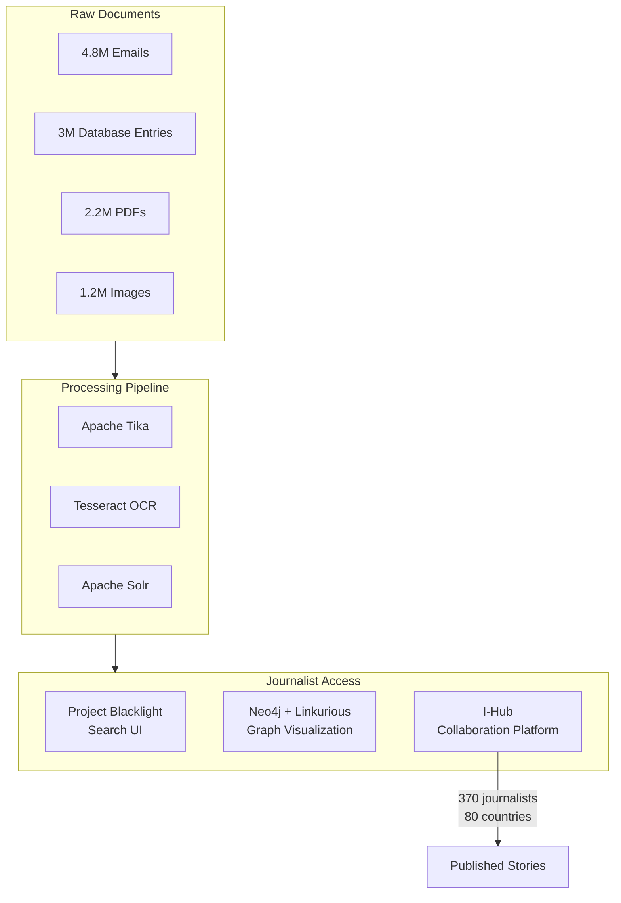
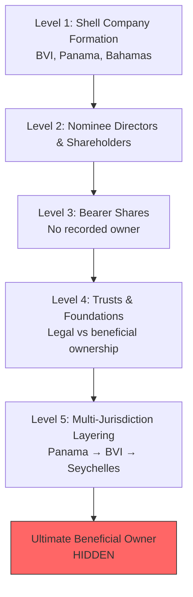

# The Panama Papers: A complete guide to the largest data leak in history

**The Panama Papers represent the most significant financial leak ever—11.5 million documents exposing how the world's wealthy hide fortunes offshore.** In April 2016, an unprecedented collaboration of over 370 journalists from 80 countries revealed the secret financial dealings of 12 world leaders, 128 politicians, celebrities, and criminals, all connected through a single Panamanian law firm called Mossack Fonseca. The revelations toppled governments, recovered nearly **$2 billion** in hidden taxes, and fundamentally changed how the world understands offshore finance. For anyone new to financial secrecy, tax evasion, or international law, this scandal offers the clearest window into how the global elite exploit legal gray zones while ordinary citizens bear the burden of honest taxation.

---

## Understanding offshore finance: the legitimate and the illicit

Before diving into the scandal itself, grasping how offshore finance works is essential. The term "offshore" refers to financial services provided by institutions in jurisdictions outside a client's home country—typically in locations offering favorable tax treatment, strong privacy protections, and minimal regulatory oversight.

**Legitimate uses exist.** American filmmaker Stanley Kubrick used offshore trusts through Mossack Fonseca to pass an 18th-century English manor to his children, avoiding double taxation from both U.S. and U.K. governments. Businesses in countries with unstable currencies may hold funds in dollars offshore for stability. Companies in Dubai sometimes use offshore structures to navigate Islamic inheritance laws. These applications are legal and, in many cases, sensible financial planning.

The problem emerges when these same tools enable criminality. The Panama Papers revealed that the structures designed for legitimate purposes—shell companies, nominee directors, bearer shares—had been weaponized for tax evasion, money laundering, sanctions evasion, and concealment of criminal proceeds on a massive scale.

### What makes a shell company dangerous

A shell company exists only on paper. It has no employees, produces no goods, provides no services, and holds no significant assets. In the British Virgin Islands, such entities can be established in under an hour for approximately $1,000-$2,000. Legitimate uses include holding intellectual property, facilitating mergers, or protecting assets during estate planning.

The danger lies in anonymity. Shell companies can employ **nominee directors**—individuals who appear on official documents but have no actual control, acting only on instructions from hidden owners. They can issue **bearer shares**—physical stock certificates where whoever holds the paper is considered the legal owner, with no recorded transfer of ownership. When stacked across multiple jurisdictions, these structures create impenetrable walls against investigation.

Mossack Fonseca created over **214,488 offshore entities** throughout its existence. In a damning internal admission, a leaked memorandum acknowledged that "95% of our work coincidentally consists of selling vehicles to avoid taxes."

### Tax avoidance versus tax evasion: a critical legal distinction

Tax avoidance is legal—using legitimate means to minimize tax obligations within the bounds of law. Contributing to retirement accounts, claiming mortgage interest deductions, and structuring businesses for tax efficiency all qualify. As Justice Louis Brandeis once wrote, "One may so arrange his affairs that his taxes shall be as low as possible."

Tax evasion is criminal—using deception, concealment, or misrepresentation to avoid paying legally owed taxes. Failing to report income, hiding money in undisclosed accounts, and falsifying documents all constitute evasion. Penalties include fines and up to five years imprisonment.

The Panama Papers repeatedly revealed how the wealthy crossed this line, using offshore structures not merely to optimize taxes but to hide assets entirely from tax authorities who had legal claim to them.

---

## Mossack Fonseca: the enablers behind the leak

The firm at the center of the scandal was founded in 1977 by **Jürgen Mossack**, a German-Panamanian lawyer, and expanded when **Ramón Fonseca Mora**, a Rhodes Scholar novelist turned attorney, merged his practice with Mossack's in 1986. By its peak, Mossack Fonseca had become the world's fourth-largest provider of offshore services, employing 600 people across more than 40 offices globally, including nine in China alone.

The firm's business model was straightforward: create and administer offshore entities for clients—or more often, for the banks, law firms, and accountants who served as intermediaries. Through a network of **over 14,000 intermediary** institutions, Mossack Fonseca handled everything from initial incorporation to ongoing compliance, providing registered addresses and appointing firm employees as nominee directors.

Internal documents revealed troubling practices. The firm routinely **backdated documents** on request—charging $8.75 per month backdated. When a 90-year-old British man was hired as a fake company owner, raising no red flags, it illustrated the firm's approach to due diligence. Two months after the data breach became public, Mossack Fonseca could not identify the owners of **70% of its 28,500 active British Virgin Islands companies** or **75% of its 10,500 active Panamanian shells**.

The firm maintained it had "not once in nearly 40 years of operation been charged with criminal wrongdoing"—a claim that would prove short-lived. Following the scandal, Mossack Fonseca collapsed, announcing closure in March 2018 due to "economic and reputational damage."

---

## The leak: how 2.6 terabytes reached journalists

The breach began with a cryptic message to Bastian Obermayer, an investigative reporter at the German newspaper Süddeutsche Zeitung: **"Hello. This is John Doe. Interested in data?"**

Obermayer was interested. Over the following months, an anonymous source delivered documents incrementally through encrypted channels—never meeting face-to-face, never revealing their identity. By the end, the journalists possessed **11.5 million files spanning 2.6 terabytes**: 4.8 million emails, 3 million database entries, 2.2 million PDFs, and 1.2 million images covering nearly 40 years of Mossack Fonseca's operations. To put this in perspective, the WikiLeaks Cablegate release—previously considered massive—totaled just 1.7 gigabytes. The Panama Papers were more than **1,500 times larger**.

Realizing they could not analyze this volume alone, Süddeutsche Zeitung contacted the International Consortium of Investigative Journalists (ICIJ) in April 2015. What followed became the largest collaborative journalism project in history.

### Security measures that protected the investigation

Physical security at Süddeutsche Zeitung was meticulous. Data was stored on **air-gapped computers never connected to the internet**. Access to the data room was strictly limited. In a particularly creative measure, journalists painted screws on computer hard drives with **glitter nail polish**—any tampering would disturb the unique sparkle pattern and reveal intrusion.

The source, meanwhile, insisted on encrypted communication only. "My life is in danger," John Doe stated. This fear proved prescient: two journalists who worked on Panama Papers-related stories were later murdered—**Daphne Caruana Galizia** in Malta (car bomb, October 2017) and **Ján Kuciak** in Slovakia (shot, February 2018).

---

## The investigation: how 370 journalists kept a secret

ICIJ faced an unprecedented coordination challenge: bring together 370 journalists from 107 media organizations across 80 countries, maintain absolute secrecy for over a year, analyze millions of documents in 25+ languages, and release stories simultaneously worldwide.

Their solution involved what ICIJ called **"radical sharing."** Unlike traditional journalism where exclusives are jealously guarded, participants communicated findings continuously, not just with immediate colleagues but with reporters worldwide. Early gatherings in Munich, Washington, and Johannesburg established ground rules. Every participant signed confidentiality agreements committing to collaborative work, regular communication, respect for embargo dates, and sharing major revelations with the group.

### Technical infrastructure that made analysis possible

If a single journalist spent one minute reviewing each file, it would take **26 years** to examine the entire leak. ICIJ's data team—just four developers and three journalists—built an infrastructure to make the impossible manageable.

**Document processing** relied on open-source tools: Apache Tika extracted text from dozens of file formats, Tesseract OCR converted scanned images to searchable text using an army of 30-40 temporary Amazon cloud servers that scaled up and down as needed. Apache Solr indexed everything for search.

**The search interface**, adapted from Project Blacklight (software typically used by librarians), allowed faceted search by folder, year, and file type, plus regular expression queries that could find patterns like passport numbers. A crucial batch-search feature let journalists upload lists of names—politicians in their country, for instance—and receive matches including fuzzy variations.

**Graph database technology** proved transformative. Using Neo4j, ICIJ mapped relationships between entities: officers (directors, shareholders, beneficiaries), intermediaries (the law firms and banks), addresses, and the offshore entities themselves. Linkurious provided visualization, allowing journalists to click through networks visually without needing technical database skills.

The collaboration platform—an internal "Facebook for journalists" nicknamed I-Hub—provided secure messaging, user profiles, file sharing, and forums for real-time coordination across time zones, all protected by two-factor authentication.

---

## The power players exposed in the documents

### Vladimir Putin's $2 billion shadow network

The documents did not name Russian President Vladimir Putin directly—but they revealed an intricate web surrounding his closest associates that funneled at least **$2 billion** through offshore companies.

At the center sat **Sergei Roldugin**, a concert cellist who happened to be Putin's childhood friend and godfather to his eldest daughter Maria. An obscure musician appeared as the owner of seven offshore companies in Panama, Belize, and the British Virgin Islands. His company Sandalwood Continental received more than **$1 billion in loans** between 2009 and 2012 from Russian Commercial Bank in Cyprus (a subsidiary of state-owned VTB Bank).

The money movements defied explanation. A Roldugin-linked company purchased Bank Rossiya shares for $6.50 per share and sold them days later at 32 times that price; Gazprom then paid 169 times the original value—$1,120 per share. The transactions bore hallmarks of money laundering rather than legitimate investment.

Putin dismissed the revelations as a plot against Russia. Roldugin was later sanctioned by the United States following the 2022 Ukraine invasion. Swiss prosecutors indicted four banking executives including the CEO of Gazprombank's Swiss arm.

### Iceland's prime minister: from protest leader to resigned hypocrite

**Sigmundur Davíð Gunnlaugsson** had risen to power leading InDefence, a movement fighting foreign creditors after Iceland's 2008 banking collapse. The Panama Papers revealed he had been one of those creditors all along.

Since 2007, Gunnlaugsson and his wife owned **Wintris Inc.**, a British Virgin Islands company holding shares worth nearly $4 million in the three Icelandic banks that failed. The company was claiming 515 million Icelandic kronur ($5.5 million) from the failed institutions—money owed to creditors the prime minister had publicly campaigned against.

When new disclosure laws took effect on January 1, 2010, Gunnlaugsson had sold his half of Wintris to his wife **for $1** the day before. He failed to disclose any of this when entering parliament in 2009. A disastrous television interview where he walked out mid-question sealed his fate. On April 5, 2016—just two days after publication—with 24,000 Icelanders (8% of the voting population) signing a resignation petition and massive protests in Reykjavik, Gunnlaugsson became the scandal's first political casualty.

### Pakistan's prime minister: disqualified, convicted, banned for life

**Nawaz Sharif**'s three children owned at least four offshore companies controlling luxury flats in London's prestigious Mayfair district. The properties—used as collateral for loans up to **$13.8 million**—were never disclosed in asset declarations.

Pakistan's Supreme Court unanimously disqualified Sharif from office in July 2017, finding him "dishonest" for concealing assets. The scandal included a bizarre twist: a document submitted by his daughter Maryam, dated 2006, was printed in the Calibri font—which wasn't commonly available until 2007. This "Fontgate" scandal further undermined the family's credibility.

In July 2018, Sharif was sentenced to **10 years imprisonment** and fined $10.6 million. His daughter received seven years. By April 2018, he had been banned from politics for life—the first Pakistani prime minister convicted of corruption.

### David Cameron's family embarrassment

British Prime Minister David Cameron faced questions not about his own actions but his father's. **Ian Cameron** had established Blairmore Holdings in the Bahamas in 1982, managing tens of millions of pounds while paying **no UK tax for over 30 years**. The fund employed bearer shares until 2006 and used up to 50 Caribbean officers annually to sign paperwork, ensuring the company wasn't "centrally managed" in Britain.

Cameron initially called it "a private matter." After four days of evasive answers, he admitted owning 5,000 shares purchased in 1997 for £12,497 and sold in January 2010 for **£30,000**—four months before becoming prime minister. The irony was cutting: Cameron had publicly criticized "aggressive tax avoidance" as "morally wrong."

### Criminals, sanctions evaders, and organized crime

Beyond politicians, the documents exposed darker networks. **DCB Finance Limited**, a Virgin Islands shell, served as a front company for North Korea's Daedong Credit Bank—sanctioned by the U.S. Treasury for providing services to arms dealers and helping expand nuclear weapons programs. Mossack Fonseca had ties to **22 individuals** subject to sanctions supporting regimes in North Korea, Russia, Syria, and Zimbabwe.

U.S. investigators believe one offshore company **supplied fuel for jets** used by the Syrian government to bomb civilians. The firm helped set up accounts for Mexican drug traffickers, a Guatemalan drug "queen," and a Salvadoran crime boss. Five people in Uruguay were arrested for laundering money for a Mexican drug cartel through Mossack Fonseca shells.

Even historical crimes surfaced: **Feberion Inc.** was linked to Britain's largest gold heist, the 1983 Brink's-Mat robbery. When UK police investigated in 1987, Mossack Fonseca helped protect the company.

---

## John Doe speaks: the whistleblower's manifesto

On May 6, 2016, a month after publication, the anonymous source released a 1,800-word manifesto titled **"The Revolution Will Be Digitized."** It remains one of the most powerful statements in whistleblower history.

**On motivation:** "I decided to expose Mossack Fonseca because I thought its founders, employees and clients should have to answer for their roles in these crimes, only some of which have come to light thus far."

**On economic inequality:** "Income inequality is one of the defining issues of our time. It affects all of us, the world over... The collective impact of these failures has been a complete erosion of ethical standards, ultimately leading to a novel system we still call Capitalism, but which is tantamount to economic slavery."

**On systemic failure:** "When it takes a whistleblower to sound the alarm, it is cause for even greater concern. It signals that democracy's checks and balances have all failed, that the breakdown is systemic, and that severe instability could be just around the corner."

The manifesto explicitly demanded whistleblower protection: "Legitimate whistleblowers who expose unquestionable wrongdoing, whether insiders or outsiders, deserve immunity from government retribution, full stop."

John Doe referenced the fates of other whistleblowers—Edward Snowden stranded in exile, Bradley Birkenfeld imprisoned despite exposing UBS fraud, Antoine Deltour prosecuted for Luxembourg Leaks—and emphasized that fear, not reward, motivated the leak. "My life is in danger."

**John Doe remains anonymous as of January 2026**—nine years after the leak. In 2024, a person claiming to be the whistleblower filed an anonymous lawsuit against the German government, seeking $14 million for an alleged breach of an agreement to share recovered revenue. The identity behind the largest leak in history may never be known.

---

## Global consequences: resignations, prosecutions, and recovered billions

### Political fallout

The immediate impact was dramatic. Iceland's prime minister resigned within 48 hours. Pakistan's prime minister was disqualified by his nation's Supreme Court, sentenced to prison, and banned from politics for life. Spain's industry minister José Manuel Soria resigned after denying ties to offshore companies named in the papers. Malta's chief of staff to the prime minister was charged in 2021 with money laundering, corruption, fraud, and forgery connected to Panama Papers revelations.

More than **82 countries** announced investigations. The documents named 12 current or former heads of state and 128 other politicians and public officials.

### Criminal prosecutions and their limits

The legal outcomes proved frustratingly mixed. In December 2018, the U.S. Southern District of New York charged four defendants including a Mossack Fonseca attorney and an American accountant who pleaded guilty. Bulgaria filed the first criminal charges in 2018. Brazil prosecuted Mossack Fonseca employees connected to the massive Petrobras/Operation Car Wash scandal. India filed 46 criminal prosecution complaints.

But in Panama itself, the story ended differently. **On June 28, 2024, a Panamanian judge acquitted Jürgen Mossack, and all 26 co-defendants.** The prosecution had sought 12-year sentences, but the court found evidence didn't comply with chain-of-custody rules and was insufficient to establish criminal responsibility. Ramón Fonseca had died in May 2024, before the verdict. Germany's international arrest warrant for both founders, issued in October 2020, remains outstanding.

### Financial recovery approaches $2 billion

As of ICIJ's April 2025 tally, governments worldwide have recovered approximately **$1.86 billion** in taxes and penalties. Sweden led with over $300 million recovered. France recovered $297 million. Spain collected €200+ million. The UK recovered $252+ million. Denmark collected $47.5 million from 155 individuals. India identified $1.6 billion in undisclosed assets under examination.

The recoveries continue. Canada has 130+ files still being examined nine years later. France has hundreds of ongoing proceedings. Australia completed 540 audits and reviews.

### Regulatory and legislative transformation

The scandal drove the most significant anti-money laundering reforms in decades.

The **European Union's 5th Anti-Money Laundering Directive** (effective January 2020), directly prompted by Panama Papers revelations, required public beneficial ownership registers for companies, extended regulations to cryptocurrency exchanges, and established centralized bank account registries across member states. The **6th Directive** (effective June 2021) harmonized money laundering definitions, established **minimum 4-year prison sentences**, and extended criminal liability to companies themselves.

The United States passed the **Corporate Transparency Act** (January 2021), requiring disclosure of beneficial owners to FinCEN. The registry went live in January 2024.

Panama's reforms proved more superficial. Law 129 (March 2020) established a beneficial ownership register framework, but according to Transparency International, **five years later it exists "only on paper."** Panama remains on the Financial Action Task Force grey list.

---

## The technical achievement: graph databases reveal hidden connections

The Panama Papers pioneered techniques now standard in data journalism. Understanding how investigators mapped connections helps illustrate both the sophistication of offshore secrecy and how it can be penetrated.

ICIJ structured data in a **Neo4j graph database** with four primary node types: entities (offshore companies), officers (directors, shareholders, beneficiaries), intermediaries (law firms, banks), and addresses. Relationships like "officer_of," "intermediary_of," and "registered_address" connected these nodes.

Graph databases excel at questions relational databases struggle with. Finding the shortest path between two seemingly unrelated people, detecting triangular relationships where Person A connects to Company A which connects to Company B (implying a hidden relationship), identifying clusters and networks—these queries run naturally on graph structures.

**Linkurious** visualization allowed journalists without technical skills to explore networks visually, clicking through connections. The ICIJ's **Offshore Leaks Database** (offshoreleaks.icij.org) now contains information on more than 810,000 entities from multiple leaks, publicly searchable. In 2025, ICIJ launched API access for automated data matching.

The tools themselves became open-source contributions. ICIJ Extract, available on GitHub, enables parallelized content extraction from massive document sets. The techniques developed for Panama Papers became templates for subsequent investigations.

---

## The stairway to tax heaven: how layered structures hide wealth

Understanding how tax havens operate technically illuminates why reform proves so difficult. The typical structure resembles a staircase, with each level adding complexity for investigators.

**Level one** involves initial company formation. A client approaches an intermediary (law firm, bank, or accountant), which creates a shell company in a jurisdiction like the British Virgin Islands—home to **over 113,000** of the entities in the Panama Papers, representing roughly 53% of all companies in the leak.

**Level two** adds nominee services. Nominee directors appear on public documents while actual owners remain hidden. Nominee shareholders hold shares "in name only," bound by private Declaration of Trust agreements. The Blairmore fund run by David Cameron's father employed up to 50 Caribbean officers annually just to sign paperwork.

**Level three** (historically) used bearer shares—physical certificates with no recorded owner. Whoever held the paper owned the company. While now largely banned, they provided complete anonymity during Mossack Fonseca's peak years.

**Level four** interposes trusts and foundations. Trusts (popular in Cook Islands, Nevis, Jersey) separate legal ownership from beneficial control. Foundations (Panama, Liechtenstein) stand as entities with no shareholders. Assets become legally owned by the structure, not the individual.

**Level five** layers multiple jurisdictions. A company in Panama owns a company in the BVI which owns a company in the Seychelles. Each layer requires investigators to navigate different legal systems, creating "information walls" that frequently prove impenetrable.

The result: when authorities finally trace an entity, they often find only the name of another shell company in another jurisdiction, with the actual human beneficiary—the **Ultimate Beneficial Owner**—invisible behind layers of legal structures and nominee arrangements.

---

## Legacy: how the Panama Papers changed the world

The Panama Papers became what ICIJ calls "shorthand for financial chicanery and political corruption in the public imagination." The term entered popular culture—referenced in television shows like "Billions," quiz shows like Jeopardy!, and the 2019 Netflix film "The Laundromat" starring Meryl Streep, Gary Oldman, and Antonio Banderas.

More importantly, the investigation created a new model for journalism. The "radical sharing" approach—competitors setting aside exclusives for collaborative impact—became the template for subsequent mega-leaks. The **Paradise Papers** (November 2017, 13.4 million documents) and **Pandora Papers** (October 2021, 12 million documents) followed the same methodology.

Edward Snowden called the Panama Papers a "best case" for whistleblower-journalist collaboration. The Pulitzer Prize committee agreed, awarding the 2017 Prize for Explanatory Reporting to ICIJ, McClatchy, and the Miami Herald.

### Ongoing significance

The story continues evolving. The Offshore Leaks Database receives approximately 250,000 visits monthly. Governments continue pursuing cases—Canada has 130+ files still under examination in 2026. The $1.86 billion recovered represents just a fraction of offshore wealth; researchers estimate roughly **10% of global economic output** sits in offshore financial centers, costing governments over $800 billion annually.

John Doe's manifesto concluded with words that remain relevant: "For fifty years, executive, legislative, and judicial branches around the globe have utterly failed to address the metastasizing tax havens spotting Earth's surface." The Panama Papers didn't solve this problem. But they made it impossible to ignore.

---

## Conclusion

The Panama Papers revealed a parallel financial system operating in plain sight, serving the wealthy while ordinary citizens bear the full burden of honest taxation. **Nearly $2 billion** has been recovered from exposed tax evaders. Governments fell. Laws changed. Yet the underlying architecture of offshore secrecy persists, with Panama's beneficial ownership register existing only on paper and enforcement remaining sporadic.

For those new to these issues, several core lessons emerge. First, the tools of offshore finance—shell companies, nominee directors, layered jurisdictions—are not inherently criminal but become weapons when deployed for concealment. Second, the line between legal tax avoidance and criminal evasion grows increasingly blurred as structures become more complex. Third, reform requires political will that often evaporates when the powerful benefit from opacity.

The anonymous whistleblower John Doe predicted that "the next revolution will be digitized." Nine years later, their identity remains protected—a testament to both the danger they faced and the care taken by journalists who built unprecedented collaborative infrastructure. The **11.5 million documents** they leaked continue generating investigations, recoveries, and reforms worldwide, proving that even the most elaborate financial secrecy can be penetrated when transparency becomes a shared global project.

---

## Further Reading

- **[TechnicalGuide.md](TechnicalGuide.md)** — Detailed examination of ICIJ's data processing pipeline, CSV structure, and graph data model
- **[Implementation.md](Implementation.md)** — Oracle Database implementation with SQL schema, PGQL queries, and Python scripts
- **[Deployment.md](Deployment.md)** — Infrastructure deployment with Terraform, Liquibase, and MCP configuration
