# Oracle Database: Panama Papers Analysis

## Converged Database for Investigative Analytics

_Presentation Draft for PowerPoint_

---

## Slide 1: Title

# Oracle Database: Panama Papers Analysis

### Property Graph | Oracle Text | Spatial | Vector Search

**Demonstrating Oracle's Converged Architecture for Complex Investigations**

_Victor Martin Alvarez | [Date]_

---

## Slide 2: The Panama Papers Story

### April 3, 2016

> "The biggest leak in the history of data journalism"

### The Investigation

- **11.5 million documents** leaked from Mossack Fonseca
- **2.6 terabytes** of data spanning 40 years
- **370+ journalists** from 80 countries
- **214,000+ offshore entities** exposed

### The Impact

- Prime Minister of Iceland resigned
- Multiple world leaders implicated
- Global tax reform discussions accelerated
- Pulitzer Prize for Explanatory Reporting (2017)

---

## Slide 3: The Data Challenge

### What Investigators Faced

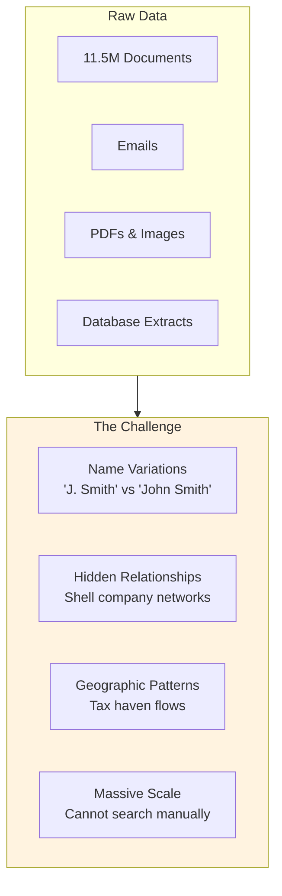

### Traditional Databases Fall Short

- **Relational only**: Can't traverse networks efficiently
- **Exact match only**: Miss name variations
- **No semantic search**: Can't find similar entities
- **Siloed tools**: Different systems for each capability

---

## Slide 4: Oracle's Converged Solution

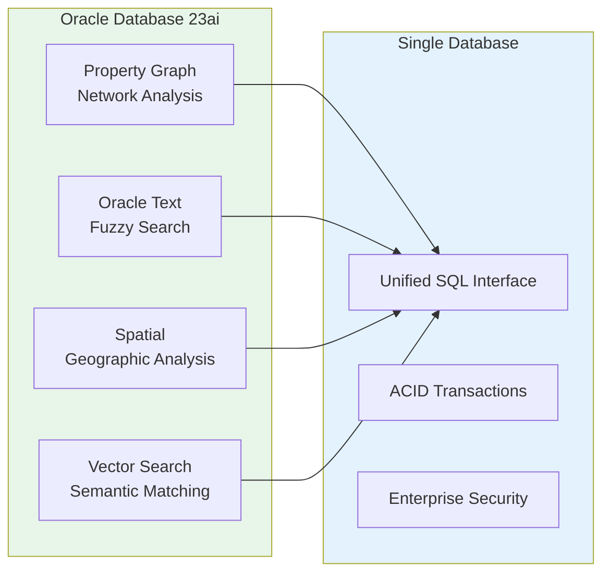

### One Database, All Capabilities

| Capability         | Use Case                          | Oracle Feature           |
| ------------------ | --------------------------------- | ------------------------ |
| **Graph**          | Follow the money trails           | SQL Property Graph       |
| **Text**           | Find name variations              | CONTAINS + FUZZY         |
| **Spatial**        | Map offshore concentrations       | SDO_GEOMETRY             |
| **Vector**         | Semantic entity resolution        | VECTOR type + embeddings |

---

## Slide 5: The ICIJ Offshore Leaks Dataset

### Public Data from Multiple Leaks

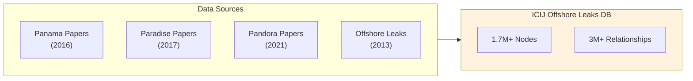

### Dataset Statistics

| Node Type          | Description                              | Records   |
| ------------------ | ---------------------------------------- | --------- |
| **Entities**       | Offshore companies, trusts, foundations  | 810K+     |
| **Officers**       | Directors, shareholders, beneficiaries   | 750K+     |
| **Intermediaries** | Law firms, banks, agents                 | 14K+      |
| **Addresses**      | Registered addresses                     | 150K+     |
| **Relationships**  | Edges connecting nodes                   | 3M+       |

---

## Slide 6: Data Model

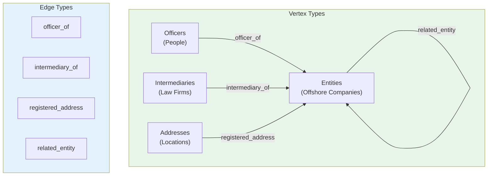

### Key Insight

**The relationships ARE the story** — who controls what, through whom, and where.

---

## Slide 7: Demo Architecture

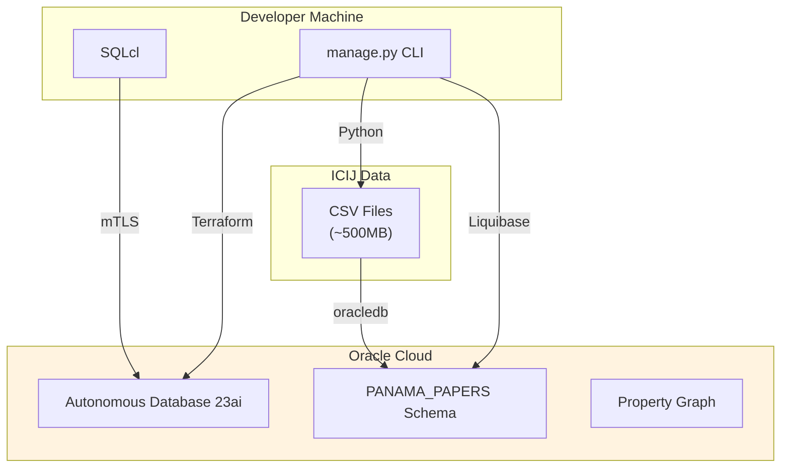

### Deployment Stack

| Component      | Tool                    | Purpose                    |
| -------------- | ----------------------- | -------------------------- |
| Infrastructure | Terraform               | Provision ADB on OCI       |
| Schema         | Liquibase               | Version-controlled DDL     |
| Data Loading   | Python + oracledb       | Batch CSV ingestion        |
| Queries        | SQLcl                   | Interactive analysis       |

---

# Part 1: Property Graph

---

## Slide 8: Why Graph for Investigations?

### The Power of Traversal

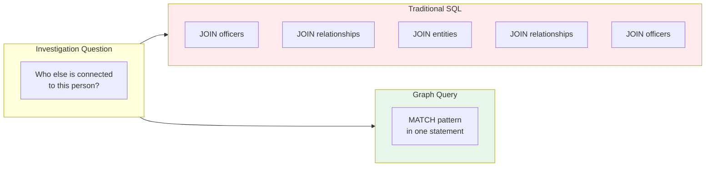

### Graph Makes Complex Patterns Simple

- **Traditional SQL**: Multiple self-joins, complex CTEs
- **Property Graph**: Pattern matching in natural syntax

---

## Slide 9: Property Graph in Oracle 23ai

### SQL/PGQ Standard

```sql
SELECT officer_name, entity_name, jurisdiction
FROM GRAPH_TABLE (PANAMA_PAPERS.panama_graph
    MATCH (o IS officers) -[r IS officer_edges]-> (e IS entities)
    WHERE o.name LIKE '%Messi%'
    COLUMNS (o.name AS officer_name,
             e.name AS entity_name,
             e.jurisdiction_desc AS jurisdiction)
);
```

### Key Features

| Feature              | Benefit                                     |
| -------------------- | ------------------------------------------- |
| **GRAPH_TABLE**      | Graph queries return relational results     |
| **MATCH clause**     | Pattern matching syntax                     |
| **No data movement** | Graph over existing relational tables       |
| **Full SQL**         | Combine with GROUP BY, JOIN, subqueries     |

---

## Slide 10: Graph Query - Network Hubs

### Find Officers Controlling Many Entities

```sql
SELECT SUBSTR(officer_name, 1, 40) AS officer_name,
       SUBSTR(officer_countries, 1, 50) AS countries,
       COUNT(DISTINCT entity_id) AS entities,
       COUNT(DISTINCT jurisdiction) AS jurisdictions
FROM GRAPH_TABLE (PANAMA_PAPERS.panama_graph
    MATCH (o IS officers) -[IS officer_edges]-> (e IS entities)
    COLUMNS (o.name AS officer_name, o.countries AS officer_countries,
             e.node_id AS entity_id, e.jurisdiction_desc AS jurisdiction)
)
GROUP BY officer_name, officer_countries
HAVING COUNT(DISTINCT entity_id) > 10
ORDER BY entities DESC
FETCH FIRST 20 ROWS ONLY;
```

### What This Reveals

- **Nominee directors**: Single person on hundreds of boards
- **Service companies**: Corporate service providers
- **Suspicious patterns**: Unusual concentration of control

---

## Slide 11: Graph Query - Sibling Companies

### Find Entities Sharing the Same Officer

```sql
SELECT entity1, shared_officer, entity2
FROM GRAPH_TABLE (PANAMA_PAPERS.panama_graph
    MATCH (e1 IS entities) <-[IS officer_edges]- (o IS officers)
          -[IS officer_edges]-> (e2 IS entities)
    WHERE e1.node_id < e2.node_id
    COLUMNS (e1.name AS entity1,
             o.name AS shared_officer,
             e2.name AS entity2)
)
FETCH FIRST 100 ROWS ONLY;
```

### Investigation Value

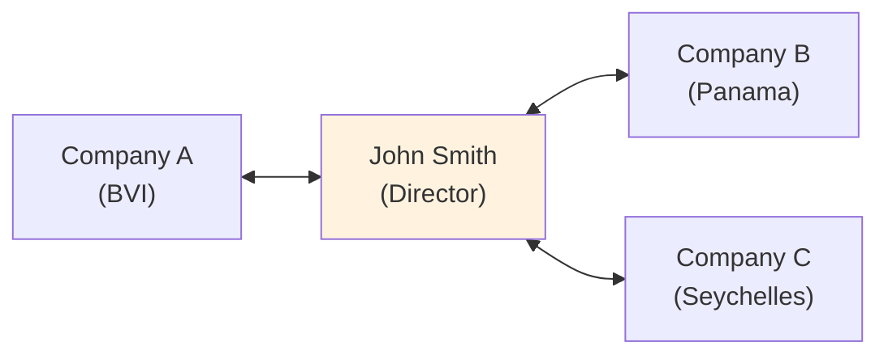

**Pattern**: Same person controlling multiple entities across jurisdictions suggests coordinated structure.

---

# Part 2: Oracle Text

---

## Slide 12: The Name Matching Problem

### Real-World Complexity

| Document 1           | Document 2              | Same Person? |
| -------------------- | ----------------------- | ------------ |
| "John Smith"         | "J. Smith"              | Maybe        |
| "Sigmundur Gunnlaugsson" | "S. D. Gunnlaugsson" | Yes          |
| "王明"               | "Wang Ming"             | Yes          |
| "Al-Rashid"          | "Al Rashid"             | Yes          |

### Why Exact Match Fails

- Name variations and abbreviations
- Transliteration differences
- Typos in source documents
- Intentional obfuscation

---

## Slide 13: Oracle Text Fuzzy Search

### Finding the Icelandic Prime Minister

```sql
SELECT name, countries, SCORE(1) as relevance_score
FROM PANAMA_PAPERS.officers
WHERE CONTAINS(name, 'FUZZY(Gunnlaugsson, 70, 100, weight)', 1) > 0
ORDER BY SCORE(1) DESC
FETCH FIRST 20 ROWS ONLY;
```

### FUZZY Parameters

| Parameter | Value | Meaning                              |
| --------- | ----- | ------------------------------------ |
| Term      | Name  | The search term                      |
| Score     | 70    | Minimum similarity (0-100)           |
| Numresults| 100   | Max expansions to consider           |
| Weight    | weight| Score by similarity                  |

### Results Include

- Exact matches: "Gunnlaugsson"
- Variations: "Gunnlaugson", "Gunlaugsson"
- Partial: "S. D. Gunnlaugsson"

---

## Slide 14: Oracle Text Architecture

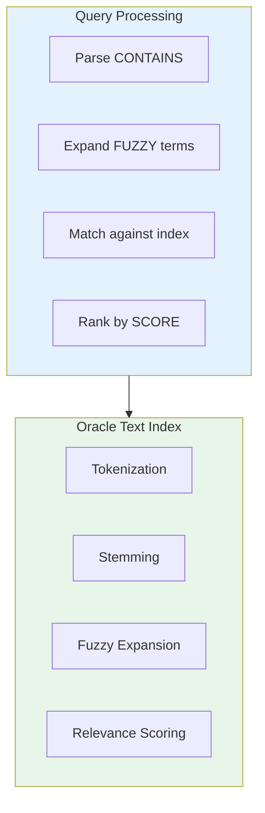

### Enterprise Features

- **Multi-language support**: Asian, Arabic, European languages
- **Custom dictionaries**: Industry-specific terms
- **Thesaurus**: Synonym expansion
- **Section search**: Search within document structure

---

# Part 3: Combining Capabilities

---

## Slide 15: The Power of Convergence

### Single Query, Multiple Techniques

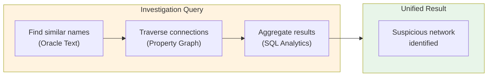

### Why This Matters

- **No ETL**: All data in one place
- **No context switching**: One SQL interface
- **Consistent security**: One set of policies
- **ACID guarantees**: Transactional integrity

---

## Slide 16: Cross-Border Flow Analysis

### Which Countries Connect Most?

```sql
SELECT officer_country, entity_jurisdiction, connection_count
FROM (
    SELECT officer_country, entity_jurisdiction,
           COUNT(*) AS connection_count
    FROM GRAPH_TABLE (PANAMA_PAPERS.panama_graph
        MATCH (o IS officers) -[IS officer_edges]-> (e IS entities)
        WHERE o.countries IS NOT NULL
          AND e.jurisdiction_desc IS NOT NULL
        COLUMNS (o.countries AS officer_country,
                 e.jurisdiction_desc AS entity_jurisdiction)
    )
    GROUP BY officer_country, entity_jurisdiction
)
WHERE connection_count > 100
ORDER BY connection_count DESC
FETCH FIRST 20 ROWS ONLY;
```

### Reveals

- **Tax haven corridors**: Which countries route through which jurisdictions
- **Geographic patterns**: Regional preferences for offshore destinations
- **Policy implications**: Evidence for international tax cooperation

---

# Part 4: Future Enhancements

---

## Slide 17: Spatial Analysis (Future)

### Geographic Intelligence

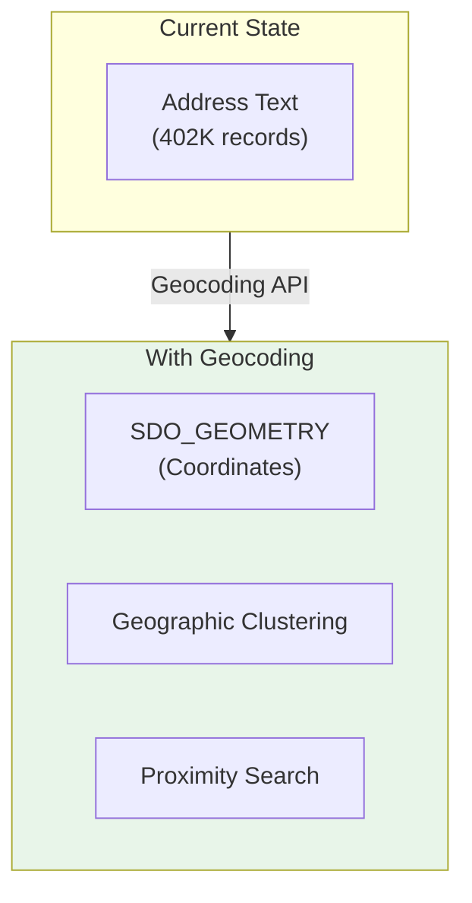

### Potential Queries

- Addresses within 5km of known shell company offices
- Geographic clustering of registered agents
- Heat maps of offshore entity concentrations

---

## Slide 18: Vector Search (Future)

### Semantic Entity Resolution

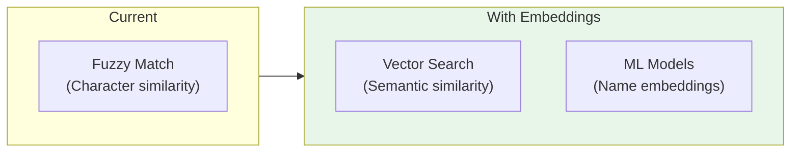

### Benefits

| Technique      | Finds                                    |
| -------------- | ---------------------------------------- |
| **Fuzzy**      | "Smith" ~ "Smyth"                        |
| **Vector**     | "John Smith" ~ "J. Smith, Director"      |

Vector search understands **meaning**, not just characters.

---

# Part 5: Key Takeaways

---

## Slide 19: Why Oracle for Investigative Analytics

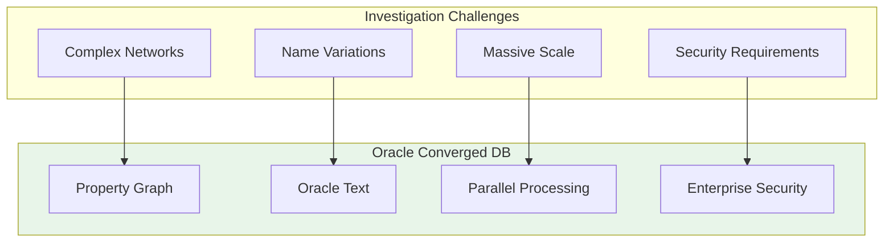

### The Bottom Line

**One database for the entire investigation workflow**

---

## Slide 20: Demo Summary

### What We Built

| Component            | Technology                     |
| -------------------- | ------------------------------ |
| Infrastructure       | Terraform on OCI               |
| Schema Management    | Liquibase                      |
| Data Ingestion       | Python + oracledb              |
| Property Graph       | SQL/PGQ on Oracle 23ai         |
| Text Search          | Oracle Text with FUZZY         |
| Query Interface      | SQLcl with saved connections   |

### What We Demonstrated

1. **Graph traversal**: Finding connected entities
2. **Fuzzy search**: Matching name variations
3. **Analytics**: Aggregating network patterns
4. **Combined queries**: Multiple techniques in one statement

---

## Slide 21: Resources

### This Demo

- **Repository**: `https://github.com/vmleon/oracle-database-panama-papers`
- **Data Source**: ICIJ Offshore Leaks Database

### Oracle Documentation

- Property Graph: `docs.oracle.com/en/database/oracle/property-graph`
- Oracle Text: `docs.oracle.com/en/database/oracle/oracle-database/23/ccref`
- Autonomous Database: `docs.oracle.com/en/cloud/paas/autonomous-database`

### ICIJ

- Offshore Leaks DB: `offshoreleaks.icij.org`
- Data License: Open Database License (ODbL)

---

## Slide 22: Thank You

# Questions?

**Contact Information**

- Victor Martin Alvarez
- victor.martin.alvarez@oracle.com

**Demo Repository**

`https://github.com/vmleon/oracle-database-panama-papers`
