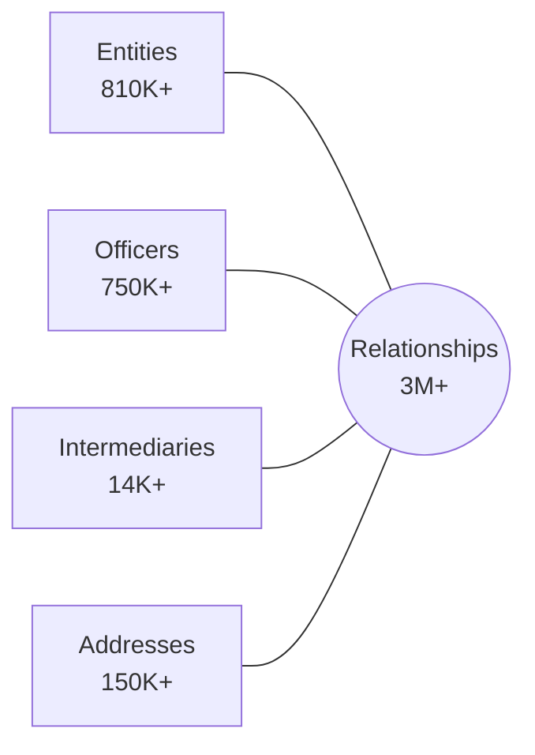

# Oracle Database: The Panama Papers

A Proof-of-Concept demonstrating Oracle Database's converged architecture for analyzing the ICIJ Offshore Leaks dataset using Property Graph, Oracle Text, Spatial, and AI Vector Search.

## Documentation

| File                                   | Purpose                                                              | Audience             |
| -------------------------------------- | -------------------------------------------------------------------- | -------------------- |
| [Overview.md](Overview.md)             | Historical context of Panama Papers investigation                    | Everyone             |
| [TechnicalGuide.md](TechnicalGuide.md) | ICIJ data structure and graph model (authoritative schema reference) | Analysts, Developers |
| [Implementation.md](Implementation.md) | Oracle-specific SQL, Python scripts, PGQL queries                    | Developers           |
| [Deployment.md](Deployment.md)         | Terraform, Liquibase, CLI tools for OCI deployment                   | DevOps, Developers   |

## Data Model

The ICIJ Offshore Leaks Database contains:

| Node Type      | Description                             | Records |
| -------------- | --------------------------------------- | ------- |
| Entities       | Offshore companies, trusts, foundations | 810K+   |
| Officers       | Directors, shareholders, beneficiaries  | 750K+   |
| Intermediaries | Law firms, banks, agents                | 14K+    |
| Addresses      | Registered addresses                    | 150K+   |
| Relationships  | Edges connecting nodes                  | 3M+     |



## Oracle Features Demonstrated

- **Property Graph** - PGQL queries over relational tables (Oracle 23ai)
- **Oracle Text** - Fuzzy name search with `CONTAINS` and `FUZZY` operators
- **Vector Search** - Semantic entity resolution with `VECTOR` type
- **Spatial** - Geographic analysis with `SDO_GEOMETRY`

## Quick Start

### Prerequisites

- Python 3.10+, Terraform 1.5+, OCI CLI 3.0+, SQLcl 24.1+, Liquibase 4.20+
- OCI account with Autonomous Database permissions

### Deployment

```bash
# Install Python dependencies
pip install -r requirements.txt

# Configure OCI and generate terraform.tfvars
./manage.py cloud setup

# Provision Autonomous Database
cd deploy/terraform && terraform init && terraform apply
cd ../..

# Deploy schema and download wallet
./manage.py cloud deploy

# Download ICIJ data (~500MB)
./manage.py data download

# Load data into Oracle (30-60 min)
./manage.py data ingest

# Configure MCP for Claude Code
./manage.py mcp setup
```

### CLI Reference

```bash
./manage.py --help              # Show all commands
./manage.py cloud setup         # Configure OCI credentials
./manage.py cloud deploy        # Deploy schema via Liquibase
./manage.py data download       # Download ICIJ CSV files
./manage.py data ingest         # Load data into Oracle
./manage.py mcp setup           # Configure SQLcl MCP connections
./manage.py full clean          # Complete cleanup
```

For detailed documentation, see [Deployment.md](Deployment.md).

### Configuration Files

The CLI uses these configuration files (auto-generated, gitignored):

| File                                | Purpose                                             |
| ----------------------------------- | --------------------------------------------------- |
| `.env`                              | Environment variables (credentials, settings)       |
| `deploy/terraform/terraform.tfvars` | Terraform variables (generated from `.j2` template) |
| `.wallet/`                          | Oracle wallet for mTLS connections                  |

## Demo Queries

These queries demonstrate Oracle's converged database capabilities for investigative analysis.

### Oracle Text: Fuzzy Name Search

Find officers with names similar to "Gunnlaugsson" (the Icelandic PM who resigned):

```sql
SELECT name, countries, SCORE(1) as relevance_score
FROM officers
WHERE CONTAINS(name, 'FUZZY(Gunnlaugsson, 70, 100, weight)', 1) > 0
ORDER BY SCORE(1) DESC
FETCH FIRST 20 ROWS ONLY;
```

### SQL Analytics: Top Jurisdictions

Find which offshore jurisdictions host the most entities:

```sql
SELECT jurisdiction, COUNT(*) as entity_count
FROM entities
WHERE jurisdiction IS NOT NULL
GROUP BY jurisdiction
ORDER BY entity_count DESC
FETCH FIRST 15 ROWS ONLY;
```

### SQL Analytics: Most Active Intermediaries

Identify law firms and banks that created the most offshore entities:

```sql
SELECT i.name AS intermediary_name,
       i.countries AS intermediary_country,
       COUNT(*) AS entities_created
FROM intermediaries i
JOIN relationships r ON i.node_id = r.node_id_start
WHERE r.rel_type = 'intermediary_of'
GROUP BY i.name, i.countries
ORDER BY entities_created DESC
FETCH FIRST 20 ROWS ONLY;
```

### Property Graph: Find Officer's Entities

Find all offshore entities where a specific person is an officer:

```sql
SELECT e.name AS entity_name, e.jurisdiction, o.name AS officer_name
FROM GRAPH_TABLE (panama_graph
    MATCH (o IS person) -[r IS officer_of]-> (e IS offshore_entity)
    WHERE o.name LIKE '%Messi%'
    COLUMNS (o.name, e.name, e.jurisdiction)
);
```

### Property Graph: Sibling Companies

Find entities sharing the same officer (potential coordinated ownership):

```sql
SELECT e1.name AS entity1, o.name AS shared_officer, e2.name AS entity2
FROM GRAPH_TABLE (panama_graph
    MATCH (e1 IS offshore_entity) <-[IS officer_of]- (o IS person)
          -[IS officer_of]-> (e2 IS offshore_entity)
    WHERE e1.node_id < e2.node_id
    COLUMNS (e1.name, o.name, e2.name)
)
FETCH FIRST 100 ROWS ONLY;
```

### Property Graph: Network Hubs

Find officers controlling the most entities across multiple jurisdictions:

```sql
SELECT o.name, o.countries,
       COUNT(DISTINCT e.node_id) AS entity_count,
       COUNT(DISTINCT e.jurisdiction) AS jurisdiction_diversity
FROM GRAPH_TABLE (panama_graph
    MATCH (o IS person) -[IS officer_of]-> (e IS offshore_entity)
    COLUMNS (o.name, o.countries, e.node_id, e.jurisdiction)
)
GROUP BY o.name, o.countries
HAVING COUNT(DISTINCT e.node_id) > 10
ORDER BY entity_count DESC
FETCH FIRST 50 ROWS ONLY;
```

### Property Graph: Cross-Border Flows

Reveal which country pairs have the most offshore connections:

```sql
SELECT officer_country, entity_jurisdiction, connection_count
FROM (
    SELECT o.countries AS officer_country,
           e.jurisdiction AS entity_jurisdiction,
           COUNT(*) AS connection_count
    FROM GRAPH_TABLE (panama_graph
        MATCH (o IS person) -[IS officer_of]-> (e IS offshore_entity)
        WHERE o.countries IS NOT NULL AND e.jurisdiction IS NOT NULL
        COLUMNS (o.countries, e.jurisdiction)
    )
    GROUP BY o.countries, e.jurisdiction
)
WHERE connection_count > 100
ORDER BY connection_count DESC
FETCH FIRST 50 ROWS ONLY;
```

### Spatial: Addresses Near a Location

Find all registered addresses within 5km of Mossack Fonseca's Panama City office:

```sql
SELECT a.address, a.countries,
       SDO_GEOM.SDO_DISTANCE(
           a.location,
           SDO_GEOMETRY(2001, 4326, SDO_POINT_TYPE(-79.5341, 9.0012, NULL), NULL, NULL),
           0.005, 'unit=KM'
       ) AS distance_km
FROM addresses a
WHERE a.location IS NOT NULL
  AND SDO_WITHIN_DISTANCE(
        a.location,
        SDO_GEOMETRY(2001, 4326, SDO_POINT_TYPE(-79.5341, 9.0012, NULL), NULL, NULL),
        'distance=5 unit=KM'
      ) = 'TRUE'
ORDER BY distance_km;
```

### Spatial: Geographic Clustering

Identify address concentrations by country:

```sql
SELECT a.countries, COUNT(*) AS address_count,
       SDO_GEOM.SDO_CENTROID(
           SDO_AGGR_CONVEXHULL(SDOAGGRTYPE(a.location, 0.005)),
           0.005
       ) AS geographic_center
FROM addresses a
WHERE a.location IS NOT NULL
GROUP BY a.countries
HAVING COUNT(*) > 50
ORDER BY address_count DESC;
```

### Vector Search: Semantic Name Matching

Find officers with names semantically similar to a query (requires embeddings):

```sql
SELECT name, countries,
       VECTOR_DISTANCE(name_embedding, :query_embedding, COSINE) AS similarity
FROM officers
WHERE name_embedding IS NOT NULL
ORDER BY VECTOR_DISTANCE(name_embedding, :query_embedding, COSINE)
FETCH FIRST 20 ROWS ONLY;
```

### Hybrid Query: Combined Analysis

Comprehensive investigation combining vector, graph, text, and spatial:

```sql
WITH similar_officers AS (
    SELECT node_id, name,
           VECTOR_DISTANCE(name_embedding, :target_embedding, COSINE) AS name_similarity
    FROM officers
    WHERE name_embedding IS NOT NULL
      AND VECTOR_DISTANCE(name_embedding, :target_embedding, COSINE) < 0.3
),
suspicious_entities AS (
    SELECT node_id, name, jurisdiction
    FROM entities
    WHERE CONTAINS(name, 'FUZZY(holding, 70) OR FUZZY(investment, 70) OR FUZZY(trading, 70)', 1) > 0
),
graph_connections AS (
    SELECT gt.officer_id, gt.entity_id
    FROM GRAPH_TABLE (panama_graph
        MATCH (o IS person) -[IS officer_of]-> (e IS offshore_entity)
        COLUMNS (o.node_id AS officer_id, e.node_id AS entity_id)
    ) gt
)
SELECT so.name AS officer_name,
       ROUND(1 - so.name_similarity, 3) AS name_match_score,
       se.name AS entity_name,
       se.jurisdiction
FROM similar_officers so
JOIN graph_connections gc ON so.node_id = gc.officer_id
JOIN suspicious_entities se ON gc.entity_id = se.node_id
ORDER BY so.name_similarity
FETCH FIRST 50 ROWS ONLY;
```

For complete query reference, see [Implementation.md](Implementation.md).

---

## Data Source

CSV data: https://offshoreleaks-data.icij.org/offshoreleaks/csv/full-oldb.LATEST.zip

## Data License

The ICIJ Offshore Leaks Database is licensed under the [Open Database License](https://opendatacommons.org/licenses/odbl/1.0/) and contents under [Creative Commons Attribution-ShareAlike](https://creativecommons.org/licenses/by-sa/3.0/).

**Required citation**: International Consortium of Investigative Journalists (ICIJ)

Source: https://offshoreleaks.icij.org
