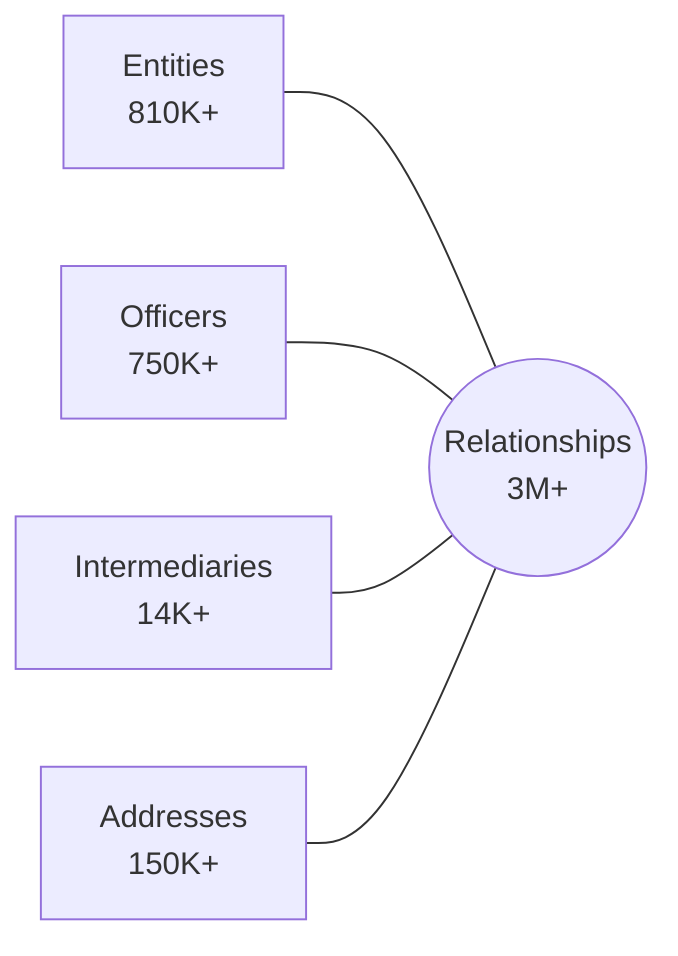

# Oracle Database: The Panama Papers

A Proof-of-Concept demonstrating Oracle Database's converged architecture for analyzing the ICIJ Offshore Leaks dataset using Property Graph, Oracle Text, Spatial, and AI Vector Search.

## Documentation

| File                                   | Purpose                                                              | Audience             |
| -------------------------------------- | -------------------------------------------------------------------- | -------------------- |
| [Overview.md](Overview.md)             | Historical context of Panama Papers investigation                    | Everyone             |
| [TechnicalGuide.md](TechnicalGuide.md) | ICIJ data structure and graph model (authoritative schema reference) | Analysts, Developers |
| [Implementation.md](Implementation.md) | Oracle-specific SQL, Python scripts, PGQL queries                    | Developers           |
| [Deployment.md](Deployment.md)         | Terraform, Liquibase, CLI tools for OCI deployment                   | DevOps, Developers   |

## Data Model

The ICIJ Offshore Leaks Database contains:

| Node Type      | Description                             | Records |
| -------------- | --------------------------------------- | ------- |
| Entities       | Offshore companies, trusts, foundations | 810K+   |
| Officers       | Directors, shareholders, beneficiaries  | 750K+   |
| Intermediaries | Law firms, banks, agents                | 14K+    |
| Addresses      | Registered addresses                    | 150K+   |
| Relationships  | Edges connecting nodes                  | 3M+     |

## Oracle Features Demonstrated

- **Property Graph** - PGQL queries over relational tables (Oracle 23ai)
- **Oracle Text** - Fuzzy name search with `CONTAINS` and `FUZZY` operators
- **Vector Search** - Semantic entity resolution with `VECTOR` type
- **Spatial** - Geographic analysis with `SDO_GEOMETRY`

## Quick Start

1. Review [Overview.md](Overview.md) for background context
2. Study the data model in [TechnicalGuide.md](TechnicalGuide.md)
3. Follow [Deployment.md](Deployment.md) for infrastructure setup
4. Explore query examples in [Implementation.md](Implementation.md)

## Data Source

CSV data: https://offshoreleaks-data.icij.org/offshoreleaks/csv/full-oldb.LATEST.zip

## Data License

The ICIJ Offshore Leaks Database is licensed under the [Open Database License](https://opendatacommons.org/licenses/odbl/1.0/) and contents under [Creative Commons Attribution-ShareAlike](https://creativecommons.org/licenses/by-sa/3.0/).

**Required citation**: International Consortium of Investigative Journalists (ICIJ)

Source: https://offshoreleaks.icij.org
