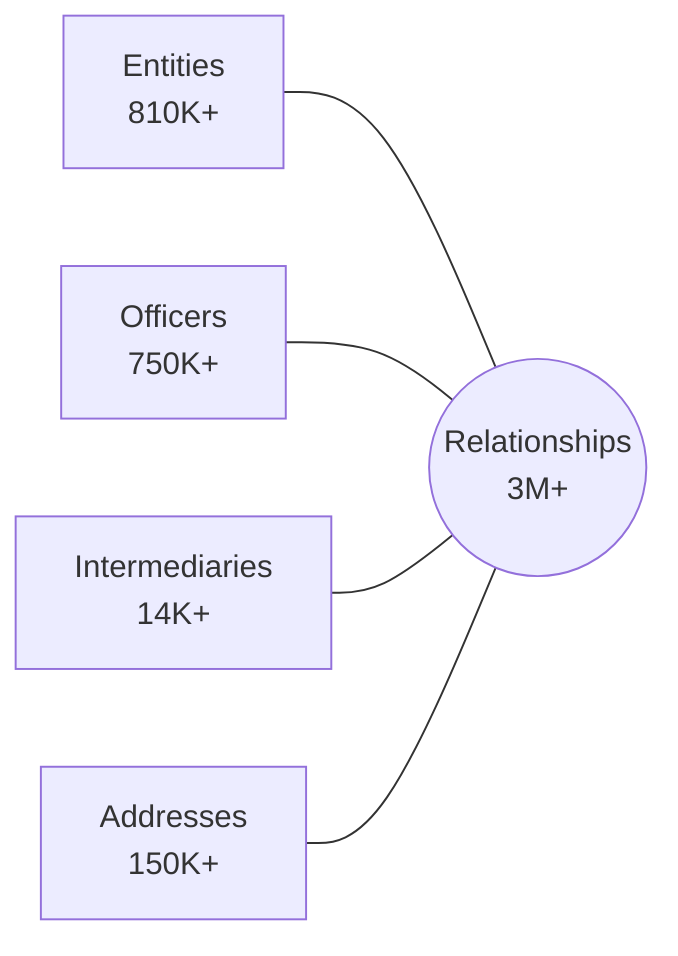

# Oracle Database: The Panama Papers

A Proof-of-Concept demonstrating Oracle Database's converged architecture for analyzing the ICIJ Offshore Leaks dataset using Property Graph, Oracle Text, Spatial, and AI Vector Search.

## Documentation

| File                                   | Purpose                                                              | Audience             |
| -------------------------------------- | -------------------------------------------------------------------- | -------------------- |
| [Overview.md](Overview.md)             | Historical context of Panama Papers investigation                    | Everyone             |
| [TechnicalGuide.md](TechnicalGuide.md) | ICIJ data structure and graph model (authoritative schema reference) | Analysts, Developers |
| [Implementation.md](Implementation.md) | Oracle-specific SQL, Python scripts, PGQL queries                    | Developers           |
| [Deployment.md](Deployment.md)         | Terraform, Liquibase, CLI tools for OCI deployment                   | DevOps, Developers   |

## Data Model

The ICIJ Offshore Leaks Database contains:

| Node Type      | Description                             | Records |
| -------------- | --------------------------------------- | ------- |
| Entities       | Offshore companies, trusts, foundations | 810K+   |
| Officers       | Directors, shareholders, beneficiaries  | 750K+   |
| Intermediaries | Law firms, banks, agents                | 14K+    |
| Addresses      | Registered addresses                    | 150K+   |
| Relationships  | Edges connecting nodes                  | 3M+     |



## Oracle Features Demonstrated

- **Property Graph** - PGQL queries over relational tables (Oracle 23ai)
- **Oracle Text** - Fuzzy name search with `CONTAINS` and `FUZZY` operators
- **Vector Search** - Semantic entity resolution with `VECTOR` type
- **Spatial** - Geographic analysis with `SDO_GEOMETRY`

## Quick Start

### Prerequisites

- Python 3.10+, Terraform 1.5+, OCI CLI 3.0+, SQLcl 24.1+, Liquibase 4.20+
- OCI account with Autonomous Database permissions

### Deployment

```bash
# Install Python dependencies
pip install -r requirements.txt

# Configure OCI and generate terraform.tfvars
./manage.py cloud setup

# Provision Autonomous Database
cd deploy/terraform && terraform init && terraform apply
cd ../..

# Deploy schema and download wallet
./manage.py cloud deploy

# Download ICIJ data (~500MB)
./manage.py data download

# Load data into Oracle (30-60 min)
./manage.py data ingest

# Save SQLcl connection
./manage.py sql setup
```

### CLI Reference

```bash
./manage.py --help              # Show all commands
./manage.py cloud setup         # Configure OCI credentials
./manage.py cloud deploy        # Deploy schema via Liquibase
./manage.py data download       # Download ICIJ CSV files
./manage.py data ingest         # Load data into Oracle
./manage.py sql setup           # Save SQLcl connection for ADB
./manage.py clean               # Complete cleanup
```

For detailed documentation, see [Deployment.md](Deployment.md).

### Configuration Files

The CLI uses these configuration files (auto-generated, gitignored):

| File                                | Purpose                                             |
| ----------------------------------- | --------------------------------------------------- |
| `.env`                              | Environment variables (credentials, settings)       |
| `deploy/terraform/terraform.tfvars` | Terraform variables (generated from `.j2` template) |
| `.wallet/`                          | Oracle wallet for mTLS connections                  |

### Clean Up

To remove all resources when you're done:

```bash
# Remove local data and configuration files
./manage.py clean

# Destroy OCI infrastructure (Autonomous Database)
cd deploy/terraform && terraform destroy
```

## Demo Queries

These queries demonstrate Oracle's converged database capabilities for investigative analysis.

To run these queries, connect to the database using SQLcl:

```bash
sql -name panama
```

### Oracle Text: Fuzzy Name Search

Find officers with names similar to "Gunnlaugsson" (the Icelandic PM who resigned):

```sql
SELECT name, countries, SCORE(1) as relevance_score
FROM PANAMA_PAPERS.officers
WHERE CONTAINS(name, 'FUZZY(Gunnlaugsson, 70, 100, weight)', 1) > 0
ORDER BY SCORE(1) DESC
FETCH FIRST 20 ROWS ONLY;
```

### SQL Analytics: Top Jurisdictions

Find which offshore jurisdictions host the most entities:

```sql
SELECT jurisdiction, COUNT(*) as entity_count
FROM PANAMA_PAPERS.entities
WHERE jurisdiction IS NOT NULL
GROUP BY jurisdiction
ORDER BY entity_count DESC
FETCH FIRST 15 ROWS ONLY;
```

### SQL Analytics: Most Active Intermediaries

Identify law firms and banks that created the most offshore entities:

```sql
SELECT i.name AS intermediary_name,
       i.countries AS intermediary_country,
       COUNT(*) AS entities_created
FROM PANAMA_PAPERS.intermediaries i
JOIN PANAMA_PAPERS.relationships r ON i.node_id = r.node_id_start
WHERE r.rel_type = 'intermediary_of'
GROUP BY i.name, i.countries
ORDER BY entities_created DESC
FETCH FIRST 20 ROWS ONLY;
```

### Property Graph: Find Officer's Entities

Find all offshore entities where a specific person is an officer:

```sql
SELECT officer_name, entity_name, jurisdiction
FROM GRAPH_TABLE (PANAMA_PAPERS.panama_graph
    MATCH (o IS officers) -[r IS officer_edges]-> (e IS entities)
    WHERE o.name LIKE '%Messi%'
    COLUMNS (o.name AS officer_name, e.name AS entity_name, e.jurisdiction_desc AS jurisdiction)
);
```

### Property Graph: Sibling Companies

Find entities sharing the same officer (potential coordinated ownership):

```sql
SELECT entity1, shared_officer, entity2
FROM GRAPH_TABLE (PANAMA_PAPERS.panama_graph
    MATCH (e1 IS entities) <-[IS officer_edges]- (o IS officers)
          -[IS officer_edges]-> (e2 IS entities)
    WHERE e1.node_id < e2.node_id
    COLUMNS (e1.name AS entity1, o.name AS shared_officer, e2.name AS entity2)
)
FETCH FIRST 100 ROWS ONLY;
```

### Property Graph: Network Hubs

Find officers controlling the most entities across multiple jurisdictions:

```sql
SELECT SUBSTR(officer_name, 1, 40) AS officer_name,
       SUBSTR(officer_countries, 1, 50) AS countries,
       COUNT(DISTINCT entity_id) AS entities,
       COUNT(DISTINCT jurisdiction) AS jurisdictions
FROM GRAPH_TABLE (PANAMA_PAPERS.panama_graph
    MATCH (o IS officers) -[IS officer_edges]-> (e IS entities)
    COLUMNS (o.name AS officer_name, o.countries AS officer_countries,
             e.node_id AS entity_id, e.jurisdiction_desc AS jurisdiction)
)
GROUP BY officer_name, officer_countries
HAVING COUNT(DISTINCT entity_id) > 10
ORDER BY entities DESC
FETCH FIRST 50 ROWS ONLY;
```

### Property Graph: Cross-Border Flows

Reveal which country pairs have the most offshore connections:

```sql
SELECT officer_country, entity_jurisdiction, connection_count
FROM (
    SELECT officer_country, entity_jurisdiction,
           COUNT(*) AS connection_count
    FROM GRAPH_TABLE (PANAMA_PAPERS.panama_graph
        MATCH (o IS officers) -[IS officer_edges]-> (e IS entities)
        WHERE o.countries IS NOT NULL AND e.jurisdiction_desc IS NOT NULL
        COLUMNS (o.countries AS officer_country, e.jurisdiction_desc AS entity_jurisdiction)
    )
    GROUP BY officer_country, entity_jurisdiction
)
WHERE connection_count > 100
ORDER BY connection_count DESC
FETCH FIRST 50 ROWS ONLY;
```

### Spatial Queries

> **Note**: Spatial queries require geocoding the addresses first. The ICIJ data doesn't include coordinates, so the `location` column is empty by default. A future enhancement would be to geocode addresses during ingestion using Oracle Spatial or a third-party geocoding API.

### Vector Search: Semantic Name Matching

> **Note**: Vector search requires generating embeddings for name fields during ingestion. This would use an embedding model (e.g., Oracle's ONNX integration or external APIs) to populate the `name_embedding` column. This is a future enhancement for the demo.

For complete query reference, see [Implementation.md](Implementation.md).

---

## Data Source

CSV data: https://offshoreleaks-data.icij.org/offshoreleaks/csv/full-oldb.LATEST.zip

## Data License

The ICIJ Offshore Leaks Database is licensed under the [Open Database License](https://opendatacommons.org/licenses/odbl/1.0/) and contents under [Creative Commons Attribution-ShareAlike](https://creativecommons.org/licenses/by-sa/3.0/).

**Required citation**: International Consortium of Investigative Journalists (ICIJ)

Source: https://offshoreleaks.icij.org
