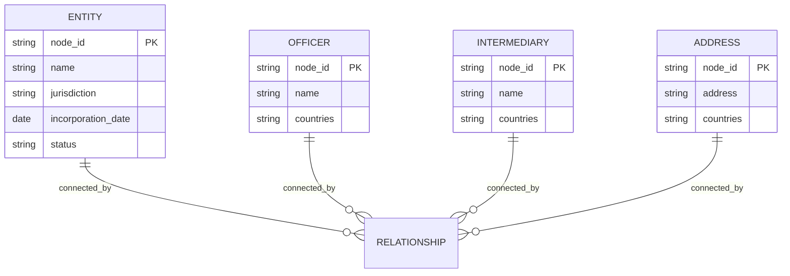
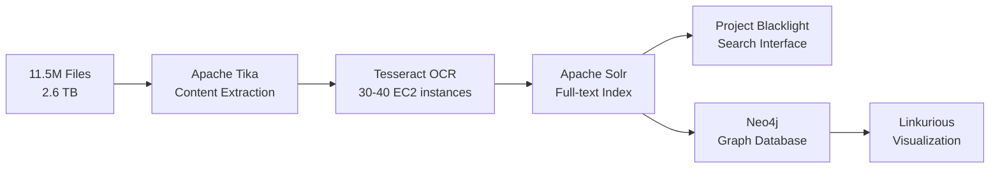

# The Panama Papers: A Technical Deep Dive into Data Processing and Graph Analysis

## Executive Summary

The Panama Papers investigation represents a watershed moment not just in investigative journalism, but in data engineering and analysis methodology. When 11.5 million files totaling 2.6 terabytes arrived at the desks of journalists in 2015, no existing playbook existed for processing, analyzing, and collaboratively investigating data at this scale. The technical infrastructure built by the International Consortium of Investigative Journalists (ICIJ) — a team of just four developers and three data journalists — became a template for subsequent mega-leaks and demonstrated how open-source technologies could be orchestrated to expose global financial secrecy.

This document provides a comprehensive technical examination of the Panama Papers infrastructure, focusing on the publicly available dataset structure, the processing pipeline that transformed raw documents into searchable intelligence, and the graph database methodology that revealed hidden connections between the world's wealthy and their offshore holdings.

---

## Understanding the Data Landscape

### The Original Leak: Scale and Composition

Before examining what data is publicly available, understanding what the original leak contained provides essential context for appreciating both the technical challenges faced and the deliberate decisions made about what to release.

The original leak from Mossack Fonseca comprised 11.5 million files spanning nearly four decades of the firm's operations, from 1977 through late 2015. The composition of these files reflects the organic accumulation of a working law firm's digital records rather than any structured export. Approximately 4.8 million files were emails, capturing decades of correspondence between the firm, its intermediaries, and clients. Another 3 million entries came from internal database systems that tracked corporate registrations, though these did not arrive in their native database format. The remaining files included 2.2 million PDFs (many of which were scanned paper documents), 1.2 million images, 320,000 text files, and thousands of files in obsolete or obscure formats that required specialized handling.

The total volume of 2.6 terabytes may seem modest by contemporary big data standards, but the challenge was never primarily about storage. The difficulty lay in the heterogeneity of formats, the prevalence of non-machine-readable content requiring optical character recognition, and the need to make this corpus searchable and navigable for hundreds of journalists with varying technical abilities working across 80 countries.

### The Critical Distinction: Raw Data vs. Structured Release

ICIJ made an intentional and significant editorial decision regarding public release. The raw leak — emails, scanned passports, bank statements, financial transactions, and attorney-client correspondence — was never released to the public. This decision reflected both ethical considerations about personal privacy and practical concerns about source protection and ongoing investigations.

What ICIJ did release was a carefully extracted and structured subset: the corporate registry information that revealed who owned what offshore entities, who served as directors or shareholders, which intermediaries facilitated the incorporations, and where these entities were registered. Think of it as the difference between releasing an entire law firm's filing cabinets versus releasing only the index cards that catalog what companies exist and who controls them.

This structured extraction became the ICIJ Offshore Leaks Database, which now incorporates data from five major leaks: the original Offshore Leaks (2013), Panama Papers (2016), Bahamas Leaks (2016), Paradise Papers (2017), and Pandora Papers (2021). Combined, the database contains information on more than 810,000 offshore entities with connections to people and companies across more than 200 countries and territories.

---

## The Public Dataset: Structure and Schema

### Obtaining the Data

The complete Offshore Leaks Database is available for download as a compressed archive of CSV files from the ICIJ website. The data is released under the Open Database License with contents under Creative Commons Attribution-ShareAlike license, requiring attribution to the International Consortium of Investigative Journalists when used.

```bash
# Download the complete dataset
wget https://offshoreleaks-data.icij.org/offshoreleaks/csv/full-oldb.LATEST.zip

# Extract the archive
unzip full-oldb.LATEST.zip
```

The extraction produces multiple CSV files, each representing a distinct node type in the underlying graph model, plus a relationships file that captures the connections between nodes.

### The Graph Data Model

The dataset implements a property graph model, where information is organized into nodes (representing entities like companies, people, and addresses) and edges (representing relationships between those entities). Understanding this model is essential for effective analysis because the true value of the data lies not in individual records but in the patterns of connection between them.

The model contains four primary node types, each stored in its own CSV file, plus a relationships file that connects them.



#### Entity Nodes (nodes-entities.csv)

Entity nodes represent the offshore legal structures at the heart of the investigation — shell companies, trusts, foundations, and other legal vehicles created in low-tax jurisdictions. Each entity record captures the essential characteristics of an offshore structure.

The `node_id` field provides a unique identifier used for joining with the relationships file. The `name` field contains the registered name of the entity, often revealing naming patterns (many shell companies use generic names like "Global Trading Ltd" or seemingly random combinations). The `jurisdiction` field indicates where the entity was incorporated, with the British Virgin Islands, Panama, and the Bahamas appearing most frequently due to their favorable secrecy laws and minimal regulatory requirements.

Date fields track the lifecycle of each entity: `incorporation_date` records when the structure was created, `inactivation_date` marks when a client requested temporary deactivation (the entity could potentially be reactivated later), and `struck_off_date` indicates permanent removal from the corporate registry. Analysis of these dates reveals interesting patterns, including a marked decline in new incorporations after 2003 and accelerated deactivations following various regulatory crackdowns.

The `sourceID` field indicates which leak the record originated from, enabling analysts to filter or compare across different data sources. Additional fields capture addresses (when directly associated with the entity), internal reference numbers from the original Mossack Fonseca systems, and status indicators.

#### Officer Nodes (nodes-officers.csv)

Officer nodes represent the people and companies that play roles in offshore entities. The term "officer" encompasses multiple functions: directors who have nominal management responsibility, shareholders who own the entity, beneficiaries who benefit from the entity's assets or income, and other connected parties.

The `name` field contains the officer's name as recorded in Mossack Fonseca's systems. A critical analytical consideration is that the same individual may appear multiple times with slight name variations (different transliterations, inclusion or exclusion of middle names, maiden names versus married names), requiring fuzzy matching techniques for comprehensive analysis. The `countries` field indicates associated nationalities or countries of residence.

Officers may be natural persons (individuals) or legal persons (other companies). When an officer is itself a company, this often indicates layered ownership structures where one shell company owns another, creating additional barriers to identifying ultimate beneficial owners.

#### Intermediary Nodes (nodes-intermediaries.csv)

Intermediaries represent the professional facilitators of offshore finance — law firms, banks, accountants, and specialized corporate service providers who serve as the connection between clients seeking offshore structures and the offshore service providers who create them. Mossack Fonseca worked with over 14,000 intermediary institutions across more than 100 countries.

The intermediary data proves particularly valuable for understanding the infrastructure of offshore finance. Rather than clients approaching Mossack Fonseca directly, the typical arrangement involved local intermediaries (often prestigious law firms or private banks in the client's home country) who would request the creation of offshore structures on behalf of their clients. This layering provided additional separation between the ultimate owner and the offshore entity.

The most active intermediaries in the data came from Hong Kong, the United Kingdom, and Switzerland — jurisdictions known for sophisticated private banking and legal services catering to high-net-worth individuals.

#### Address Nodes (nodes-addresses.csv)

Address nodes capture the registered addresses associated with entities, officers, and intermediaries. In the offshore world, addresses often reveal patterns of mass registration — many distinct entities sharing identical addresses at known corporate service providers — or the use of nominee addresses that obscure the actual location of beneficial owners.

Analysis of address data can reveal clusters of related entities (multiple companies at the same address may share common ownership) and identify corporate service providers who specialize in providing registered addresses for offshore structures.

#### Relationships (relationships.csv)

The relationships file is where the graph structure materializes. Each record represents a directed edge connecting two nodes, with a type that describes the nature of the connection.

The `node_id_start` and `node_id_end` fields contain the identifiers of the connected nodes, which can be joined against any of the node files. The `rel_type` field categorizes the relationship. Common relationship types include `officer_of` (a general officer relationship to an entity), `intermediary_of` (the intermediary who facilitated an entity's creation), `registered_address` (linking an entity to its registered address), and `related_entity` (connections between entities found in the underlying documents).

More specific relationship types capture particular roles: `shareholder_of`, `director_of`, `beneficiary_of`, `secretary_of`, `protector_of` (for trusts), and various `nominee_` prefixed types that indicate one party acting as a nominee (front person) for another. These nominee relationships are especially significant for investigation because they indicate deliberate obscuring of true ownership.

### Sample Data Structures

To illustrate the concrete structure, consider representative records from each file type.

An entity record might contain:

```
node_id: "10000001"
name: "DORADO ASSET MANAGEMENT LTD."
jurisdiction: "British Virgin Islands"
incorporation_date: "2007-03-15"
inactivation_date: "2014-09-22"
struck_off_date: ""
sourceID: "Panama Papers"
address: ""
status: "Defaulted"
```

A corresponding officer record might show:

```
node_id: "12000001"
name: "John Smith"
countries: "United States"
sourceID: "Panama Papers"
```

And a relationship connecting them:

```
node_id_start: "12000001"
node_id_end: "10000001"
rel_type: "director_of"
sourceID: "Panama Papers"
```

This structure enables reconstruction of the complete network by joining relationship records against node records.

> **Implementation Note:** For Oracle table definitions based on this schema, see [Implementation.md](Implementation.md) — "Table Creation" section.

---

## The Processing Pipeline: From Raw Documents to Searchable Intelligence

Understanding how ICIJ transformed 2.6 terabytes of heterogeneous documents into the structured dataset provides essential context for appreciating both the engineering achievement and the limitations of what can be derived from leaked data.



### The Challenge of Unstructured Data

The raw Mossack Fonseca files presented multiple processing challenges simultaneously. The documents arrived incrementally over months rather than as a single delivery, requiring a pipeline capable of handling ongoing ingestion. The format diversity was extreme — standard PDFs sat alongside decades-old word processing formats that modern software struggles to interpret, scanned images of paper documents required optical character recognition, and email archives needed parsing to extract both content and metadata.

ICIJ's data team built their processing infrastructure around open-source components, creating an orchestration layer called Extract (available at github.com/ICIJ/extract) that coordinated the transformation process.

### Content Extraction with Apache Tika

Apache Tika served as the foundation for content extraction. Tika provides a unified interface for extracting text and metadata from over 1,400 different file formats, abstracting away the complexity of dealing with proprietary document structures. When processing a PDF, Tika extracts the embedded text; when processing a Word document, it pulls both content and document properties; when encountering an email file, it parses headers, body, and attachments.

For the Panama Papers, Tika's metadata extraction proved as valuable as content extraction. Document metadata often contains author names, creation dates, modification histories, and software identifiers that help establish provenance and timeline even when document content is sparse or unclear.

### Optical Character Recognition at Scale

A substantial portion of Mossack Fonseca's records consisted of scanned paper documents — incorporation certificates, signed agreements, passport copies, and handwritten notes. These files, typically stored as TIFF images or image-based PDFs, contain no extractable text and require optical character recognition to become searchable.

ICIJ used Tesseract, the open-source OCR engine originally developed by Hewlett-Packard and now maintained by Google, for this transformation. However, running OCR on millions of images with reasonable turnaround time required significant parallelization.

The solution involved deploying elastic compute capacity through Amazon Web Services. The Extract tool would spin up between 30 and 40 EC2 instances as temporary processing workers, distributing OCR tasks across them. When processing load was high, more instances would be provisioned; when load decreased, instances would be terminated to manage costs. This elastic approach allowed processing millions of images in days rather than months.

The team achieved approximately 99% success rate in extracting searchable text from the original documents — a remarkable figure given the variety of formats, the age of some documents (dating back to the 1970s), and the varying quality of scanned images.

### Indexing with Apache Solr

Extracted text flowed into Apache Solr, a full-text search engine built on Apache Lucene. Solr creates inverted indexes that enable rapid text search across massive document collections — the same fundamental technology that powers web search engines.

For the Panama Papers, Solr indexing enabled several critical capabilities. Basic keyword search allowed journalists to find documents containing specific names, company identifiers, or terms of interest. Faceted search let users filter results by metadata dimensions such as file type, folder origin, or date range. Boolean operators supported complex query construction, combining multiple terms with AND, OR, and NOT logic.

More advanced features proved equally important. Proximity search found documents where terms appeared near each other (useful for finding specific people mentioned in relation to specific companies). Regular expression queries enabled pattern matching, allowing searches for formats like passport numbers or bank account identifiers without knowing specific values. Fuzzy matching handled the inevitable variations in name spellings across documents from different sources and languages.

### The Journalist Interface: Project Blacklight

Raw Solr provides powerful search capabilities but no user interface. ICIJ adapted Project Blacklight, an open-source discovery platform originally developed for academic library catalogs, to provide journalists with an accessible search interface.

Blacklight presented search results with faceted navigation panels, allowing users to progressively narrow results by selecting filters. Preview functionality displayed document content without requiring download. A batch search feature proved particularly valuable — journalists could upload lists of names (such as all politicians from their country) and receive matches across the entire corpus, including fuzzy matches that caught spelling variations.

The interface was deployed on ICIJ-controlled servers with two-factor authentication required for access. The approximately 370 journalists participating in the investigation accessed this platform remotely, each searching for leads relevant to their geographic or topical focus.

### Structured Data Extraction

Parallel to the document processing pipeline, ICIJ's team worked to extract structured data from Mossack Fonseca's internal databases. This proved challenging because the database contents did not arrive in their original format — the firm used a proprietary system, and exports required reverse engineering to understand the schema and relationships.

The team developed processes to identify entity names, officer details, incorporation dates, and the relationships between them. This structured extraction produced the graph data that ultimately became the public Offshore Leaks Database.

An important caveat accompanies this data: information about ownership relationships is often buried in unstructured documents (emails mentioning beneficial owners, power-of-attorney letters, internal notes) rather than appearing in formal database fields. The structured dataset captures what was systematically recorded in Mossack Fonseca's systems, but the complete picture of beneficial ownership often requires analyzing the underlying documents that remain unavailable to the public.

---

## Graph Database Methodology and Analysis

### Why Graph Databases Matter for Financial Investigation

The Panama Papers data is fundamentally about relationships — people connected to companies, companies connected to other companies, intermediaries facilitating connections, shared addresses suggesting common ownership. Traditional relational databases can store this information, but querying it effectively becomes increasingly difficult as the complexity of relationships grows.

Consider a seemingly simple question: "Find all entities connected to John Smith within three degrees of separation." In a relational database, this requires a query with multiple self-joins on the relationships table, and the number of joins must be specified in advance based on the desired path length. The query becomes unwieldy, and performance degrades exponentially as path length increases.

Graph databases address this by storing relationships as first-class citizens alongside the data they connect. Rather than computing relationships through joins at query time, a graph database maintains direct pointers between connected nodes. Traversing from one entity to connected entities to their connections becomes a matter of following pointers rather than performing expensive table scans.

### The Property Graph Model in Practice

The Offshore Leaks data implements a property graph model where both nodes and relationships can carry attributes. Nodes have labels indicating their type (Entity, Officer, Intermediary, Address) and properties storing their characteristics (name, jurisdiction, dates). Relationships have types indicating the nature of connection (director_of, shareholder_of, registered_address) and can also carry properties (though in the public dataset, relationship properties are minimal).

This model naturally represents the offshore finance ecosystem. An investigation might start with a known individual, follow relationships to identify entities they control, explore those entities' other officers to find associates, examine shared addresses to discover clusters of related entities, and trace intermediaries to understand which professional networks facilitated the structures.

### Query Patterns for Investigation

Graph query languages enable intuitive expression of investigative questions. While the CSV format provides the raw data, tools that can interpret the graph structure enable sophisticated analysis.

Finding all entities where a specific person serves as officer requires matching the pattern of an Officer node with a particular name connected to Entity nodes via any officer relationship. Discovering the shortest path between two seemingly unrelated individuals reveals potential hidden connections through shared entities, shared intermediaries, or shared addresses.

Community detection algorithms can identify clusters of densely connected nodes that may represent coordinated ownership structures. Centrality measures reveal which nodes are most important to network connectivity — a person or intermediary with high betweenness centrality sits on many shortest paths between other nodes, potentially serving as a key facilitator.

> **Implementation Note:** For Oracle Property Graph creation and PGQL query examples, see [Implementation.md](Implementation.md) — "Oracle Property Graph Implementation" section.

### Key Analytical Findings from Graph Analysis

Analysis of the Panama Papers graph structure has revealed several significant patterns.

Geographic analysis shows that certain jurisdictions appear disproportionately as entity registration locations relative to their economic size. The British Virgin Islands, with a population under 30,000, hosted over 113,000 entities in the Panama Papers alone — more than any other jurisdiction. Panama, the Bahamas, and the Seychelles also appear as major registration locations, reflecting their positioning as offshore financial centers.

Intermediary analysis reveals that professional facilitators from particular countries dominated the business. Hong Kong, the United Kingdom, and Switzerland together accounted for a substantial majority of intermediary activity. These jurisdictions combine sophisticated financial services industries with strong bank secrecy traditions.

Network centrality analysis identifies the United Kingdom, Switzerland, and Hong Kong as the most "central" countries in the relationship network — meaning they have the most connections and sit on the most paths between other nodes. This centrality reflects their roles as both sources of clients seeking offshore structures and hosts of intermediaries facilitating those structures.

Edge analysis produced a surprising finding: some of the most important connections (measured by edge betweenness centrality) linked first-world secrecy jurisdictions with developing countries. The Switzerland-Mali connection ranked among the most significant edges, illustrating how offshore finance enables elites in developing countries to move wealth through established secrecy centers.

Temporal analysis shows a marked decline in new entity incorporations after 2003, potentially reflecting increased regulatory scrutiny following various international anti-money-laundering initiatives. Conversely, inactivation rates increased after 2005, suggesting clients were actively winding down offshore structures as the regulatory environment tightened.

Correlation analysis against external indicators found strong relationships (correlation coefficients between 0.6 and 0.7) between a country's Financial Secrecy Index ranking and its involvement in the leaks. Countries with higher secrecy scores attracted more offshore entity registrations, confirming the intuition that opacity is a primary selling point of offshore finance.

---

## Working with the CSV Data

### Loading and Initial Exploration

The CSV files are straightforward to load in any data analysis environment. In Python with pandas, basic loading requires only standard library functionality.

```python
import pandas as pd

# Load the primary node files
entities = pd.read_csv('nodes-entities.csv', low_memory=False)
officers = pd.read_csv('nodes-officers.csv', low_memory=False)
intermediaries = pd.read_csv('nodes-intermediaries.csv', low_memory=False)
addresses = pd.read_csv('nodes-addresses.csv', low_memory=False)

# Load the relationships
relationships = pd.read_csv('relationships.csv', low_memory=False)

# Examine basic statistics
print(f"Entities: {len(entities):,}")
print(f"Officers: {len(officers):,}")
print(f"Intermediaries: {len(intermediaries):,}")
print(f"Addresses: {len(addresses):,}")
print(f"Relationships: {len(relationships):,}")
```

The `low_memory=False` parameter ensures consistent dtype inference across the entire file, which is important for large files where pandas might otherwise infer different types from different chunks.

### Reconstructing Relationships

Joining relationship data to node data reconstructs the connections for analysis.

```python
# Find all officers of a specific entity
def get_officers_of_entity(entity_id, relationships_df, officers_df):
    # Filter relationships where the entity is the target of an officer relationship
    officer_rels = relationships_df[
        (relationships_df['node_id_end'] == entity_id) &
        (relationships_df['rel_type'].str.contains('officer|director|shareholder|beneficiary', case=False, na=False))
    ]

    # Join to get officer details
    return officers_df[officers_df['node_id'].isin(officer_rels['node_id_start'])]

# Find all entities connected to a specific officer
def get_entities_of_officer(officer_id, relationships_df, entities_df):
    # Filter relationships where the officer is the source
    entity_rels = relationships_df[
        (relationships_df['node_id_start'] == officer_id) &
        (relationships_df['rel_type'].str.contains('officer|director|shareholder|beneficiary', case=False, na=False))
    ]

    # Join to get entity details
    return entities_df[entities_df['node_id'].isin(entity_rels['node_id_end'])]
```

### Building Network Graphs

For network analysis, the relationships can be loaded into graph analysis libraries such as NetworkX.

```python
import networkx as nx

# Create a directed graph from relationships
G = nx.from_pandas_edgelist(
    relationships,
    source='node_id_start',
    target='node_id_end',
    edge_attr='rel_type',
    create_using=nx.DiGraph()
)

# Add node attributes from the node DataFrames
# This requires mapping node_ids to their attributes
for _, row in entities.iterrows():
    if row['node_id'] in G:
        G.nodes[row['node_id']]['type'] = 'Entity'
        G.nodes[row['node_id']]['name'] = row['name']
        G.nodes[row['node_id']]['jurisdiction'] = row.get('jurisdiction', '')

# Similar processing for officers, intermediaries, and addresses
```

### Analytical Queries

Once the data is loaded, analytical queries can reveal patterns in the offshore network.

```python
# Find the most common jurisdictions
jurisdiction_counts = entities['jurisdiction'].value_counts()
print("Top 10 Jurisdictions:")
print(jurisdiction_counts.head(10))

# Analyze incorporation trends over time
entities['incorporation_year'] = pd.to_datetime(
    entities['incorporation_date'],
    errors='coerce'
).dt.year

yearly_incorporations = entities['incorporation_year'].value_counts().sort_index()

# Find officers with the most entity connections
officer_connection_counts = relationships[
    relationships['rel_type'].str.contains('officer|director', case=False, na=False)
].groupby('node_id_start').size().sort_values(ascending=False)

# Identify the most active intermediaries
intermediary_counts = relationships[
    relationships['rel_type'] == 'intermediary_of'
].groupby('node_id_start').size().sort_values(ascending=False)
```

---

## Limitations and Considerations

### Data Completeness

The public dataset represents a structured extraction from the original leak, not the complete corpus. Beneficial ownership information captured in unstructured documents (emails, notes, power-of-attorney letters) does not appear in the structured data unless it was formally recorded in Mossack Fonseca's database systems. Many connections between ultimate owners and their offshore structures remain hidden in documents that have not been publicly released.

### Identity Resolution

The data contains no universal identifiers for individuals or companies. The same person may appear multiple times with different name spellings, variations, or transliterations. Analysis seeking to consolidate records for the same individual requires fuzzy matching techniques and manual verification. ICIJ warns that the data comes from leaked records rather than standardized registries and may contain duplicates.

### Temporal Coverage

The data spans activities from 1977 through 2015 for the Panama Papers component, with additional leaks covering different time periods. Information about ownership and officer roles reflects the situation as recorded at various points in time; subsequent changes are not captured. An entity shown with a particular director in the data may have different officers today.

### Negative Inference

The presence of a person or entity in the database does not indicate illegality. Many legitimate uses exist for offshore structures, including estate planning, asset protection, and international business operations. Conversely, the absence of a person or entity from the database does not indicate they have no offshore holdings — Mossack Fonseca was just one of many offshore service providers, representing perhaps 5-10% of the global market.

---

## Conclusion

The Panama Papers technical infrastructure demonstrates how open-source technologies can be orchestrated to transform an unprecedented data leak into actionable investigative intelligence. The combination of Apache Tika for content extraction, Tesseract for optical character recognition, Apache Solr for full-text search, and graph database methodology for relationship analysis created a reproducible framework that ICIJ has applied to subsequent investigations.

The publicly available CSV dataset provides researchers, journalists, and analysts with access to the structured heart of the leak — the corporate registry information revealing who created what offshore entities and who controlled them. While this represents only a fraction of the original 2.6 terabytes, it captures the essential graph structure that enables network analysis and pattern detection.

Understanding this infrastructure matters beyond the Panama Papers themselves. The techniques developed here have become standard methodology for data journalism investigations, the collaborative framework has been replicated for subsequent leaks, and the graph analysis approaches apply to any investigation centered on relationship networks. The technical achievement was not merely processing the data, but creating systems that enabled hundreds of journalists with varying technical skills to contribute meaningfully to a coordinated global investigation.

---

## References and Resources

The ICIJ Offshore Leaks Database is available at https://offshoreleaks.icij.org with data download at https://offshoreleaks.icij.org/pages/database.

The ICIJ Extract tool for parallelized content extraction is open-source at https://github.com/ICIJ/extract.

Technical interviews with Mar Cabra, former head of ICIJ's Data and Research unit, provide detailed accounts of the infrastructure decisions and are available through the ICIJ website and various data journalism conference proceedings.

The dataset is released under the Open Database License (ODbL) with contents under Creative Commons Attribution-ShareAlike license. Any use must cite the International Consortium of Investigative Journalists.

---

## Next Steps

- **Implementation:** See [Implementation.md](Implementation.md) for Oracle schema creation, Python ingestion scripts, PGQL queries, and Oracle Text configuration
- **Deployment:** See [Deployment.md](Deployment.md) for OCI infrastructure provisioning and automated deployment
